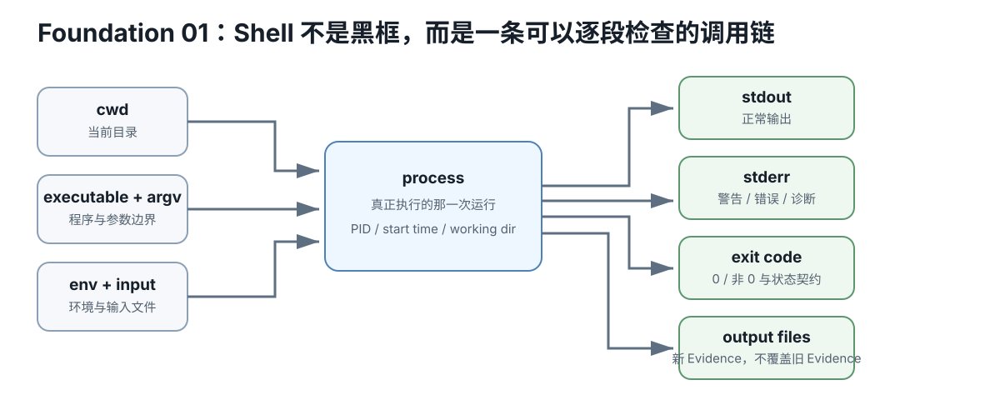

# Foundation 01 — Shell、路径、文件与进程：够用就好

硬件等级：L0  
风险：safe  
成本：0

## 为什么现在才学

课程里的命令经常长这样：

~~~bash
python3 script.py input.json --out-dir results
~~~

你不需要先成为 Linux 管理员，但必须知道：
- 当前在哪个目录；
- 一个路径指向什么；
- 命令运行了哪个程序；
- stdout/stderr 去哪里；
- 怎样不覆盖 Evidence。

<figure>
  
  <figcaption>Shell 命令的可审计调用链：cwd、程序、参数、环境和输入共同形成进程，进程产生 stdout、stderr、退出码与输出文件。</figcaption>
</figure>

## 1. 当前目录

~~~bash
pwd
ls
~~~

- `pwd`：我现在在哪；
- `ls`：这里有什么。

进入目录：

~~~bash
cd path/to/folder
~~~

返回上一级：

~~~bash
cd ..
~~~

## 2. 相对路径和绝对路径

~~~text
./model.gguf
../reference/file.md
/home/me/models/model.gguf
~~~

前两个依赖当前目录；最后一个从文件系统根开始。

实验 Evidence 最容易出现的问题之一就是：
“我以为这个相对路径指向 A，实际运行时指向 B。”

不确定时先：

~~~bash
realpath some/file
~~~

## 3. 文件不要原地覆盖

课程常要求：

~~~bash
cp template.json my-run.json
~~~

意思是保留模板，编辑新文件。

真实 Evidence 输出目录通常要求：
- 不存在，或
- 已存在但为空。

这是为了避免新旧实验混在一起。

## 4. stdout / stderr

程序通常有两条输出流：
- stdout：正常结果；
- stderr：警告/错误/诊断。

保存 stdout：

~~~bash
command | tee output.txt
~~~

但严格实验工具通常会自己分别保存 stdout/stderr，优先用课程脚本的封装。

## 5. Exit code

程序退出：
- 0 通常表示成功；
- 非 0 表示失败/阻塞。

不要看到“生成了一些文件”就假设成功；继续看最后的：

~~~text
PASS
READY
BLOCKED
FAIL
~~~

以及 return code。

## 6. 进程

查进程：

~~~bash
ps
ps aux
~~~

结束你自己的前台命令通常可用：

~~~text
Ctrl+C
~~~

长期 server 后面课程会再讲 systemd/readiness；现在不用提前学。

## 7. 权限

如果看到：

~~~text
Permission denied
~~~

不要第一反应就是：

~~~bash
sudo ...
~~~

先判断：
- 文件有没有 execute bit；
- 路径是否属于你；
- 课程是否真的要求 root。

绝大多数 benchmark/LLM 实验应在普通用户权限完成。

## 小练习

1. 建一个空目录；
2. 进入它；
3. 创建 `hello.txt`；
4. 用 `pwd` 和 `realpath hello.txt` 写出绝对路径；
5. 复制成 `hello-copy.txt`；
6. 确认原文件没有被覆盖。

## Retrieval Practice

1. 为什么实验脚本喜欢拒绝非空 output directory？
2. 相对路径的含义由什么决定？
3. Permission denied 时为什么不应该机械加 sudo？
4. stdout 与 stderr 为什么都值得保存？

## 完成证据

写下：
- 当前目录；
- 一个相对路径；
- 它解析出的绝对路径；
- 一次命令的 exit code。

## Mental Model：Shell 不是“黑框魔法”，而是一条可审计调用链

每次命令都可以拆成：

~~~text
current working directory
+ executable
+ argv
+ environment
+ input files
→ process
→ stdout / stderr / exit code
→ output files
~~~

课程后面所有严格实验，本质上都在把这条链保存下来。

## Worked Example：同一条相对路径为什么会读到两个不同文件

假设：

~~~text
/home/me/run-a/model.gguf
/home/me/run-b/model.gguf
~~~

而命令都写：

~~~bash
tool -m ./model.gguf
~~~

如果当前目录不同，./model.gguf 就不是同一个 artifact。  
所以 Evidence 中至少要保留：

~~~bash
pwd
realpath ./model.gguf
~~~

以及脚本最终解析后的 exact path / hash。

## Redirection 最小知识

你只需要先认识：

~~~bash
command > stdout.txt
command 2> stderr.txt
command > stdout.txt 2> stderr.txt
~~~

这解释“为什么屏幕上没看到错误，但 stderr 文件里有”。课程自己的 capture 工具优先于手写重定向，因为它还会记录 argv、时间、return code 和 hash。

## Troubleshooting Tree

~~~text
command not found
→ executable/path/PATH

No such file
→ cwd + relative path + typo

Permission denied
→ ownership/mode/mount policy
→ 不先 sudo

process hangs
→ distinguish busy / waiting / deadlock / network / I/O
→ Ctrl+C only after preserving what matters

files exist but status FAIL/BLOCKED
→ trust exit/status contract, not file existence
~~~

## No-hardware fallback

本节本来就是 L0。没有 Linux 也可以在 macOS shell 完成大部分练习；Windows 可使用 WSL、Git Bash 或 PowerShell 做等价练习，但课程命令的 shell 语义以对应实验说明为准。

## Decision Rule

当一个实验因为“文件找不到、路径错、权限错、进程没退出”失败时，先修执行环境，不讨论 GPU/模型性能。基础 I/O 身份不清楚，后面的 benchmark 数字没有证据价值。

## Transfer

以后遇到 Docker、SSH、systemd、CI，你仍然在追同一条链：谁启动了哪个 process、在哪个目录、拿了哪些输入、产生了什么输出、以什么状态结束。

## Primary Sources

- GNU Coreutils manual: https://www.gnu.org/software/coreutils/manual/
- Bash manual: https://www.gnu.org/software/bash/manual/
