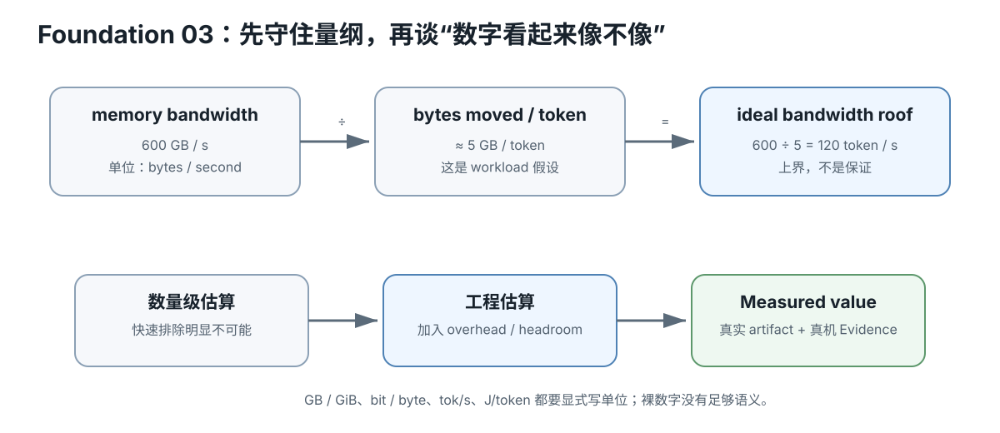

# Foundation 03 — 数学、单位与估算：只学会用的

硬件等级：L0  
风险：safe  
成本：0

<figure>
  
  <figcaption>单位、估算与实测：量纲守恒把带宽与每 token 搬运量转换成 token/s 上界，并区分数量级估算、工程估算和实测。</figcaption>
</figure>

## 1. 这门课最常用的数学

主要是：
- 乘除；
- 比例；
- 百分比；
- powers of two；
- bytes / bits；
- 平均数/percentile 的基本含义；
- 少量指数与对数直觉（softmax/PPL）。

不要求先学线性代数证明。

## 2. bit 与 byte

~~~text
8 bit = 1 byte
~~~

例：

~~~text
7B parameters × 4 bit
≈ 28B bit
≈ 3.5 GB raw payload
~~~

但量化文件可能还有 scale/metadata/mixed tensors，所以真实 bytes 以 artifact 为准。

## 3. GB 与 GiB

~~~text
1 GB  = 10^9 bytes
1 GiB = 2^30 bytes
~~~

产品规格、工具输出可能使用不同口径。

比较前先统一单位。

## 4. 带宽

~~~text
bandwidth = bytes / second
~~~

如果每生成一个 token 近似要读 `W` bytes，粗略 bandwidth roof：

~~~text
tokens/s <= memory_bandwidth / W
~~~

只是上界模型，不是保证。

## 5. Arithmetic Intensity

~~~text
AI = FLOP / bytes moved
~~~

低 AI 更容易被 memory roof 限制；
高 AI 更容易接近 compute roof。

## 6. 百分比变化

Baseline 100，candidate 120：

~~~text
speedup = 120 / 100 = 1.2×
percent increase = (120-100)/100 = 20%
~~~

不要混：
- +20%
- 1.2×
- 快 20 tok/s

## 7. 平均值与 tail

一次请求很慢可以被平均值“稀释”。

Serving 后面常看：
- median/p50；
- p95；
- p99。

课程会说明具体 percentile 算法，不能假设所有工具实现完全一致。

## 8. PPL 的最小直觉

Cross-entropy 是平均负 log probability。

Perplexity：

~~~text
PPL = exp(cross_entropy)
~~~

你现在只要记住：
- 在**同 tokenizer / corpus / protocol**下，较低 PPL 通常表示模型给真实下一个 token 更高概率；
- PPL 不是所有任务质量的万能分数。

## 9. 矩阵 shape 比公式证明更重要

看到：

~~~text
[B, T, d]
~~~

先学会问：
- 每个维度是什么；
- 哪个维度在 prefill 很大；
- decode 时哪个变成 1；
- tensor 有多少 element；
- 每 element 几 bytes。

这已经足够解释大量本地推理瓶颈。

## 小练习

计算：
1. 8B 参数、4.5 bpw 的 raw weight bytes；
2. 24 GiB 转 bytes；
3. 600 GB/s 除以 5 GB/token 的理想 roof；
4. 50 tok/s → 60 tok/s 是多少倍、多少百分比。

## Retrieval Practice

1. 为什么 4-bit 模型文件不一定严格等于参数量×0.5 byte？
2. GB/GiB 混用会造成什么误差？
3. AI 高低分别更容易接近哪个 roof？
4. 1.25× 和 +25% 是什么关系？

## 完成证据

写一张单位表，后续所有预算都显式写单位，不只写裸数字。

## 10. Mental Model：先守住“量纲”，再算数字

最常见的错误不是不会乘除，而是单位被悄悄丢掉。

例如：

~~~text
600 GB/s ÷ 5 GB/token = 120 token/s
~~~

单位自动告诉你结果是什么。如果你算出 120 GB，说明式子已经错了。

## Worked Example A：8B × 4.5 bpw

~~~text
8 × 10^9 parameter
× 4.5 bit / parameter
÷ 8 bit / byte
≈ 4.5 × 10^9 byte
≈ 4.5 GB
≈ 4.19 GiB
~~~

这只是 raw weight payload 估算。真实文件还要看 metadata、scale、mixed precision tensor 和 container overhead。

## Worked Example B：24 GiB 到底是多少 byte

~~~text
24 × 2^30
= 25,769,803,776 bytes
~~~

如果规格写 24 GB，则十进制是：

~~~text
24,000,000,000 bytes
~~~

二者相差约 7.4%。容量边缘场景不能混用。

## Worked Example C：Roofline 只能给上界

假设：

~~~text
memory bandwidth = 600 GB/s
bytes moved per token ≈ 5 GB/token
~~~

理想 roof：

~~~text
600 / 5 = 120 token/s
~~~

真实值低于 120 很正常，因为还存在：
- cache miss / ineffective reuse；
- kernel launch；
- compute；
- synchronization；
- host work；
- thermal/power；
- 实际 bytes/token 估算误差。

所以 roof 是“排除不可能”，不是“承诺一定能达到”。

## 11. 估算的三档精度

课程里把数字分成：

~~~text
order-of-magnitude estimate
→ engineering estimate
→ measured value
~~~

例如“7B Q4 大约几 GB”适合快速 fit 判断；真正决定是否装得下时要读 exact artifact bytes，再加 KV、runtime buffer 和 headroom。

## 12. 常见数学误区

- +25% 与 1.25× 是同一变化的两种表达，不是两个提升；
- 从 80 降到 60 是 -25%，从 60 回到 80 是 +33.3%；
- p95 不是“最慢 5% 的平均值”；
- PPL 只能在同 tokenizer、corpus、protocol 下直接比较；
- GB/s 高不代表 workload 一定 bandwidth-bound；
- 参数量不是运行时内存总量。

## Troubleshooting Checklist

算出一个结果后问：

1. 每个输入单位是什么？
2. 最终单位对吗？
3. 十进制/二进制前缀混了吗？
4. 这是上界、估算还是实测？
5. 是否遗漏 overhead？
6. 比较双方口径是否相同？

## No-hardware fallback

本节全部用纸笔或计算器即可完成。没有任何真机要求。

## Decision Rule

估算用于快速淘汰明显不可能的方案、建立预期范围、决定下一步应该测什么。估算不能替代真实 artifact bytes、实际 VRAM/RAM headroom、PP/TG、功耗或质量 Evidence。

## Transfer

以后读 PCIe GB/s、VRAM bandwidth、TFLOPS、tokens/s、J/token、$/GB、TCO，都先做同一件事：把单位写出来，再比较。

## Primary Sources

- NIST SP 811 — Guide for the Use of the International System of Units (SI): https://www.nist.gov/pml/special-publication-811
- IEC — Prefixes for binary multiples: https://www.iec.ch/prefixes-binary-multiples

