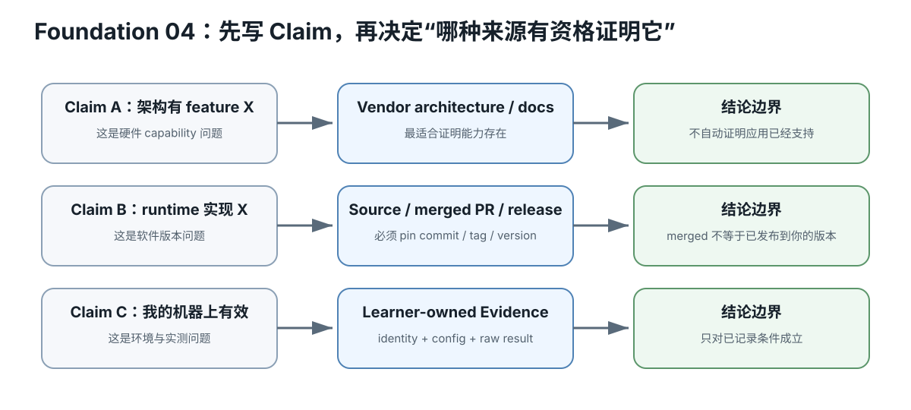

# Foundation 04 — Git / GitHub / 一手资料：不会写代码也要会考古

硬件等级：L0  
风险：safe  
成本：0

## 真实问题

“网上有人说这张卡支持某功能”到底够不够？

课程证据优先级：

~~~text
官方架构/开发文档
→ 原始论文/规范
→ canonical upstream source/docs
→ maintainer issue/PR/release
→ 可复现社区测试
→ 社区经验
→ 卖家描述
~~~

<figure>
  
  <figcaption>Claim-first 证据链：硬件能力、运行时支持和本机有效是不同问题，需要不同 source class。</figcaption>
</figure>

## 1. Repo、commit、branch

- repository：项目历史；
- branch：可移动的开发线；
- commit：一个具体历史快照。

课程做严格实验时偏好记录 commit，因为：

~~~text
master/main 今天
!=
master/main 三个月后
~~~

## 2. README 不是全部真相

README 适合发现功能。

要判断细节时继续看：
- docs；
- source；
- release notes；
- tests；
- issue/PR。

## 3. Issue / PR 怎么读

先分：
- confirmed bug；
- feature request；
- open question；
- workaround；
- merged fix；
- unreproduced report。

一个 open issue 只能证明：
“有人报告/讨论了这个问题”。

不能自动证明：
“所有机器都有这个 bug”。

## 4. Pin exact version

Evidence 里记录：

~~~text
project
commit/tag/version
build flags
driver/runtime
~~~

否则“同一个 llama.cpp”可能已经不是同一个实现。

## 5. 找 primary source 的最短流程

遇到 claim：

~~~text
RTX 某代支持 X
~~~

优先：
1. 厂商 architecture/programming docs；
2. 对应 SDK/tool docs；
3. runtime upstream support；
4. 实测。

遇到模型结构：
1. model config；
2. model card；
3. paper/technical report；
4. runtime parser/implementation。

## 小练习

选一个开源项目：
1. 找 README；
2. 找最新 release/tag；
3. 找一个相关 source 文件；
4. 找一个 issue；
5. 分别写出这四种来源能证明什么、不能证明什么。

## Retrieval Practice

1. 为什么 branch 名不能替代 commit identity？
2. open issue 能证明什么，不能证明什么？
3. 硬件 capability 与 runtime support 为什么要查两类来源？
4. 卖家描述在证据层级里为什么最低？

## 完成证据

为一个课程 claim 写 3 层来源：
- primary;
- implementation;
- experiment plan.

## Primary Sources

- Git documentation: https://git-scm.com/docs
- GitHub Docs — commits: https://docs.github.com/repositories/committing-changes-to-your-project

## Mental Model：每个 Claim 都要问“哪种来源有资格证明它”

不要把所有链接当作同一种证据。先写 claim，再找最合适的 source class。

~~~text
Claim A: 某 GPU 架构拥有 feature X
→ vendor architecture/programming document

Claim B: 某 runtime 当前实现了 feature X
→ exact upstream source / merged PR / release

Claim C: 我的机器上 feature X 有效
→ learner-owned measured Evidence
~~~

这三类来源互相不能替代。

## Worked Example：一个 Issue 到底能证明什么

假设 Issue 标题是：

~~~text
Arc A770 crashes with backend X
~~~

Issue 本身最多证明某人报告了问题，并在其描述环境中出现了某现象。若 maintainer 复现、定位、合入修复并发布，证据链才逐步增强：

~~~text
report
→ reproduced
→ root cause
→ patch
→ merged commit
→ released version
→ your own retest
~~~

任何一步都不要提前升级结论。

## Commit / Tag / Release 的区别

- commit：最精确源码身份；
- tag：名字指向一个版本点，通常较稳定；
- release：围绕 tag/commit 的发布说明与资产；
- branch：会移动，适合开发，不适合长期实验身份。

严格 benchmark 最好保存 commit；若使用正式 release，也保存其对应 tag/commit。

## Source Reading Worksheet

每次调查至少写：

~~~text
claim:
source:
source type:
exact version/date:
what it proves:
what it does NOT prove:
next source needed:
~~~

这个表能防止“看了很多链接但证据链仍然是空的”。

## Community Evidence 怎么用

社区数据不是垃圾，但必须保留边界：
- exact hardware；
- software version；
- model/artifact；
- workload；
- test method；
- raw data 是否可见；
- 是否可重复。

条件不全时，它适合生成 hypothesis，不适合直接升级成购买结论。

## Troubleshooting Research

- 文档写支持，源码没实现：区分 architecture capability 与 application support；
- PR merged 但 release 未包含：记录 commit，不假设已发布；
- 搜到旧 issue：看日期、版本、关闭原因；
- fork 有 patch：确认是否 upstreamed、是否还维护；
- 搜不到 primary source：把 claim 降级为 UNVERIFIED，不用二手引用填空。

## No-hardware fallback

本节就是 L0。完全靠公开 repo/docs 就能完成。

## Decision Rule

如果一个重要 claim 只能追到卖家描述、无条件截图、二手转述或没版本的论坛话术，就不允许把它升级成“已知事实”。最好的输出可能是 UNKNOWN / NEEDS MEASUREMENT。

## Transfer

以后调查 GPU、LLM 模型、驱动、框架、量化、散热改造、二手故障模式，都使用同一条规则：claim-first、source-class-aware、version-pinned、明确 non-claim。

