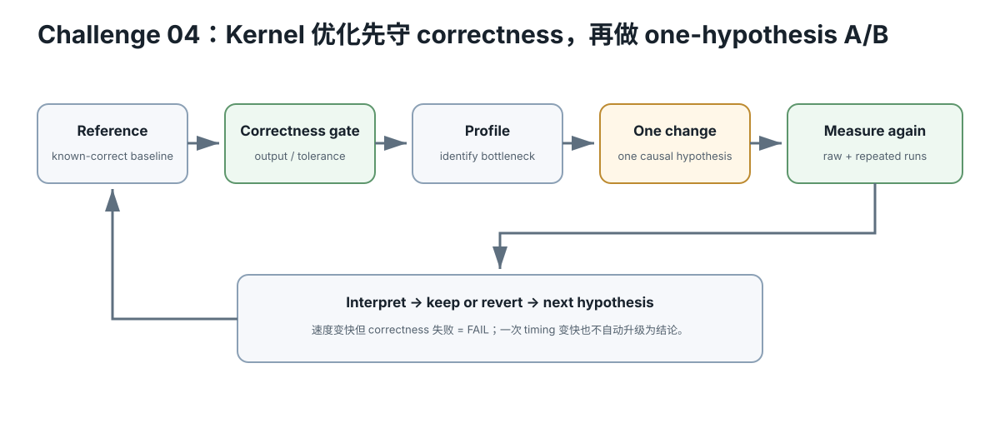

# Challenge 04 — Triton：从向量加法到可测 Kernel

硬件等级：L0 阅读；真机通常 L1/L2  
风险：safe  
成本：0（已有支持环境时）

<figure>
  
  <figcaption>Triton/kernel 优化按 reference → correctness → profile → one change → repeated measurement 循环，速度提升不能绕过 correctness gate。</figcaption>
</figure>

## Goal

把前面学的：
- program/block；
- memory coalescing；
- tiling；
- arithmetic intensity；
- masks；
- correctness；
- benchmark discipline

迁移到 Triton。

Triton 是语言/编译器，不是“自动把 Python 变成最快 CUDA”。

## 1. 第一条 kernel：Vector Add

跟随当前官方 tutorial 理解：

~~~text
program_id
→ block offsets
→ mask
→ load
→ compute
→ store
~~~

你必须能把每一行映射回 Slice 02–04 的 GPU 心智模型。

## 2. 第二步：Fused Softmax

重点不是抄代码，而是问：
- 为什么 fusion 减少中间 memory traffic？
- row 是否能放进当前 on-chip working set？
- block size/padding 带来什么浪费？
- shape 改变后 kernel 假设还成立吗？

## 3. 第三步：Matmul

把官方 matmul tutorial 拆成：

~~~text
tile mapping
→ A/B pointer arithmetic
→ load
→ dot/MMA path
→ accumulator
→ store
→ autotune configs
~~~

## 4. Benchmark contract

每个 kernel 至少比较：
- correctness；
- exact Triton/PyTorch/GPU identity；
- shapes/dtype；
- warm-up/repeats；
- reference implementation；
- latency/throughput；
- profiler/compiled resource evidence（可用时）。

## 5. 不允许的结论

~~~text
“Triton 比 CUDA 快”
~~~

没有意义。

你只能声称：
“在 exact shape/dtype/device/version 下，这个 kernel 相对这个 reference 的结果是 X。”

## Retrieval Practice

1. block size 为什么既影响 memory transaction 也影响 wasted masked lanes？
2. fusion 为什么可能更快，也可能造成 register pressure？
3. autotune winner 能跨 GPU 永久复用吗？
4. correctness 为什么必须在 benchmark 前？

## 完成证据

选 vector-add、softmax 或 matmul：
- 画 program mapping；
- 列 traffic；
- 写 correctness test；
- 写 benchmark manifest；
- 真机可用时测至少 3 种 shape。

## Current Primary Source

- Triton documentation: https://triton-lang.org/main/
- Official tutorials: https://triton-lang.org/main/getting-started/tutorials/

运行时以当前官方安装/支持矩阵为准。

## Expected outcome

至少完成一个 correctness-first kernel，并能解释 program/block mapping、memory access、shape 与 benchmark contract；优化前后必须有相同输入与 reference。

## Failure recovery

kernel 输出不正确时停止性能比较：先缩小 shape、固定 seed、与 reference 做误差检查，再逐步恢复优化。

## What this does NOT prove

某个 toy Triton kernel 赢过 naive baseline，不代表赢过 cuBLAS/rocBLAS/FlashAttention 等成熟库，也不代表端到端 LLM 更快。

## No-hardware path

没有支持的加速器时先读 kernel/source、手动画 program-id→data mapping；真实 benchmark 延后。
