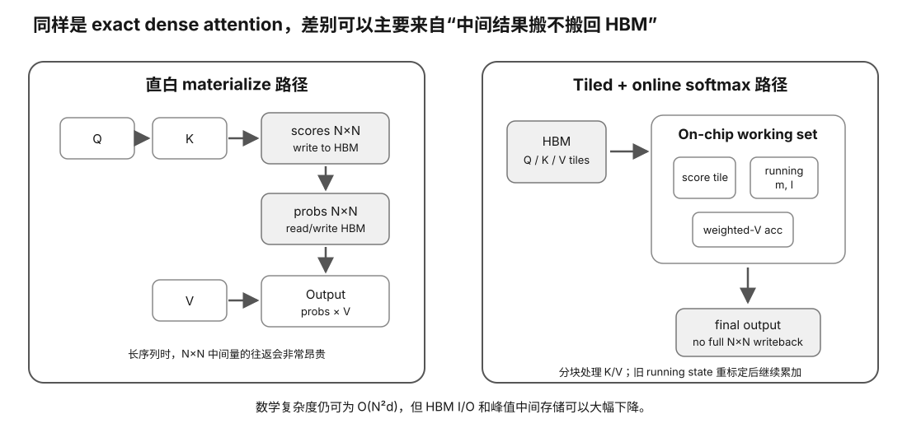

# Challenge 05 — FlashAttention 源码考古：从论文到 Kernel

硬件等级：L0 源码阅读；L1/L2 可选 profiling  
风险：safe  
成本：0

<figure>
  
  <figcaption>FlashAttention 源码考古先抓住核心 I/O 机制：通过 tiled/online 计算减少中间矩阵往返外部内存，再映射到具体实现。</figcaption>
</figure>

## Goal

你已经在 Slice 12 理解：

~~~text
attention math
!=
必须 materialize 完整 score matrix
~~~

现在把论文概念定位到真实实现。

## 1. 先冻结版本

记录：
- repository；
- commit/tag；
- target implementation；
- target GPU generation；
- dtype；
- forward/backward/inference scope。

不要在 `main` 滚动期间写“源码第 123 行永远做 X”。

## 2. 建 Paper → Code Map

至少找出概念对应：
- Q/K/V tiling；
- online softmax state；
- block/program/work partition；
- shared/on-chip staging；
- accumulator；
- causal mask；
- output normalization/writeback。

你不需要第一遍读懂所有 template/meta-programming。

## 3. 从数据流切入

先画：

~~~text
HBM Q/K/V
→ tile load
→ QK
→ running max/sum
→ probability × V
→ accumulator
→ output
~~~

然后对照源码找“这一条箭头在哪里”。

## 4. 版本演进问题

不同 FlashAttention generation 可能改变：
- work partition；
- warp specialization；
- Hopper-specific async/TMA paths；
- supported dtype/shape；
- API。

课程稳定部分只保留 I/O-aware exact attention 原理；具体实现必须 pin source。

## 5. Profiler optional

有合适 GPU 时：
- 选择 exact shape；
- 保存 backend/kernel identity；
- 比 reference SDPA；
- 观察 DRAM/SM/occupancy；
- 不把一个 shape 结论推广全部 workload。

## Retrieval Practice

1. 论文里的 online softmax state 在代码里可能以哪些变量/阶段出现？
2. 为什么先画 dataflow 比从模板定义第一行一路读更有效？
3. Hopper-specific optimization 为什么不能反推旧 GPU 也走同一路径？
4. source commit 为什么是 Evidence 一部分？

## 完成证据

一份 Source Archaeology Note：
- pinned commit；
- paper concept；
- source file/symbol；
- dataflow；
- 你确认的事实；
- 仍看不懂的 UNKNOWN；
- optional profiler evidence。

## Sources

- FlashAttention paper: https://arxiv.org/abs/2205.14135
- Official implementation repository: https://github.com/Dao-AILab/flash-attention

## Expected outcome

建立一张 paper concept → source file/function → data movement/tiling → runtime dispatch 的地图，并能指出某个版本里 fast path 的约束。

## Failure recovery

源码太大时不要从入口一路顺读；先选一个 shape/dtype/backend，沿 dispatch 到一个具体 kernel，再反向连接论文概念。

## What this does NOT prove

读懂源码路径不证明运行时一定选择该 kernel；必须用 build/runtime/profiler Evidence 确认实际 dispatch。

## No-hardware path

源码考古本身完整可做；profiler 只是增强。
