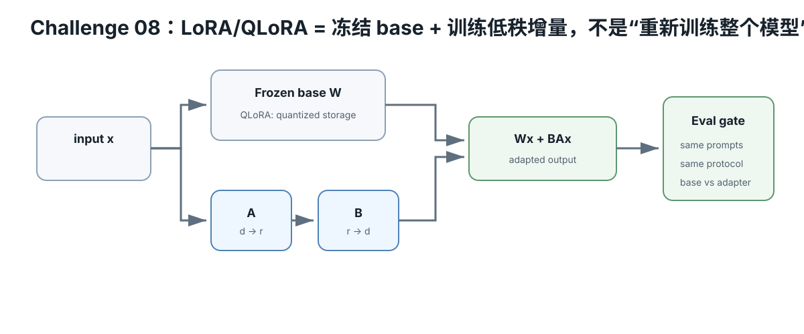

# Challenge 08 — LoRA / QLoRA：低成本适配，不是“给模型灌知识”

硬件等级：L0 设计；L2/L3 可选训练  
风险：safe（软件）  
成本：L0 为 0；训练只用已有硬件

<figure>
  
  <figcaption>LoRA/QLoRA 用冻结 base 加低秩 adapter 学习增量；QLoRA 还把 base 以量化形式驻留，评估时要固定 base、adapter 与协议身份。</figcaption>
</figure>

## 真实问题

你有一个基础模型，希望它更稳定输出某格式、学习某种风格/任务行为、适配小领域指令。

应该用 prompt、RAG、LoRA 还是 full fine-tune？

先选问题类型，再选技术。

## 1. LoRA 的核心

对原权重矩阵 W，不直接训练整块 W，而学习低秩更新：

~~~text
W' = W + delta_W
delta_W ~= B A
rank r << matrix dimensions
~~~

基础权重冻结，训练参数大幅减少。

重要变量：
- target modules；
- rank r；
- scaling/alpha；
- dropout；
- dataset；
- optimizer；
- sequence length；
- train/eval split。

## 2. QLoRA 多了什么

经典 QLoRA 思路：
- frozen base 以低 bit quantized representation 驻留；
- 梯度通过 frozen quantized base；
- 只训练 LoRA adapter。

不要混淆：
- inference quant file；
- training-time quantization；
- adapter dtype；
- optimizer state。

## 3. 什么时候不用 LoRA

知识经常变化：优先考虑 RAG。

只差 prompt/template：先修 prompt。

需要严格外部事实引用：LoRA 不能替代 retrieval/provenance。

没有评测集：先建立 evaluation，别先训练。

## 4. L0 memory budget

画训练内存：

~~~text
base weights
+ quant metadata
+ LoRA params
+ LoRA gradients
+ optimizer states
+ activations
+ temporary workspace
~~~

训练显存不能用“模型文件大小”估算。

## 5. Dataset discipline

保存：
- dataset source/license；
- preprocessing；
- train/eval split；
- prompt/template；
- max length；
- exact examples hash/version。

避免把 evaluation 样本泄漏进 training。

## 6. Quality gate

至少比较：
- base；
- adapter；
- target task；
- general regression fixtures；
- deterministic/format compliance；
- memory/training time。

“loss 降了”不等于真实任务变好。

## 7. Current implementation path

Hugging Face PEFT 是当前常用 LoRA 框架之一；具体 API、quant integration、supported models 会变化。

课程固定原理，不固定 pip 版本/参数。

## Retrieval Practice

1. LoRA rank 增大，训练参数和表达能力通常怎样变化？
2. QLoRA 的“4-bit”发生在哪一层，为什么不等于 adapter 也是 4-bit？
3. 为什么经常变化的事实更适合 RAG？
4. 没有 held-out eval 时，training loss 能证明什么？

## 完成证据

先做 Adapter Design Card：
- base identity；
- problem type；
- why LoRA not prompt/RAG；
- target modules/rank hypothesis；
- dataset provenance；
- memory budget；
- evaluation gate；
- rollback（不用 adapter 即回 base）。

真机训练后再补 adapter hash 与结果。

## Sources

- LoRA paper: https://arxiv.org/abs/2106.09685
- QLoRA paper: https://arxiv.org/abs/2305.14314
- Hugging Face PEFT: https://huggingface.co/docs/peft/
- PEFT LoRA guide: https://huggingface.co/docs/peft/main/conceptual_guides/lora

## Expected outcome

你应能说明 base model、adapter、训练 dtype/quant、dataset、eval fixture 与显存预算的关系，并用 quality gate 判断 adaptation 是否真的改善目标任务。

## Failure recovery

训练 loss 下降但目标 fixture 退化时，不继续盲目加 epoch；先检查数据泄漏、模板/tokenizer、eval identity 与 overfitting。

## What this does NOT prove

LoRA/QLoRA 不是自动“让模型学会新知识”的保证；小训练集上的提升也不能推广到所有任务。

## No-hardware path

可只做 memory budget、dataset/eval design 和 adapter identity worksheet；真实训练延后。
