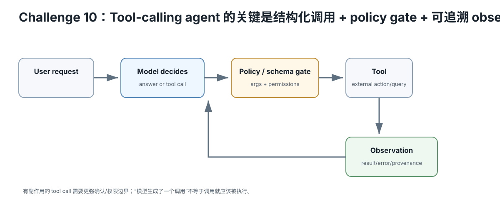

# Challenge 10 — Tool Calling / Agent：模型提议，宿主验证并执行

硬件等级：L0/L1  
风险：medium（工具权限）  
成本：0

<figure>
  
  <figcaption>Tool-calling agent 的核心是结构化调用、schema/policy gate 与可追溯 observation；模型提出调用不等于调用天然允许执行。</figcaption>
</figure>

## 最重要的安全模型

不要把 agent 想成：

~~~text
LLM 可以操作电脑
~~~

而要想成：

~~~text
LLM generates a proposed structured action
→ host validates
→ policy decides
→ tool executes
→ result returns to model
~~~

**执行权限属于 host，不属于模型。**

## 1. Tool schema

一个工具至少定义：
- name；
- purpose；
- typed arguments；
- validation；
- allowed range；
- output schema；
- side effects。

L0 从无副作用工具开始：
- calculator；
- unit conversion；
- lookup in a local static table。

## 2. Tool-call loop

~~~text
user
→ model
→ structured tool call
→ JSON/schema validation
→ policy
→ execute
→ tool result
→ model final answer
~~~

保存每一步 raw message。

## 3. 不要给第一版 agent shell

高风险反例：

~~~text
tool = exec arbitrary shell command
~~~

尤其不要把 retrieved web/doc text、user-supplied content、model output 直接拼进 shell。

先做 allowlist、typed tools、read-only tools。

## 4. Failure cases

测试：
- nonexistent tool；
- missing arg；
- wrong type；
- out-of-range；
- model invents extra args；
- tool error；
- prompt injection tries to call unauthorized tool；
- repeated loop。

Agent 必须能失败得清楚。

## 5. Current llama.cpp case study

当前 llama-server 支持 OpenAI-style function/tool calling；具体 chat-template/tool-call style 与 flags 会演进。

Current server 也有实验性 built-in tools；上游明确提示相关能力不适合不可信环境。

本课程第一版不使用内置 shell/file-write 工具。

## 6. Evaluation

不要只测“成功 demo”。

记录：
- tool selection accuracy；
- argument validity；
- task success；
- unauthorized-call rate；
- retries/loops；
- latency/token cost。

## Retrieval Practice

1. 为什么 LLM 不应该直接拥有执行权限？
2. JSON schema validation 能防什么，不能防什么？
3. read-only calculator 为什么是更好的第一工具？
4. tool result 为什么也应该被当成不可信数据输入模型？

## 完成证据

做一个 2–3 个无副作用工具的小 agent：
- schemas；
- policy；
- 10 条正常 fixture；
- 10 条错误/攻击 fixture；
- raw trace；
- success/failure matrix。

## Current Source

- llama.cpp server: https://github.com/ggml-org/llama.cpp/blob/master/tools/server/README.md

运行前 pin commit 并重新检查 tool-calling 文档。

## Expected outcome

完成一个最小、白名单、低权限 tool loop，并能展示 schema validation、拒绝非法参数、超时/失败处理和可审计 tool result。

## Failure recovery

第一版不要给 shell/任意文件系统/广泛网络权限。Tool call 解析失败时先缩到纯函数工具与固定 fixture。

## What this does NOT prove

模型正确选择一次工具不代表 agent 安全；自然语言确认也不能替代真正的权限边界与参数验证。

## No-hardware path

小模型或 mock model/tool fixture 即可验证 orchestration 和安全边界。
