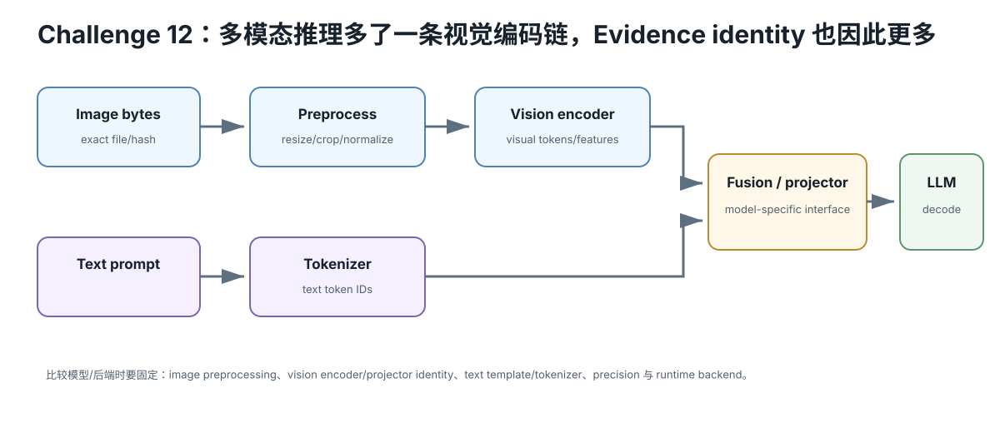

# Challenge 12 — 本地多模态：Text Model 之外还有哪些 Artifact 与预算？

硬件等级：L0 设计；L1/L2 真机  
风险：safe；注意图片/音频隐私  
成本：0

<figure>
  
  <figcaption>多模态本地推理多出 image preprocess、vision encoder/projector 等身份层；比较后端时这些条件必须与 text tokenizer/runtime 一起固定。</figcaption>
</figure>

## Goal

把“本地模型”从单一 GGUF 扩展成：

~~~text
text model
+ multimodal encoder/projector
+ media preprocessing
+ prompt/template
+ runtime integration
+ extra memory/compute
~~~

多模态不是“把图片当文字 token 直接塞进去”。

## 1. Artifact identity

至少冻结：
- text model；
- multimodal projector/encoder artifact；
- tokenizer/chat template；
- runtime commit；
- input media bytes/hash；
- image resize/crop/audio preprocess（如果适用）。

只保存 model name 不够。

## 2. 处理链

视觉例子：

~~~text
image bytes
→ decode/resize/normalize
→ vision encoder
→ visual features/tokens
→ projector
→ language-model context
→ generation
~~~

每层都可能有 device placement、memory、latency、dtype、compatibility。

## 3. Context / Memory Budget

多模态输入可能增加：
- encoder working set；
- projector weights；
- visual/audio tokens；
- KV/context；
- preprocessing buffers。

因此“文本 8B Q4 能 fit”不能直接推导“同系列视觉模型也一样 fit”。

## 4. Quality fixture

不要只拿一张猫图 demo。

准备：
- simple object；
- OCR/文字；
- chart/table；
- spatial relation；
- unsupported/ambiguous；
- privacy-sensitive fixture（用人工合成，不放真实私人资料）。

记录输入 hash 与 expected rubric。

## 5. Current llama.cpp case study

当前 llama.cpp 的 multimodal 子项目通过 libmtmd/相关工具支持多种视觉模型，且上游明确说明该区域快速开发、breaking changes 预期较高。

因此课程不固定一个永久 CLI。

运行时：
- pin commit；
- 阅读当前 multimodal docs；
- 保存 text + projector identities；
- 保存实际 offload/device log。

## Retrieval Practice

1. 为什么同名 vision model 需要 text/model-projector 双重身份？
2. image tokens 为什么会影响 context/KV？
3. projector offload 改变的是哪类 capacity/performance？
4. 多模态 support 快速变化时，哪些内容放 Intelligence 而不是 stable Lesson？

## 完成证据

Multimodal Packet：
- text model hash；
- projector/encoder hash；
- runtime commit；
- input media hashes；
- preprocess identity；
- memory before/after；
- latency split（可测时）；
- quality fixtures；
- privacy non-claims。

## Current Source

- llama.cpp multimodal docs: https://github.com/ggml-org/llama.cpp/blob/master/tools/mtmd/README.md

运行前重新检查当前 upstream。

## Expected outcome

把 text model、vision/audio encoder/projector、preprocessing、token/context expansion、memory budget 与质量 fixture 分开记录，形成完整 multimodal artifact chain。

## Failure recovery

模型加载成功但结果异常时，先检查 projector/processor/template/artifact revision 是否匹配，不要先归因 GPU。

## What this does NOT prove

“支持图片/音频输入”不等于质量足够，也不等于 multimodal path 与纯文本共享相同性能瓶颈。

## No-hardware path

使用模型 config/model card 做 artifact + memory/context worksheet；真实媒体推理延后。
