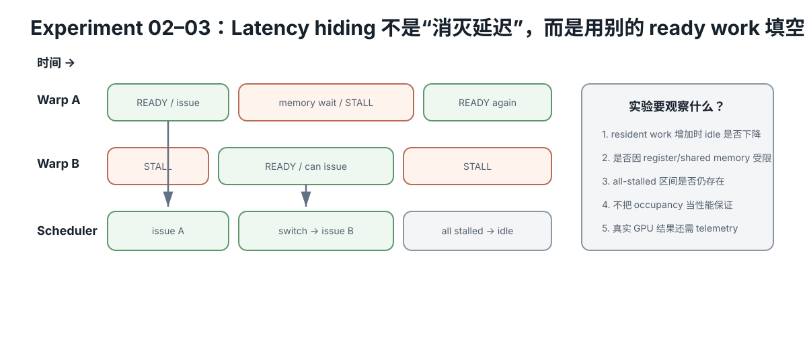

# Experiment 02 — Scheduler 如何用更多 resident groups 隐藏等待？

Hardware level: L0  
Risk: safe  
Cost: 0  
需要：Python 3  
替代路径：没有 Python 时，可直接手算前 30 cycles 的 1-group 与 4-group 情况。

<figure>
  
  <figcaption>Latency hiding 调度：某个 warp 等待时，调度器只能用其他 ready work 填空；所有 warp 都 stall 时仍会 idle。</figcaption>
</figure>

## 问题

假设一个极简 GPU scheduler：

- 每 cycle 最多发射 1 条指令；
- 每个 resident group 重复执行 4 条 compute instruction；
- 然后发射 1 条 memory instruction；
- memory instruction 之后，该 group 因依赖等待 20 cycles；
- scheduler 每 cycle 都优先找一个 ready group。

只有 1 个 resident group 时会怎样？

如果同时 resident 2、4、8、16、32 个 groups，scheduler 的 idle cycles 会怎样变化？

## 为什么做这个实验

真实 GPU 的 warp/wavefront scheduler 复杂得多，而且不同架构的 scheduler 数量、issue width、pipeline 和 memory latency 都不同。

这个实验只保留一个稳定机制：

**一个 group stall 时，如果还有其他 ready resident groups，scheduler 可以继续发射工作。**

它不是周期精确 GPU 模拟器。

## 运行

~~~bash
python simulate.py
~~~

## 观察

重点看 issue utilization：

- 1 group：等待几乎完全暴露；
- 2–8 groups：更多等待被其他 groups 覆盖；
- 16 groups：模型已经接近饱和；
- 32 groups：在本参数下达到 100% issue utilization。

然后比较 8 groups 与 16 groups：

在这个模型里，如果 register/shared-memory/LDS pressure 让可驻留 groups 从 16 降到 8，issue utilization 会从约 94.4% 降到约 76.4%。

再比较 16 groups 与 32 groups：

resident groups 翻倍，但利用率只从约 94.4% 到 100%。这就是“更多 occupancy 有递减收益”的最小反例。

## 你应该得出的结论

1. latency hiding 依赖“还有别的 ready group”，不是让单次 memory latency 变短。
2. occupancy 提供 latency-hiding headroom，但不是 performance 本身。
3. register/shared-memory/LDS 使用增加，可能减少 resident groups。
4. 当已有足够 ready groups 时，继续增加 occupancy 的收益会变小甚至没有收益。
5. 真实 kernel 还要同时考虑 memory bandwidth、cache、ILP、divergence、pipeline 和指令混合。

## Evidence

提交 Experiment Card，并回答：

1. 1 group 为什么只有约 20.8% issue utilization？
2. 16 → 32 groups 为什么没有获得 2x throughput？
3. 如果一个 kernel 用更多 registers 把 resident groups 从 16 限制到 8，这一定是坏优化吗？为什么？
4. 把这个模型分别映射到 NVIDIA warp/SM 和 AMD wavefront/CU。

## Hypothesis

resident groups 增加时，scheduler 更容易在某组等待 memory 时找到其他 ready work，因此 issue utilization 先快速上升、随后收益递减；latency 本身并没有变短。

## Fixed variables

compute/memory 指令模式、20-cycle wait 与 scheduler issue width 固定，只改变 resident group count。

## What to observe

- 1/2/4/8/16/32 groups 的 idle cycles 与 issue utilization；
- 8→16 与 16→32 的边际收益；
- resident group 减少如何暴露等待；
- 为什么 occupancy 是 headroom 而不是性能本身。

## Troubleshooting

- 不要把 group 数直接等同真实 warp occupancy 百分比。
- 这个模型没有带宽竞争；真实系统 groups 太多也可能争同一 memory roof。
- register/shared-memory 限制只是 residency 原因之一。
- 更多 groups 不保证所有 kernel 更快。

## What this proves

你能解释 scheduler 如何通过其他 ready groups 隐藏依赖等待。

## What this does NOT prove

它不是任何 NVIDIA/AMD GPU 的周期级模拟器。

## No-hardware path

完整 L0，可手算。

## Transfer question

一个优化让每线程寄存器更多、resident warps 下降，但单 warp 指令更少。为什么不能只看 occupancy 就判断它更差？
