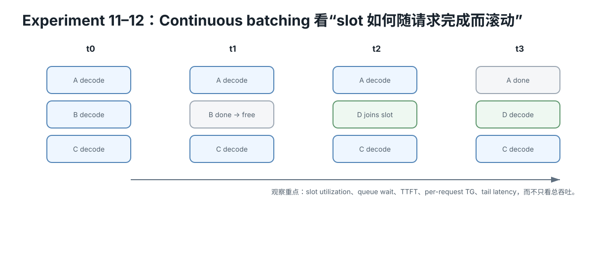

# Experiment 11 — Slots、Queue 与 Continuous Batching 概念实验

Hardware level: L0  
Risk: safe  
Cost: 0  
需要：Python 3

<figure>
  
  <figcaption>Continuous batching 要看请求完成后 slot 如何释放并被新请求接替；吞吐提升必须和排队、TTFT、TG、tail latency 一起读。</figcaption>
</figure>

## 问题

为什么 server slots 增加时：

- aggregate throughput 可能上升；
- queue wait 可能下降；
- active-user token cadence 却可能变慢？

continuous batching 又为什么比固定 static groups 更适合长短请求混合？

## 模型

每个 decode step：

- 对每个 active request 产生 1 token；
- batch 越大，step 越慢；
- 但成本低于线性增长。

抽象公式：

~~~text
step_time(batch) = 1 + 0.22 × (batch - 1)
~~~

这不是任何真实 GPU 的 timing model。

它只用来隔离：

~~~text
queue
batch amortization
per-user cadence
dynamic admission
~~~

## Part A — 8 个同时到达的等长请求

配置：

- 8 requests
- each 32 output tokens
- all arrive at t=0
- slots = 1 / 2 / 4 / 8 / 16

运行：

~~~bash
python simulate.py
~~~

观察：

- makespan
- aggregate tokens / time-unit
- average first-token wait proxy
- max first-token wait proxy
- active step time

注意 first-token wait proxy：

- 包含 queue + first decode step；
- 不包含真实 prompt processing / tokenization / network。

所以不要把它叫真实 TTFT。

## Part B — Static vs Continuous

请求 output lengths：

~~~text
8, 32, 8, 32, 8, 32
~~~

slots=2。

### Static groups

先固定两两成组。

即使短请求完成，也要等同组长请求结束，下一组才能进来。

### Continuous admission

任何 request 完成后，queue 中下一个 request 立刻填入空 slot。

## Expected insight

continuous batching 不要求：

~~~text
所有 request 同时开始
所有 request 同时结束
~~~

它让 active set 动态变化。

## Evidence

回答：

1. 为什么 slots 1→8 时 aggregate throughput 不是 8×？
2. 为什么 slots 越多 active step time 反而增加？
3. 为什么 queue wait 同时下降？
4. static groups 为什么在长短请求混合时浪费 slot？
5. slots=16 为什么对只有 8 个请求没有进一步收益？
6. 这个模型为什么不能用来预测真实 llama-server 的 tok/s？

## Hypothesis

slots 增加会降低部分 queue wait 并提升 aggregate throughput，但 batch 变大也会增加每步成本，因此单用户 cadence 可能恶化；continuous admission 在长短请求混合时比 static group 更少浪费空 slot。

## Fixed variables

Part A 固定 8 个 32-token 请求，只改 slots；Part B 固定请求长度序列与 slots=2，只改 admission policy。

## What to observe

- makespan；
- aggregate throughput；
- first-token wait proxy；
- active step time；
- static vs continuous 的 slot idle 时间；
- slots 超过请求数为何无新增收益。

## Troubleshooting

- first-token wait proxy 不是实际 TTFT。
- 公式是 toy model，不能拿数值预测 llama-server。
- aggregate throughput 与 per-user cadence 要同时看。
- static group 的浪费来自短请求完成后不能立即补位。

## What this proves

你能解释 queue、slot、batch amortization 与 per-user latency 的基本 tradeoff。

## What this does NOT prove

它不模拟真实 GPU、KV、prefill、continuous-batching scheduler 或网络延迟。

## No-hardware path

完整 L0。

## Transfer question

为什么从 4 slots 增加到 8 slots 可能让总吞吐更高，但每个活跃用户的 token 间隔也更长？
