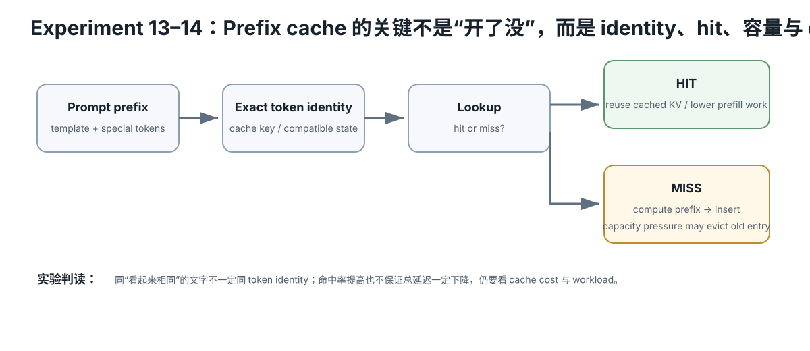

# Experiment 13 — Prefix Cache Capacity / Hit / Eviction

Hardware level: L0  
Risk: safe  
Cost: 0  
需要：Python 3

<figure>
  
  <figcaption>Prefix cache 的核心是 exact token identity、hit/miss、容量压力与 eviction；相似文本不自动等于可复用缓存。</figcaption>
</figure>

## 问题

“开启 Prefix Cache”为什么不代表一定有收益？

我们同时观察：

- hit count
- reused prompt tokens
- processed prompt tokens
- finite capacity
- eviction
- decode work

## Workload

请求序列：

~~~text
A, B, A, C, A, B
~~~

每个 request：

~~~text
shared prefix = 1024 tokens
unique suffix = 64 tokens
new output    = 128 decode tokens
~~~

只有 prefix ID 相同才可复用。

## Cache model

容量单位是“完整 prefix entry”，不是现实 GPU block。

测试：

~~~text
capacity = 0, 1, 2, 3
~~~

eviction：

~~~text
LRU-like
~~~

这个 policy 只用于教学。

## 运行

~~~bash
python simulate.py
~~~

## 为什么固定 decode=128？

为了直接隔离：

~~~text
prefix cache changes prompt work
but not new-output decode work
~~~

总 decode：

~~~text
6 requests × 128 = 768 tokens
~~~

所有 cache capacity 都相同。

## 观察

### capacity 0

没有 cache。

所有 6 个 request 都处理：

~~~text
1024 + 64 = 1088 prompt tokens
~~~

总 prompt processed：

~~~text
6528
~~~

### capacity 1

虽然“开启 cache”，但工作集 A/B/C 不断把彼此赶出去。

这个访问序列产生 0 hit。

### capacity 2

A 可以在部分访问中留住：

- 2 hits
- 2048 reused prefix tokens
- prompt work 降到 4480

### capacity 3

A/B/C 都能留下：

- 3 hits
- 3072 reused
- prompt work 3456

## Evidence

回答：

1. 为什么 capacity=1 和 cache=off 一样没省 prompt tokens？
2. capacity=2 哪两个 request 命中？
3. 为什么 saved tokens 比 hit rate 更有解释力？
4. 为什么 decode total 永远是 768？
5. 真实 block cache 为什么比“3 个 entry”复杂？
6. LRU 为什么只是一个 policy，而不是 Prefix Cache 定义本身？

## Hypothesis

Prefix Cache 是否有收益，取决于请求是否真的共享前缀、cache 容量是否能容纳 working set、以及 eviction policy。仅仅“开启 cache”不能保证命中。

## Fixed variables

请求顺序 A,B,A,C,A,B、每个 shared prefix/suffix/output 长度固定；只改变 cache capacity。

## What to observe

1. capacity=0/1/2/3 的 hit count。
2. reused prompt tokens 与 processed prompt tokens。
3. capacity=1 为什么因为 thrashing 得到 0 hit。
4. decode total 为什么始终不变。
5. hit rate 与 saved/reused tokens 哪个更接近实际 prompt-work 节省。

## Troubleshooting

- prefix ID 必须完全相同才算命中。
- 不要把 unique suffix 算进 reusable prefix。
- cache capacity 单位只是教学 entry，不代表真实 block/page 数。
- eviction policy 会改变命中模式，因此结果不能推广成“LRU 永远最好”。

## What this proves

你能从 workload reuse 与有限容量解释 Prefix Cache 的收益/失效。

## What this does NOT prove

它不预测真实 llama-server block cache、显存占用或 TTFT 改善百分比。

## No-hardware path

完整 L0。

## Transfer question

如果工作集从 A/B/C 增加到 100 个几乎不重复的 prefix，即使 cache 很大，为什么收益仍可能很低？
