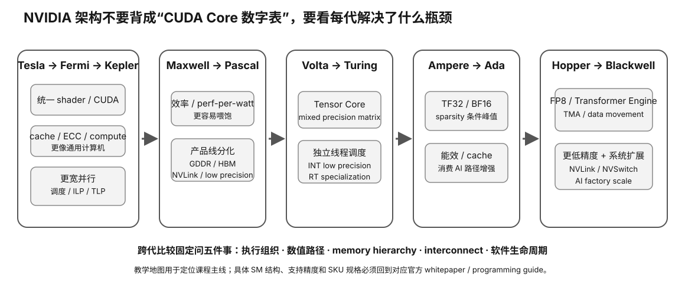

# Experiment 23 — NVIDIA Generation Feature-Lineage Traps

硬件等级：L0

<figure>
  
  <figcaption>NVIDIA 代际比较应沿同一组轴读取：执行资源、矩阵专用化、内存系统、互连与软件支持，而不是只背 CUDA Core 数量。</figcaption>
</figure>

## 问题

架构学习最容易出现的错误不是“年份记错”，而是：

```
architecture family
→ 被误当成
every SKU has the same feature
```

这个实验不模拟真实性能，而是把代际知识做成可验证 assertions。

## 运行

```bash
python3 check_lineage.py
```

脚本验证两类东西：

### A. First-introduction lineage

例如：
- unified programmable CUDA-era foundation → Tesla/G80
- compute L2 cache hierarchy → Fermi
- warp shuffle → Kepler
- SMM scheduler partitioning → Maxwell
- page-faulting Unified Memory → Pascal
- Tensor Core → Volta
- Independent Thread Scheduling → Volta
- async global→shared pipeline → Ampere
- TMA / block cluster → Hopper
- FP4 Tensor path in RTX Blackwell → Blackwell

### B. Variant traps

例如：
- “all Pascal has HBM2” → false
- “all Pascal has GP100-class FP16” → false
- “all Ampere has same FP32 SM” → false
- “Hopper is simply the GeForce successor to Ampere” → false
- “all Blackwell is dual-die” → false
- “Q4 GGUF on Blackwell automatically means native FP4” → false

## 为什么这是实验而不是背答案

你要做的是修改 `student_answers.json` 中的答案，然后让脚本自动判断。

它训练的是：

```
claim
→ architecture family?
→ exact variant?
→ workload/kernel?
→ stable or dynamic?
```

而不是型号记忆。

## 完成标准

- 所有 stable lineage 题正确；
- 所有 variant trap 都能解释为什么错；
- 能自己再添加至少一条“同名架构不同能力”的 assertion。

## Why this experiment

NVIDIA 架构课最容易出现“某代架构支持某功能 → 这一代所有 SKU 都一样”的错误。这个实验训练你把 architecture family、exact die/SKU、runtime path 和 workload 使用证据分层。

## Hypothesis

稳定的 first-introduction lineage 可以用于建立历史脊柱；但任何“这一代都支持/都一样”的 claim 都必须继续落到 exact variant。硬件有某功能也不能自动推出当前 Q4/FP4 kernel 正在使用它。

## Fixed variables

Stable lineage assertions 不随市场变化；variant assertions 使用仓库给定题目。不要为了答对而把架构名替换成某个具体 SKU。

## What to observe

1. 哪些题是 first-introduction lineage。
2. 哪些题故意把 family capability 扩大成 every-SKU capability。
3. “Blackwell 有 FP4 Tensor path”与“任意 Q4 GGUF 原生走 FP4”为什么是两层事实。
4. 哪些结论属于稳定架构事实，哪些需要当前 runtime/backend 再验证。

## Troubleshooting

- 不要把 data-center 与 GeForce 同代产品当同一 die/feature set。
- 不要把 architecture feature 与 SKU memory system 混为一谈。
- “首次引入”不等于后续每个变体都以相同方式实现。
- 当前软件是否启用某 feature 属于动态证据。

## Evidence to save

保存 100% 通过的答案，并新增至少一条你自己的 variant trap，写清它需要哪一层证据才能判定。

## What this proves

你能用“family → variant → runtime → workload”四层框架阅读 NVIDIA 代际资料。

## What this does NOT prove

它不证明任何具体 NVIDIA GPU 的当前 LLM 性能、兼容性或购买价值。

## No-hardware path

完整 L0，不需要 NVIDIA GPU。

## Transfer question

一份架构白皮书写某代支持新低精度格式，但你正在看的消费 SKU 产品页没提。下一步应该直接假设有，还是继续查 exact SKU/backend？为什么？
