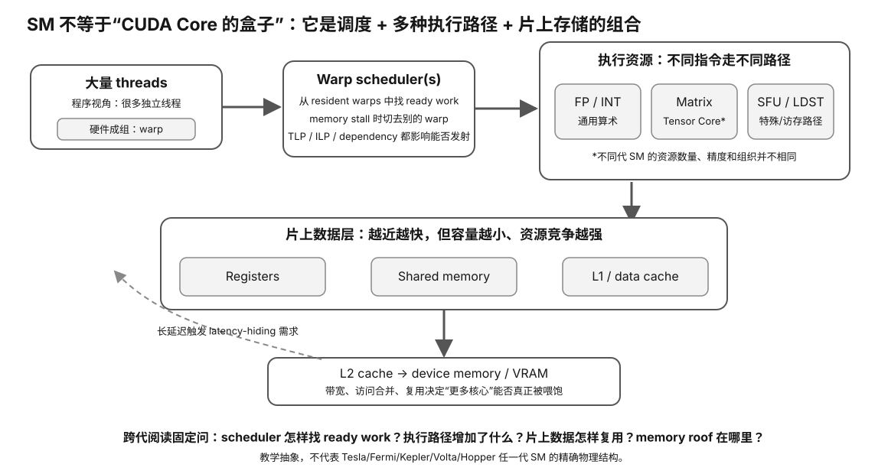

# Experiment 24 — Real NVIDIA Capability / Architecture Inventory

硬件等级：L1/L2（任意可被 NVIDIA driver 识别的 GPU）

风险：只读。

<figure>
  
  <figcaption>真实 NVIDIA capability inventory 要把 SM 执行模型、数据路径与 runtime 暴露出的能力对应起来。</figcaption>
</figure>

## 目标

把“我这张卡是什么架构”从型号印象变成 Evidence：

```
exact GPU name
→ compute capability
→ driver
→ memory
→ PCIe/topology
→ current software-support boundary
```

## A. 采集

```bash
./collect-nvidia.sh > nvidia-inventory.txt 2>&1
```

当前 NVIDIA Programming Guide 官方推荐可直接查询：

```bash
nvidia-smi --query-gpu=name,compute_cap
```

脚本还会保存：
- driver/version；
- memory；
- PCI bus；
- topology；
- full `nvidia-smi -q`；
- optional PyTorch capability/build。

## B. Architecture mapping

运行：

```bash
python3 identify_arch.py
```

脚本调用：

```
nvidia-smi --query-gpu=name,compute_cap
```

然后把 compute capability 映射到当前 architecture family。

## C. 为什么 compute capability 比“RTX 30/40/50”更干净

CUDA software targets architecture capability, not marketing series name.

Examples:
- 7.5 → Turing；
- 8.0 / 8.6 → Ampere variants；
- 8.9 → Ada；
- 9.0 → Hopper；
- 10.x / 12.x → current Blackwell families。

映射表属于动态 intelligence；新架构出现后必须更新。

## D. 接下来检查什么

拿到 architecture 后不要停止。继续问：

1. exact VRAM?
2. memory bandwidth/spec source?
3. Tensor/low-precision support?
4. current CUDA toolkit support?
5. target llama.cpp/PyTorch/TensorRT backend support?
6. PP/TG real benchmark?

## E. 特别是旧卡

如果是 Maxwell/Pascal/Volta：
- 不要只看到“CUDA still runs”就认为能使用最新 Toolkit；
- 对照 `intelligence/gpu/nvidia-generation-support-2026-08-27.md`。

如果是 Kepler/Fermi：
- modern CUDA software-stack compatibility is much more constrained；
- treat them as legacy/educational unless exact older stack is intentionally maintained.

## 结果

填写 `RESULT-TEMPLATE.md`，保留原始 `nvidia-inventory.txt`。

## Why this experiment

型号名只是入口。真正判断 CUDA/LLM 可用性时，需要把 exact GPU、compute capability、driver、VRAM、PCIe/topology 与当前软件支持边界连成同一条证据链。

## Hypothesis

如果当前 NVIDIA 软件路径成立，系统应能稳定报告同一设备身份与 capability；旧卡即使还能被 driver 识别，也可能在最新 Toolkit/backend 上进入受限状态。

## Fixed variables

采集期间不升级 driver、不切换 CUDA/PyTorch/llama.cpp build。先冻结当前环境，再解释结果。

## What to observe

- exact GPU name 与 compute capability；
- driver/build identity；
- VRAM 与 PCI bus/topology；
- PyTorch/llama.cpp 是否看到同一设备；
- architecture mapping 与 exact SKU feature 之间仍有哪些未知。

## Troubleshooting

- nvidia-smi 可见但 PyTorch/llama.cpp 不可见：优先查 build/runtime，不要先怀疑 GPU 损坏。
- compute capability 只说明架构 target，不等于所有 SKU feature 相同。
- 旧卡 support matrix 属动态信息，必须记录版本/日期。

## Evidence to save

保存完整 nvidia-inventory.txt、identify_arch 输出、当前软件版本和 RESULT-TEMPLATE。

## What this proves

你能建立当前 NVIDIA 设备 capability/软件可见性档案。

## What this does NOT prove

它不证明 PP/TG、Tensor Core 实际利用率、长期稳定性或购买价值。

## No-hardware fallback

没有 NVIDIA GPU 时完成 Experiment 23。

## Transfer question

一张卡 compute capability 已知，但目标 llama.cpp build 不枚举它。此时“架构支持”与“当前可用”为什么必须分开写？
