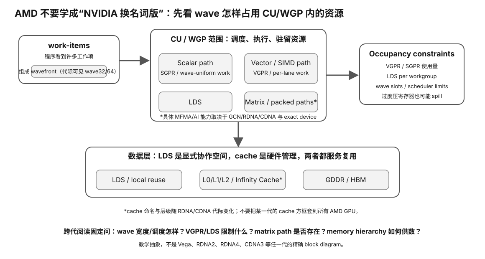

# Experiment 26 — Real AMD gfx Target / ROCm Inventory

硬件等级：L1/L2（任意 AMD GPU；完整 ROCm path 需要已安装 ROCm/HIP）

风险：只读。

<figure>
  
  <figcaption>真实 AMD/ROCm inventory 要同时记录 wave、CU、VGPR/SGPR/LDS 语义和当前软件栈是否真正支持。</figcaption>
</figure>

## 目标

把：

```
"这是 RDNA3 / RDNA2 / Vega"
```

升级成：

```
exact model
→ exact gfx target
→ wavefront properties
→ ROCm/HIP version
→ official support status
→ backend visibility
```

## A. 一键采集

```bash
./collect-amd.sh > amd-inventory.txt 2>&1
```

采集器只做只读命令：

- `lspci`
- `amd-smi version/list/static`
- `rocminfo`
- `hipconfig --full`
- optional PyTorch HIP identity

## B. 解析 gfx target

```bash
python3 identify_arch.py
```

脚本解析 `rocminfo` 中形如：

```
gfx1030
gfx1100
gfx1201
gfx90a
gfx942
gfx950
```

的 target，并给出课程 snapshot mapping。

## C. 当前 mapping

常见：

```
gfx803       → GCN/Polaris-era
gfx900/906   → Vega / GCN5
gfx908       → CDNA / MI100
gfx90a       → CDNA2 / MI200
gfx942       → CDNA3 / MI300
gfx950       → CDNA4 / MI350

gfx101x      → RDNA
gfx103x      → RDNA2
gfx110x      → RDNA3
gfx115x      → RDNA3.5
gfx120x      → RDNA4
```

CDNA5/current future targets必须按最新 AMD docs 更新，不在脚本里猜。

## D. Support check

拿到 gfx target 后，打开当前 AMD ROCm support/compatibility matrix，确认：

- exact product 是否列出；
- OS；
- ROCm version；
- Runtime vs full SDK/library support；
- PyTorch/vLLM/llama.cpp support。

不能只因为：

```
gfx1030 = RDNA2
```

就推导：

```
all RX 6000 cards fully supported on this OS
```

## E. AMD SMI current commands

Current AMD SMI docs support：

```bash
amd-smi version
amd-smi list
amd-smi static
amd-smi topology
```

脚本保存 `--help`，所以未来 CLI 改动可追溯。

## F. LLM next step

如果目标 backend 是 llama.cpp：

1. exact build；
2. HIP/ROCm device detection；
3. exact model；
4. PP；
5. TG；
6. VRAM；
7. compare CPU / Vulkan / HIP path if relevant。

不要假设 HIP 一定是每张 Radeon 的最佳 backend；需要 Evidence。

## 结果

填写 `RESULT-TEMPLATE.md` 并保留 `amd-inventory.txt`。

## Why this experiment

AMD 的真实可用性必须落到 exact gfx target、OS、ROCm/HIP 与应用 backend，而不能只写“RDNA2/3 支持 ROCm”。

## Hypothesis

一条完整 AMD 路径应能从 PCI/device identity 一直连到 rocminfo/hipconfig 和目标 backend 枚举；链条中断的位置决定下一步查驱动、ROCm、build 还是 SKU 支持矩阵。

## Fixed variables

采集期间不升级 ROCm、不切换 kernel/driver、不换 llama.cpp build。先记录当前状态。

## What to observe

- exact GPU 与 gfx target；
- ROCm/HIP version；
- amd-smi/rocminfo visibility；
- PyTorch HIP / llama.cpp visibility；
- exact product + OS support state；
- dGPU/consumer vs CDNA 路径差异。

## Troubleshooting

- gfx family 映射不等于 exact SKU 官方支持。
- rocminfo 可见但应用不见，优先查应用 build/backend。
- CLI 缺失本身是有效 Evidence。
- support matrix 属动态信息，记录版本和日期。

## Evidence to save

保存 amd-inventory.txt、identify_arch 输出、support source/version 与 RESULT-TEMPLATE。

## What this proves

你能定位当前 AMD 软件栈在哪一层成立或中断。

## What this does NOT prove

它不证明 HIP 一定最快，也不生成真实 PP/TG 或购买建议。

## No-hardware fallback

没有 AMD GPU 时完成 Experiment 25。

## Transfer question

同为 gfx103x 家族，两张 Radeon 在不同 OS/ROCm 组合中为什么不能只凭架构名推导相同支持状态？
