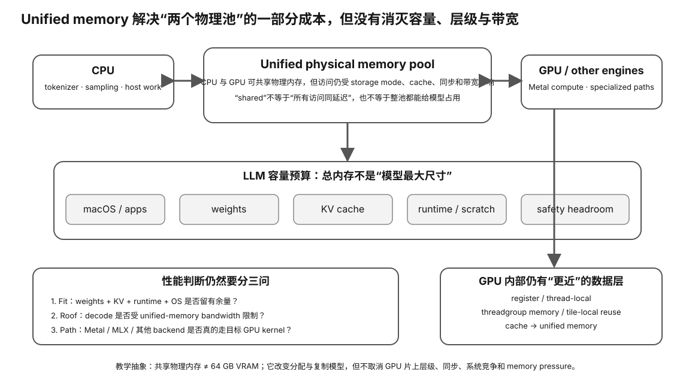

# Experiment 28 — Real Apple Silicon / Metal / MLX Inventory

硬件等级：L1/L2（Apple Silicon Mac；Metal probe 需要 Xcode Command Line Tools）

风险：只读，不修改系统 memory limits。

<figure>
  
  <figcaption>真实 Apple Metal/MLX inventory 需要把 unified memory、GPU/ANE/CPU 路径与实际 runtime backend 对应起来。</figcaption>
</figure>

## 目标

在真实 Mac 上收集：

```
exact chip
→ installed unified memory
→ Metal unified-memory properties
→ recommended GPU working set
→ SIMD-group width
→ threadgroup limit
→ MLX CPU/GPU identity
→ llama.cpp Metal device
```

这样“Mac 有多少可用显存”“Apple SIMD 是多少宽”“MLX/llama.cpp 在跑什么”都不靠猜。

## A. 一键采集

```bash
./collect-apple.sh > apple-inventory.txt 2>&1
```

脚本记录：

- `sw_vers`
- `uname -m`
- `system_profiler SPHardwareDataType SPDisplaysDataType`
- `hw.memsize`
- `vm_stat`
- Metal probe
- optional MLX probe
- optional llama-bench device/build

## B. Metal probe

```bash
xcrun swift metal_inventory.swift
```

输出：

- device name；
- `hasUnifiedMemory`；
- `recommendedMaxWorkingSetSize`；
- `currentAllocatedSize`；
- `maxBufferLength`；
- `threadExecutionWidth`；
- `maxTotalThreadsPerThreadgroup`。

### Why compile a tiny kernel?

`threadExecutionWidth` belongs to the compute pipeline state, not merely to the marketing chip name.

The probe compiles a no-op Metal compute kernel and queries the resulting pipeline.

This is the correct runtime Evidence.

## C. MLX probe

If MLX is installed:

```bash
python3 mlx_probe.py
```

Current MLX API records:
- MLX version if exposed;
- default device;
- CPU device info;
- GPU device info;
- device counts.

It does **not** claim Neural Engine use.

## D. llama.cpp

If `llama-bench` is available:

```bash
llama-bench --version
llama-bench --list-devices
```

For a real performance run, use the existing course Experiment 10 / llama-bench workflow and record:

- exact llama.cpp commit/build；
- Metal device；
- exact GGUF + SHA256；
- PP；
- TG；
- context/KV；
- thermal/power mode。

## E. What to compare across Macs

Use the same model/config and record:

| Mac | unified memory | recommended working set | chip tier | PP | TG |
|---|---:|---:|---|---:|---:|
| | | | | | |

Then add official memory bandwidth from Apple product documentation.

Do not infer bandwidth from `recommendedMaxWorkingSetSize`; they are different properties.

## F. Important M5 check

On M5/A19-era hardware, current Metal 4 tensor support is a rapidly changing backend area.

Save:
- exact macOS；
- Xcode/Metal compiler；
- llama.cpp commit；
- initialization log；
- tensor-path status if runtime reports it。

Do not assume a hardware Neural Accelerator is active just because the chip is M5.

## G. Result

Fill `RESULT-TEMPLATE.md` and preserve raw `apple-inventory.txt`.


## Why this experiment

Apple Silicon 上最容易混淆的是 installed unified memory、GPU recommended working set、memory bandwidth、Metal execution width、MLX device 和 Neural Engine。这个实验把它们分别用 runtime Evidence 固化。

## Hypothesis

一条可用 Apple GPU 路径应能从 exact chip/OS 一直连到 Metal device、pipeline execution properties、MLX/llama.cpp device visibility；任何一层不可见都应保留为 UNKNOWN/unsupported，而不是靠芯片营销名猜。

## Fixed variables

采集期间不修改系统 memory limits、不切换 macOS/Xcode/MLX/llama.cpp build。先记录当前机器。

## What to observe

- installed unified memory 与 recommendedMaxWorkingSetSize 的差异；
- threadExecutionWidth 来自 pipeline runtime，不是营销常数；
- MLX CPU/GPU identity；
- llama.cpp Metal device/build；
- memory bandwidth 必须来自独立规格来源；
- M5/Metal 4 tensor path 属动态 backend 事实。

## Troubleshooting

- 没装 MLX/llama-bench 时记录 unavailable，不为“完成”强装。
- recommended working set 不是 VRAM 额度保证，也不是 bandwidth。
- MLX GPU 可用不证明 ANE 正在参与。
- 新 tensor path 必须以 exact OS/Xcode/runtime log 为准。

## Evidence to save

保存 apple-inventory.txt、Metal probe、MLX probe、llama.cpp device/build identity 和 RESULT-TEMPLATE。

## What this proves

你能建立真实 Apple Silicon 的 unified-memory/Metal/backend capability 档案。

## What this does NOT prove

它不证明真实 PP/TG、ANE 使用、长期稳定性或跨 Mac 性价比。

## No-hardware fallback

没有 Apple Silicon 时完成 Experiment 27。

## Transfer question

一台 Mac 有 64GB unified memory，但 recommended working set 较小。为什么不能直接把 64GB 写成“可用显存”？
