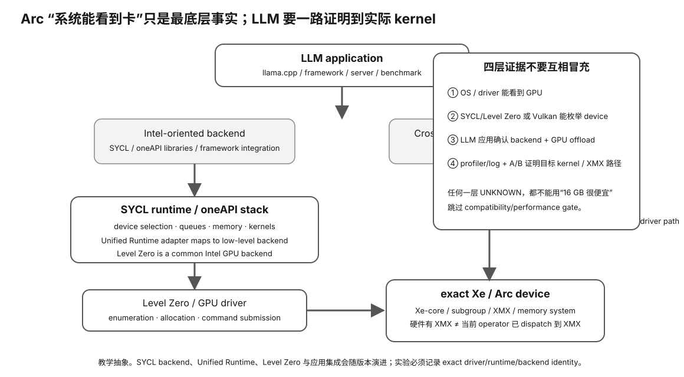

# Experiment 30 — Real Intel XPU / SYCL / Level Zero Inventory

硬件等级：L1/L2

适用：
- Intel Arc A/B dGPU；
- Intel built-in Arc；
- supported modern Intel iGPU；
- Data Center Max/Flex。

风险：只读。

<figure>
  
  <figcaption>真实 Intel XPU/SYCL inventory 要从应用到底层 runtime/driver 逐层确认实际执行路径。</figcaption>
</figure>

## 目标

一次采集：

```
PCI device
→ SYCL / Level Zero visibility
→ torch.xpu visibility
→ llama.cpp SYCL visibility
→ VRAM/global memory
→ subgroup/workgroup properties
```

## A. 一键采集

```bash
./collect-intel.sh > intel-inventory.txt 2>&1
```

尝试记录：

- `lspci`
- `sycl-ls`
- `clinfo -l`
- `icpx --version`
- Level Zero related environment
- PyTorch `torch.xpu`
- llama.cpp `--list-devices`
- `llama-ls-sycl-device` if available

缺少工具是 valid Evidence。

## B. PyTorch XPU

当前 PyTorch 正式提供：

```python
torch.xpu.is_available()
torch.xpu.device_count()
torch.xpu.get_device_name()
```

当前官方验证范围包括 Arc A/B 系列和部分 Core Ultra integrated Arc。

运行：

```bash
python3 xpu_probe.py
```

## C. SYCL / Level Zero

当前 oneAPI 推荐用：

```bash
sycl-ls
```

观察是否出现：

```
[level_zero:gpu]
```

`ONEAPI_DEVICE_SELECTOR` 可以筛选 Level Zero GPU。

## D. llama.cpp SYCL

如果是 SYCL build：

```bash
llama-bench --list-devices
llama-ls-sycl-device
```

当前 upstream 会显示诸如：
- device name；
- global mem；
- max work group；
- max subgroup；
- driver version。

## E. dGPU vs iGPU

### Arc dGPU
```
dedicated GDDR VRAM
```

### Intel iGPU
```
shared system memory
```

不要把两种 “Global mem size” 按相同容量模型解释。

## F. Real LLM A/B

在已有 Experiment 10 基础上记录：
- llama.cpp commit；
- oneAPI/SYCL；
- device；
- model/SHA；
- quant；
- PP；
- TG；
- FlashAttention on/off if current backend supports it；
- raw JSON。

## G. 结果

填写 `RESULT-TEMPLATE.md`。

## Why this experiment

Intel GPU 能被 PCIe/系统识别，只是最底层证据。真正进入 Local LLM 之前，还要确认 SYCL/Level Zero、框架 XPU 与实际 llama.cpp backend 是否都能看到同一设备。

## Hypothesis

一个可用的 Intel GPU 路径应能形成“physical device → low-level runtime → framework/backend enumeration”的连续证据链；链条中断的位置决定下一步查驱动、oneAPI/build 还是应用层。

## Fixed variables

采集期间不升级驱动、不重装 oneAPI、不切换 llama.cpp build。先记录当前环境，之后再做任何修复。

## What to observe

1. PCI device identity。
2. sycl-ls/Level Zero 是否看到 GPU。
3. torch.xpu 是否可用。
4. llama.cpp SYCL build 是否枚举目标 device。
5. dGPU dedicated VRAM 与 iGPU shared memory 的容量语义差异。
6. subgroup/workgroup properties 是设备能力，不是固定跨代常数。

## Troubleshooting

- OS 看见设备但 sycl-ls 不见：优先查驱动/runtime。
- sycl-ls 可见但 llama.cpp 不见：优先查 build/backend。
- torch.xpu 与 llama.cpp 是不同软件路径，不能相互替代证明。
- 当前官方支持范围是动态信息；运行实验时记录版本与日期。

## Evidence to save

保存 intel-inventory.txt、xpu_probe 输出、SYCL/Level Zero/llama.cpp build identity 和 RESULT-TEMPLATE。

## What this proves

你能确认当前 Intel GPU 软件栈在哪一层可见/不可见。

## What this does NOT prove

它不证明实际 LLM PP/TG、XMX kernel 使用、质量或未来版本支持。

## No-hardware fallback

没有 Intel GPU 时完成 Experiment 29；本实验留到 Learner Verified。

## Transfer question

sycl-ls 能看到 Arc GPU，但 llama-bench --list-devices 没有它。最合理的下一步是查硬件坏了，还是查 llama.cpp build/backend？为什么？
