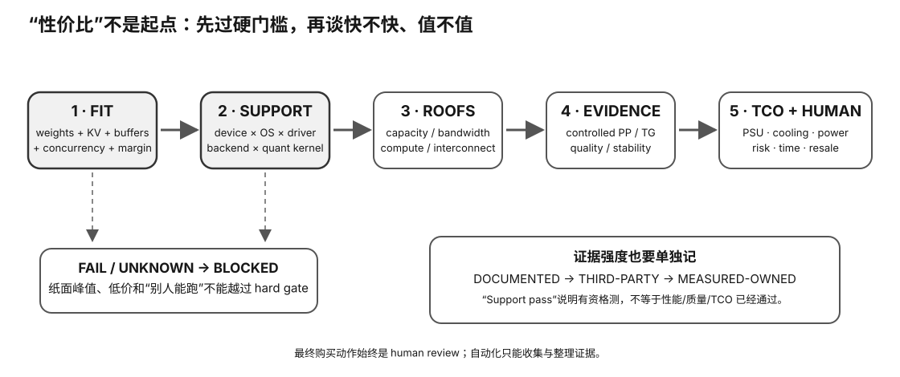

# Experiment 32 — Real Used-Hardware Candidate Dossier

硬件等级：L0/L1

这是买卡/买 Mac 前的 Evidence 模板，不需要先拥有硬件。

<figure>
  
  <figcaption>真实二手候选 dossier 先过容量/兼容/供电等硬门槛，再进入价格、性能与风险的综合比较。</figcaption>
</figure>

## 目标

For one exact listing/candidate, produce:

```
identity
→ workload
→ capacity gate
→ software gate
→ evidence gaps
→ TCO
→ risk
→ decision
```

## 使用

复制模板：

```bash
cp candidate-template.json my-candidate.json
```

填写所有你能确认的字段。

然后：

```bash
python3 evaluate_candidate.py my-candidate.json
```

脚本不会替你猜未知字段。

如果关键字段缺失，输出：

```
NEEDS EVIDENCE
```

## Evidence source等级

每个关键 claim 可以填：

```
E3 = official / local raw
E2 = reproducible / reputable
E1 = weak / seller
E0 = unknown
```

## Hard gates

### Capacity

填写：
- workload runtime footprint；
- candidate usable memory。

### Software

填写：
- support state；
- exact backend/version。

Allowed support states:
- official-current
- official-pinned
- community-enabled
- runtime-visible-only
- unsupported

是否接受 community-enabled 是你自己的 scenario constraint。

## Risk

不要只填“矿卡/非矿”。

记录：
- board condition；
- BIOS；
- repair；
- memory errors；
- corrosion；
- fan；
- seller test；
- return policy；
- software-lifespan risk。

## TCO

记录：
- asking price；
- platform/PSU/cooling extra；
- expected energy；
- repair reserve；
- expected resale。

## Decision

脚本只做结构性检查。

最终人工结论写进：
`RESULT-TEMPLATE.md`。

## Why this experiment

真正买二手硬件之前，你需要把“卖家说什么、官方说什么、你还不知道什么、你的 workload 要什么”放进同一个 dossier。这个实验的目标是阻止凭感觉下单。

## Hypothesis

只要 capacity 或 software hard gate 未满足，或者关键字段缺失，就不应该进入“这卡值不值”的软比较；NEEDS EVIDENCE 本身就是正确结果。

## Fixed variables

一次 dossier 绑定一个 exact listing/candidate 和一个明确 workload。不要把多个卖家/多个 SKU 混进同一文件。

## What to observe

1. identity/workload/capacity/software/TCO/risk 各字段的来源。
2. E0–E3 evidence level 对结论有什么影响。
3. 哪些 unknown 会阻止继续。
4. asking price 为什么不能覆盖 capacity/support fail。
5. software-lifespan risk 为什么属于 TCO/风险的一部分。

## Troubleshooting

- 卖家描述只能算 seller evidence，不是独立验证。
- usable memory 要和目标 runtime footprint 在同一语义下比较。
- community-enabled 是否可接受，要由 scenario constraint 明确。
- unknown 不要填 0/false 来“完成表格”。

## Evidence to save

保存 exact listing snapshot、candidate JSON、evaluator 输出和最终 RESULT-TEMPLATE。

## What this proves

你会对一条真实候选建立可审计的购买前证据包。

## What this does NOT prove

它不证明卖家信息真实，也不自动 BUY。

## No-hardware path

主路径就是购买前 L0 调查，不需要先拥有硬件。

## Transfer question

一张卡价格很好、显存也够，但你找不到目标 OS/runtime 的可靠支持证据。为什么正确状态是 NEEDS EVIDENCE，而不是“先买再说”？
