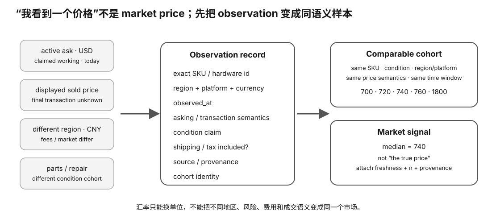

# Experiment 33 — Normalize a Messy Secondhand GPU Search

硬件等级：L0

<figure>
  
  <figcaption>二手市场观察要把同型号但不同成色、版本、附件、保修与时间窗口归一到可比较 cohort。</figcaption>
</figure>

## 问题

搜索“3090”得到 10 个价格：

```
1598
400
3000
7200
7300
7400
7500
7600
7800
9500
```

能不能直接算平均值？

不能。

这些记录里故意混了：

- multi-SKU bait；
- cooler-only；
- broken card；
- stock 3090 24G；
- 3090 48G VRAM mod。

## 运行

```bash
python3 normalize_market.py sample_listings.csv
```

脚本默认只统计：

```
exact_model = RTX 3090
vram_gib = 24
cohort = STOCK
condition = WORKING
```

并把：

```
ASK
SOLD-CONFIRMED
```

分开。

## 目标

学会：

```
search result
!= market sample
```

只有 normalization 后才有 price distribution。

## 完成标准

能解释每条 excluded row 为什么不能进入 stock 3090 24G working-price sample。

## Why this experiment

二手市场最容易制造“看起来有很多数据”的假象。搜索结果里混着残件、改卡、坏卡、引流价和不同显存版本，如果直接平均，得到的不是市场价，而是垃圾混合物的平均值。

## Hypothesis

只有把 exact model、VRAM、cohort、condition 和 price type 标准化后，留下的样本分布才有解释意义。ASK 和 SOLD-CONFIRMED 也必须分开。

## Fixed variables

本实验使用同一份 sample_listings.csv 和固定 inclusion rule。不要为了让均价“更合理”临时删数据。

## What to observe

1. 每条被排除记录到底违反哪个 cohort 条件。
2. STOCK 24G working 样本还剩多少。
3. ASK 与 SOLD-CONFIRMED 的语义为什么不同。
4. 48G 改卡为什么不能和 stock 24G 混在一个 cohort。

## Troubleshooting

- 标题写“3090”不等于 exact model。
- “已售”标签也不自动证明成交金额就是展示价格。
- 维修、显存改装、缺件、整机套装都需要独立 cohort。
- 样本少时应报告 sample count，而不是装作分布很稳定。

## Evidence to save

保存原始 CSV、normalization 输出，以及 excluded rows + exclusion reason。

## What this proves

你会把搜索结果转换成一个定义明确的市场样本。

## What this does NOT prove

它不产生当前真实市场价，也不能证明展示的 SOLD 价格是最终成交价。

## No-hardware path

完整 L0 实验。

## Transfer question

如果一个 3090 48GB 改卡比 stock 24GB 贵 30%，你应该把它视为异常值删除，还是建立独立 cohort？为什么？
