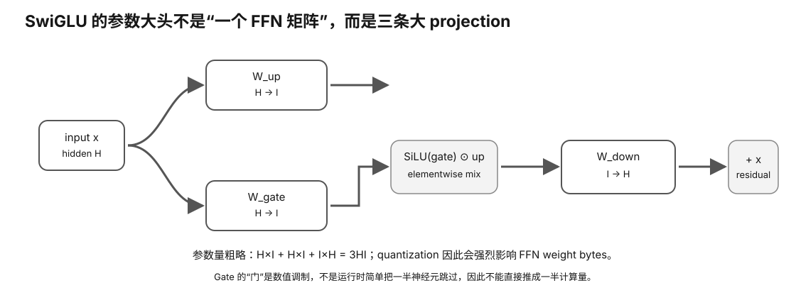

# Experiment 48 — Dense SwiGLU FFN Weight / Shape Model

硬件等级：L0

<figure>
  
  <figcaption>SwiGLU FFN 包含 gate/value 两条投影路径与逐元素门控，再投影回 hidden size；参数与算力估算要按实际结构算。</figcaption>
</figure>

## Default

A LLaMA-like dense teaching configuration:

```
layers = 32
hidden d = 4096
intermediate d_ff = 11008

Hq = 32
Hkv = 32
Dh = 128

weight bits = 16
prefill rows = 512
decode rows = 1
```

## Run

```bash
python3 model.py
```

Try quantized storage proxy:

```bash
python3 model.py --weight-bits 4.5
```

## Expected default structure

FFN weights/layer:

```
3 × 4096 × 11008
=
135,266,304
```

Attention Q/K/V/O baseline:

```
67,108,864
```

Ratio:

```
FFN / attention ≈ 2.016
```

FP16 FFN weight storage/layer:

```
≈ 258 MiB
```

## Shape contrast

Prefill:

```
X      [512,4096]
gate   [512,11008]
up     [512,11008]
down   [512,4096]
```

Decode:

```
X      [1,4096]
gate   [1,11008]
up     [1,11008]
down   [1,4096]
```

## Weight-only AI proxy

The script also prints:

```
16M / weight_bits
```

FLOP/weight-byte.

It deliberately ignores activation/dequant/cache overhead and is not a benchmark.


## Why this experiment

Transformer block 里不只有 attention。Dense LLaMA-like 模型中，SwiGLU FFN 往往拥有很大的权重体积和内存流量。这个实验让你从 shape/weight accounting 理解 FFN 为什么是硬件成本大头。

## Hypothesis

默认配置下 FFN weight baseline 应约为 attention projection baseline 的 2×；降低 weight bits 会按 proxy 减少存储/weight-byte，但不会自动证明 runtime 速度按相同比例提升。

## Fixed variables

layers、hidden、intermediate、attention heads 和 prefill/decode rows 保持不变；Try 阶段只改变 weight-bits。

## What to observe

1. gate/up/down 三个矩阵为什么是 3*d*d_ff。
2. FFN/attention ratio。
3. prefill rows=512 与 decode rows=1 的 shape 差异。
4. weight-only AI proxy 为什么会随 weight bits 改变。
5. 为什么 proxy 忽略 dequant、activation、cache 等开销。

## Troubleshooting

- 不要把 SwiGLU 简化成两个矩阵。
- weight storage proxy 不等于完整模型 VRAM。
- MoE 模型不能直接使用这个 dense accounting 代表 total experts。

## Evidence to save

保存两次运行输出，并画出 gate/up/down 的 shape 流程。

## What this proves

你能从 dense SwiGLU 结构估算 FFN 权重规模和 shape。

## What this does NOT prove

它不是 benchmark，不证明 Q4.5 一定比 FP16 快，也不评价质量。

## No-hardware path

完整 L0。

## Transfer question

为什么 decode 只有 1 row 时，巨大的 FFN 权重仍然可能让单 token 推理很依赖显存带宽？
