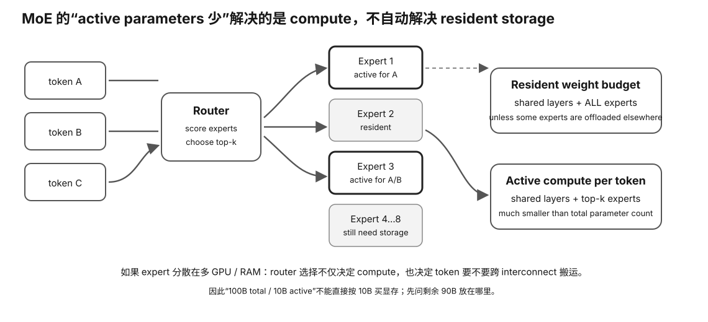

# Experiment 50 — MoE Total / Active / Weight-Reuse Model

硬件等级：L0

<figure>
  
  <figcaption>MoE 每个 token 只激活部分 expert，但总权重仍要考虑驻留/搬运；active params 与 total params 不能混为一谈。</figcaption>
</figure>

## Goal

Separate four quantities:

```
total expert params
active expert params/token
resident expert bytes
idealized batch expert-weight bytes/token
```

Default:

```
d = 4096
expert d_ff = 14336
experts = 8
top-k = 2
MoE layers = 32
effective weight bits = 4.5
batch tokens = 16
```

## Run

```bash
python3 model.py
```

The script evaluates two synthetic routing patterns:

### Balanced

32 assignments spread evenly:

```
[4,4,4,4,4,4,4,4]
```

### Skewed

All tokens choose experts 0 and 1:

```
[16,16,0,0,0,0,0,0]
```

## What it demonstrates

Balanced routing:
- better expert/device utilization;
- more unique expert weights touched.

Skewed routing:
- stronger weight reuse;
- terrible expert-parallel load balance.

So:
```
minimum weight bytes
!=
minimum latency
```

## Scope

The batch weight-read calculation is an **ideal lower-bound proxy**:
one expert weight set counted once if at least one token uses it.

Real runtimes tile weights, have finite cache, dequantize, schedule kernels and may move activations/weights differently.


## Why this experiment

MoE 最大的认知陷阱是把 total params、active params、resident weights 和实际每批次读取权重混成一个数。这个实验故意把四者分开。

## Hypothesis

Balanced routing 会触及更多 unique experts，理想化 weight-read bytes 更高但负载更均匀；Skewed routing 权重复用更强，却可能制造严重 expert imbalance。

## Fixed variables

d、expert d_ff、expert count、top-k、layers、weight bits、batch tokens 全部固定，只改变 routing assignment pattern。

## What to observe

1. total expert params 与 active expert params/token。
2. resident expert bytes 为什么不随 top-k 缩到 active bytes。
3. balanced/skewed unique experts touched。
4. idealized weight reuse 与 load balance 的 tradeoff。
5. 为什么 minimum bytes 不等于 minimum latency。

## Troubleshooting

- total MoE params 不等于每 token compute。
- active params 不等于必须驻留的权重。
- toy 假设 expert weight touched 一次就只读一次，是极理想下界。
- 真机还要考虑 cache、tiling、dequant、expert parallel communication。

## Evidence to save

保存两种 routing 输出，并做四列表：total / active / resident / touched-weight proxy。

## What this proves

你能区分 MoE 的容量、激活计算和批内权重复用概念。

## What this does NOT prove

它不预测真实 MoE TG、routing quality 或多卡 expert-parallel 性能。

## No-hardware path

完整 L0。

## Transfer question

一个 8×7B top-2 MoE 为什么不能简单写成“每 token 就是 14B，所以只需要 14B 权重显存”？
