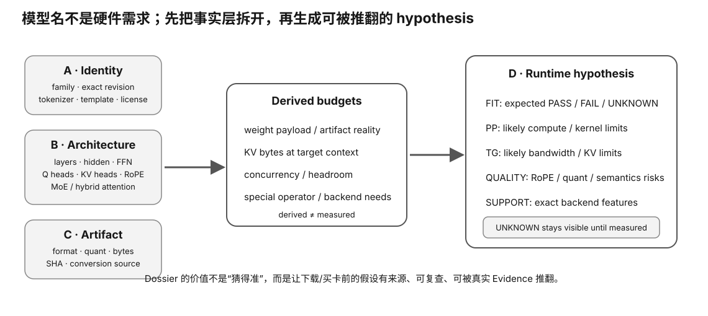

# Experiment 53 — Real Model Architecture Dossier

硬件等级：L0

<figure>
  
  <figcaption>真实 model architecture dossier 要绑定 exact config/model artifact 与来源，避免仅凭营销名称推断结构。</figcaption>
</figure>

## Goal

Create a reusable model-side dossier for an actual model you may deploy.

## Run

With config only:

```bash
python3 dossier.py config.json \
  --context 32768 \
  --kv-bits 16 \
  --sequences 1 \
  --params-b <published-parameter-count> \
  --weight-bpw <effective-bpw> \
  --reserve-gib 1 \
  --memory-gib <candidate-usable-memory>
```

Better, when exact GGUF exists:

```bash
python3 dossier.py config.json \
  --artifact /path/to/model.gguf \
  --context 32768 \
  --kv-bits 16 \
  --memory-gib 24
```

The exact artifact path causes the script to record:
- file bytes;
- SHA256.

## Evidence discipline

The output separates:
- config facts;
- formula-derived proxies;
- runtime hypotheses.

It never outputs fake PP/TG.

## Finish

Fill:
`RESULT-TEMPLATE.md`

Then pair this dossier with:
- Slice 18 hardware candidate dossier;
- Slice 22 real capstone.


## Why this experiment

这个实验把前面的 config 公式真正绑定到“你未来可能部署的一个具体模型 artifact”。关键是让 config facts、artifact identity、derived proxy、runtime hypothesis 分层保存。

## Hypothesis

只要 exact config/artifact 和 context/KV 条件明确，就能形成一个可复用 model-side dossier；但它仍不能替代 runtime benchmark。

## Fixed variables

一次 dossier 只绑定一个 exact config 和一个 exact artifact/revision。context、kv-bits、sequence count、candidate memory 都要显式写入。

## What to observe

1. config facts 与公式派生字段分区。
2. exact artifact 时 file bytes + SHA256 是否被记录。
3. capacity verdict 使用了哪些假设。
4. 哪些字段仍是 runtime hypothesis 而不是事实。

## Troubleshooting

- published parameter count 没有来源时不要硬填。
- effective bpw 必须和 exact artifact 对应。
- artifact SHA 变化后，旧 dossier 不应继续代表新文件。
- capacity proxy 不等于实际 VRAM telemetry。

## Evidence to save

保存 config、artifact SHA、完整命令、dossier 输出和 RESULT-TEMPLATE。

## What this proves

你会建立“模型身份 → 结构 → 内存假设”的可追踪档案。

## What this does NOT prove

它不生成真实 PP/TG/PPL，也不证明 backend compatibility 或长期稳定性。

## No-hardware path

有 config/artifact 即可完成大部分；GPU 不是必需。

## Transfer question

如果同一模型名字重新下载后 GGUF SHA 变了，你为什么应该把它当成新的 artifact identity？
