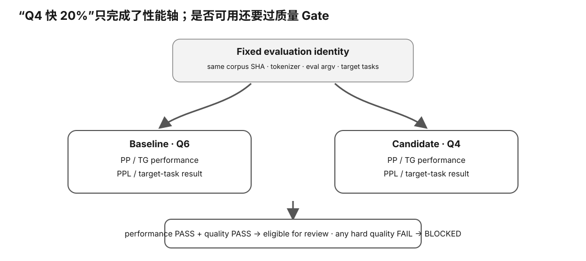

# Experiment 59 — Real Quant / Backend Quality Gate

硬件等级：L1/L2，取决于 model/runtime。

<figure>
  
  <figcaption>真实 quality gate 先确认比较协议与正确性，再决定性能变化是否值得接受；速度提升不能绕过质量门槛。</figcaption>
</figure>

## Goal

Pair a performance A/B with a quality A/B.

Good targets:
- F16/Q8/Q6/Q5/Q4 variants derived from the same base;
- backend/build changes with the same exact model;
- KV representation changes, with additional target-context tests.

## 0. Freeze identity

Record:
- corpus file + SHA256;
- model/source revision;
- baseline artifact SHA256;
- candidate artifact SHA256;
- tokenizer identity;
- llama.cpp commit;
- exact command args.

Also copy:

```bash
cp quality-identity.template.json quality-identity.json
```

Fill the machine-readable identity fields.

I30 uses quality identity schema v2. `evaluation_args` is **not a shell string**; it is the exact JSON argv-token list after removing only executable + model/corpus selectors:

~~~json
{
  "quality_identity_schema_version": 2,
  "tokenizer_identity": "...",
  "corpus_sha256": "...",
  "fixture_revision": "...",
  "evaluation_args": []
}
~~~

If the quality command has additional evaluation arguments, copy them token-by-token and in order into `evaluation_args`.

Experiment 61 / Intelligence I27/I30 requires this small identity artifact to be PACKET-indexed and execution-bound.

I26 separately hashes the actual corpus file, so `corpus_sha256` is not accepted as a standalone self-reported value.

Do not compare unrelated model/tokenizer PPL.

## 1. Current llama.cpp perplexity path

Pinned upstream builds target:

```
llama-perplexity
```

Current official helper uses the form:

```bash
llama-perplexity -m MODEL.gguf -f CORPUS.txt
```

Always inspect current:

```bash
llama-perplexity --help
```

before a real run.

Baseline:

```bash
llama-perplexity -m "$BASE" -f "$CORPUS" | tee baseline-ppl.txt
```

Candidate:

```bash
llama-perplexity -m "$CAND" -f "$CORPUS" | tee candidate-ppl.txt
```

Use the same runtime/build and evaluation args.

### Seal the quality execution evidence

For an auditable run, prefer the Intelligence I28 helper instead of piping only through tee:

~~~bash
python3 ../../../tools/intelligence/capture_quality_eval.py \
  --out-dir baseline-quality-run \
  --model-artifact "$BASE" \
  --quality-corpus "$CORPUS" \
  --quality-manifest quality-identity.json \
  -- \
  llama-perplexity -m "$BASE" -f "$CORPUS"
~~~

Then verify the sealed command/result evidence:

~~~bash
python3 ../../../tools/intelligence/verify_quality_execution.py \
  --quality-command-record baseline-quality-run/quality-command.json \
  --stdout baseline-quality-run/stdout.txt \
  --stderr baseline-quality-run/stderr.txt \
  --packet baseline-quality-run/PACKET.json \
  --model-artifact "$BASE" \
  --quality-corpus "$CORPUS" \
  --quality-manifest baseline-quality-run/quality-identity.json
~~~

I28 binds the exact model and corpus argv paths, hashes the model/corpus, binds the quality identity artifact, and preserves both raw streams.

I30 additionally requires exact equality between the v2 `evaluation_args` token list and the actual executed non-input argv.

### Extract the machine-readable quality metric

After the sealed execution verifies, run:

~~~bash
python3 ../../../tools/intelligence/extract_quality_metric.py \
  --quality-command-record baseline-quality-run/quality-command.json \
  --stdout baseline-quality-run/stdout.txt \
  --stderr baseline-quality-run/stderr.txt \
  --packet baseline-quality-run/PACKET.json \
  --model-artifact "$BASE" \
  --quality-corpus "$CORPUS" \
  --quality-manifest baseline-quality-run/quality-identity.json \
  --out baseline-quality-run/quality-metric.json
~~~

I31 is deliberately narrow: it accepts exactly one supported `Final estimate: PPL = VALUE +/- UNCERTAINTY` line. Chunk-only or ambiguous output is BLOCKED rather than guessed.

I32 makes this independently reproducible `quality-metric.json` mandatory for real non-synthetic intake.

### Compare baseline vs candidate quality

After both sides have complete quality bundles:

~~~bash
python3 ../../../tools/intelligence/compare_quality_metrics.py \
  --baseline-dir baseline-quality-run \
  --candidate-dir candidate-quality-run \
  --baseline-model "$BASE" \
  --candidate-model "$CAND" \
  --quality-corpus "$CORPUS" \
  --out quality-comparison.json
~~~

I33 only computes descriptive PPL delta/ratio when tokenizer, corpus, fixture revision, evaluation argv, parser/metric and quality executable hash/bytes all match exactly.

It does not perform a significance test or turn PPL into a universal quality verdict.

### Execution-variable quality A/B

When the intended Experiment 61 variable is under `variant.execution.*`, do **not** use the I33 exact-identical-argv comparator.

Instead copy:

~~~bash
cp quality-variable-contract.template.json quality-variable-contract.json
~~~

Fill the manifest value ↔ exact quality argv mapping for baseline and candidate.

Then use:

~~~bash
python3 ../../../tools/intelligence/compare_quality_execution_variable.py \
  --baseline-manifest ../61-real-benchmark-evidence-packet/baseline-manifest.json \
  --candidate-manifest ../61-real-benchmark-evidence-packet/candidate-manifest.json \
  --baseline-dir baseline-quality-run \
  --candidate-dir candidate-quality-run \
  --baseline-model "$BASE" \
  --candidate-model "$CAND" \
  --quality-corpus "$CORPUS" \
  --variable-contract quality-variable-contract.json \
  --out quality-comparison.json
~~~

I39 upgrades this to a reproducible schema-v2 comparison artifact and embeds the variable-contract SHA plus both metric SHAs.

Verify it with `verify_quality_execution_variable_comparison.py` before downstream use.

Current safety scope:
- `variant.execution.*` only;
- same exact model artifact;
- same quality executable;
- fixed tokenizer/corpus/fixture identity;
- side-specific evaluation argv must match the explicit contract.

This proves an auditable declared mapping. It does **not** independently prove that an upstream flag has the semantic effect claimed by the contract.

## 2. Dataset

llama.cpp contributors commonly use Wikitext-2 for quantization comparisons, but your own domain corpus can also be useful.

Never compare numbers if corpus/preprocessing differ.

## 3. Optional KL path

Current llama.cpp can record high-precision reference logits and compare a quantized candidate with KL-based statistics.

This can require **tens of GiB** of logit storage for common models/corpora.

Only use after checking disk budget and current `--help`/README.

Do not make KL-logit capture the default beginner path.

## 4. Target task fixtures

Copy:

```
QUALITY-RESULT-TEMPLATE.md
```

Add your real tasks:
- deterministic JSON;
- coding;
- Chinese;
- RAG;
- long-context retrieval.

Freeze prompt identity using Experiment 57.

## 5. Pair performance

Use Experiment 40:
- baseline PP/TG;
- candidate PP/TG;
- same one-variable discipline.

For model-artifact A/B, use I36 → I37 → I38.

For execution-variable A/B, use I39 → I40 → I41.

These paths produce reproducible descriptive tradeoff evidence only. They do not make an automatic decision.

## No fake results

This lab ships with no model PPL or task scores.


## Hypothesis

性能优化/量化只有在 fixed quality identity 下通过质量 gate，才有资格进入性能×质量 tradeoff；不同 tokenizer/corpus/eval argv 的 PPL 不能直接比较。

## Fixed variables

同一 quality A/B 固定 tokenizer、corpus SHA、fixture revision、quality executable/build 与协议；model-artifact 或 execution-variable 变化必须走各自明确的比较合同。

## What to observe

- sealed exact argv 与 raw stdout/stderr；
- unique Final estimate PPL；
- baseline/candidate PPL delta/ratio；
- corpus/tokenizer/evaluation identity equality；
- performance change 与 quality change 是否方向一致；
- target-task fixture 与 generic PPL 的互补性。

## Troubleshooting

- 不同 tokenizer/corpus 的 PPL 不可直接排名。
- ambiguous/chunk-only PPL output 应 BLOCKED，不猜。
- execution-variable quality A/B 必须有显式 argv mapping contract。
- PPL descriptive difference 不自动等于统计显著性或用户任务质量差异。
- KL/logit 路径磁盘成本高，不作为默认 beginner path。

## Evidence to save

保存 corpus/identity、quality command record、raw streams、PACKET、quality-metric、comparison artifact、target-task results 与对应 hashes。

## What this proves

你能为一个真实 model/quant/backend comparison 建立可复现质量证据，并把它与性能分开审查。

## What this does NOT prove

PPL 不是万能质量分数，单一 corpus 也不能代替你的真实任务。

## No-hardware fallback

完成 Experiment 58；真实 PPL 在有模型/runtime 时执行，GPU 不是绝对必需。

## Transfer question

Q4 TG 提升 25%，但 PPL 变差且你的 JSON task fixture 失败。为什么“更快”不能自动通过 release gate？
