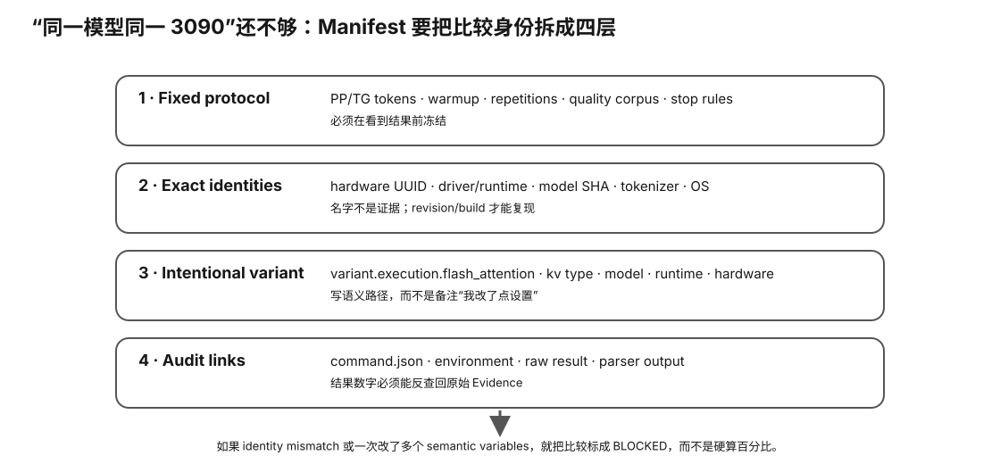

# Experiment 61 — Real Benchmark / Workload Evidence Packet

硬件等级：L1/L2/L3，取决于被测机器。

<figure>
  
  <figcaption>真实 benchmark Evidence packet 要让 manifest、原始输出、hash 与结果摘要相互可追溯，而不是只留下一个 tok/s 数字。</figcaption>
</figure>

## Goal

Upgrade Experiment 40 from a small A/B manifest to a complete reproducibility contract.

Final packet should connect:

```
hardware
→ runtime
→ model artifact
→ execution config
→ prompt token identity
→ sampler
→ PP/TG
→ quality evaluation
→ telemetry
→ raw evidence hashes
```

## 0. Canonical RTX 3090 / Qwen3-8B / llama.cpp skeleton

For the NVIDIA-first real acquisition path, start from:

~~~text
real-evidence-session.rtx3090-qwen3-8b-llamacpp.skeleton.json
~~~

It pre-fills only the existing production catalog IDs:

~~~text
hw:nvidia:geforce-rtx-3090:24g
model:qwen:qwen3-8b
runtime:ggml-org:llama.cpp
~~~

It deliberately leaves local paths and command flags unresolved.

See `CANONICAL-IDS.md` for the current production IDs.

For every field that I53 deliberately refuses to infer, see:

~~~text
SEMANTIC-FIELD-SOURCES.md
~~~

## 1. Start from template

```bash
cp manifest.template.json baseline-manifest.json
cp manifest.template.json candidate-manifest.json
```

Use one stable:
```
comparison_id
```

for both.

## 2. Fill fixed protocol

Freeze:
- PP tokens;
- TG tokens;
- repetitions/warmup;
- tokenizer identity;
- quality corpus SHA;
- fixture revision/eval args.

## 3. Fill semantic variant blocks

### Hardware
Use exact device identity and hash the profile packet.

### Runtime
Record runtime commit/version/backend/build.

### Model
Record exact:
- artifact SHA;
- bytes;
- quant;
- source revision.

### Execution
Record:
- context;
- sequences;
- offload;
- FA;
- KV types;
- split parameters;
- threads.

### Prompt
Prefer Experiment 57:
- rendered SHA;
- token-ID SHA;
- token count.

### Sampler
For real end-to-end generation, record exact sampling identity.

For a pure `llama-bench` model-eval run, use an explicit:
```
mode = "not-applicable-model-eval"
```
rather than inventing sampler settings.

## 4. Declare the intervention

Examples:

```
variant.execution.flash_attention
variant.execution.kv_k
variant.model
variant.runtime
variant.hardware
```

If multiple semantic blocks must change together, do not force the run through the one-variable validator.

Label it a system comparison.

## 5. Validate

```bash
python3 validate_manifest_ab.py \
  baseline-manifest.json \
  candidate-manifest.json
```

Save:

```
validator.txt
```

## 6. Run performance + quality

Performance:
- reuse Experiment 40.

### Preferred workspace → I54 → I53 → I52 path

On the actual machine, prefer creating a clean workspace first:

~~~bash
python3 ../../../tools/intelligence/bootstrap_real_evidence_workspace.py \
  --out-dir /absolute/path/to/e61-real \
  --profile rtx3090-qwen3-8b-llamacpp
~~~

If the exact real files already exist, you may additionally bind:

~~~text
--model-artifact /absolute/path/to/model.gguf
--quality-corpus /absolute/path/to/corpus.txt
--observed-at YYYY-MM-DD
~~~

Open the generated `RUN.md`.

The bootstrap is not I55 and creates no evidence by itself. It only copies templates and binds paths.

If bootstrapping manually instead, first preserve the same-machine semantic sources.

For the NVIDIA-first path, copy and review:

~~~text
semantic-source-probes.rtx3090-llamacpp.json
~~~

Then run:

~~~bash
python3 ../../../tools/intelligence/capture_semantic_sources.py \
  semantic-source-probes.rtx3090-llamacpp.json \
  --out-dir semantic-source-evidence
~~~

Require:

~~~text
SEMANTIC SOURCE CAPTURE: READY-FOR-SEMANTIC-REVIEW
~~~

Review `semantic-source-evidence/bundle.json` and the raw probe streams. I54 does not fill the manifest for you.

Build the concrete hardware profile from that verified bundle:

~~~bash
python3 ../../../tools/intelligence/assemble_hardware_profile.py \
  semantic-source-evidence/bundle.json \
  --out profile.txt
~~~

Require:

~~~text
HARDWARE PROFILE ASSEMBLER: READY
~~~

This profile is a lossless container for the verified I54 streams; it is not an interpreted device claim.

Now start with the real session template and fill:
- canonical IDs;
- exact source paths;
- exact benchmark and quality argv;
- explicit device identity;
- explicit runtime/build/backend;
- explicit model quant/source revision;
- explicit execution semantics.

Then materialize byte-derived identity into a new copy:

~~~bash
python3 ../../../tools/intelligence/prepare_real_evidence_session.py \
  real-session.json \
  --out-dir prepared-session
~~~

Required result:

~~~text
REAL SESSION PREPARE: READY-TO-RUN-I52
~~~

I53 safely computes only fields that are fixed by local bytes/machine-readable source artifacts.

It will not guess runtime or execution semantics.

Now run I52 using the prepared copy:

~~~bash
python3 ../../../tools/intelligence/run_real_evidence_session.py \
  prepared-session/session.json \
  --out-dir real-session-output
~~~

### Direct one-session I52 path

For the first real packet, prefer the orchestrated path after all source artifacts and exact argv are ready:

~~~bash
cp real-evidence-session.template.json real-session.json
# fill every REPLACE/path/argv field

python3 ../../../tools/intelligence/run_real_evidence_session.py \
  real-session.json \
  --out-dir real-session-output
~~~

The runner executes the existing benchmark capture, quality capture, PPL extraction and real-intake verifier in sequence.

It does **not** generate manifests, choose flags, choose a model, or infer canonical IDs.

Required success:

~~~text
REAL SESSION: READY
~~~

Then inspect:

~~~text
real-session-output/session-summary.json
real-session-output/intake-args.json
real-session-output/benchmark/
real-session-output/quality/
~~~

Do not auto-ingest. Review raw evidence and identity first.

### Recommended capture/seal path

After the manifest is filled, prefer the Intelligence capture helper for the raw performance command:

```bash
python3 ../../../tools/intelligence/capture_real_benchmark.py \
  --manifest baseline-manifest.json \
  --out-dir baseline-run \
  --model-artifact /path/to/model.gguf \
  --include profile.txt \
  --include prompt-evidence/manifest.json \
  -- \
  llama-bench -m /path/to/model.gguf -p 512 -n 128 -r 5 ... -o json
```

Use the exact current `llama-bench --help` for the argv after `--`.

The helper does not invent flags. It executes the argv without a shell, preserves stdout/stderr/command identity, and builds a PACKET integrity index.

Success here is only:

```text
CAPTURE: SEALED
```

Then run `verify_real_intake.py` with canonical IDs **and the local model artifact**:

```text
--hardware-profile baseline-run/evidence/profile.txt
--prompt-manifest baseline-run/evidence/prompt-manifest.json
--quality-corpus /path/to/quality-corpus.txt
--quality-manifest /path/to/quality-identity.json
--model-artifact /path/to/model.gguf
--command-record baseline-run/command.json
--quality-command-record baseline-quality-run/quality-command.json
--quality-stdout baseline-quality-run/stdout.txt
--quality-stderr baseline-quality-run/stderr.txt
--quality-packet baseline-quality-run/PACKET.json
--quality-metric baseline-quality-run/quality-metric.json
```

For non-synthetic intake:
- I22 hashes the local GGUF and requires SHA256 + bytes to match the manifest;
- I23 requires command.json to be PACKET-indexed and reparses exact `-m/--model` argv to the same local GGUF;
- I24 hashes the captured hardware profile, requires it to match `variant.hardware.profile_sha256`, and requires PACKET coverage;
- I25 requires an Experiment 57 prompt-evidence manifest and matches messages/template/rendered/token-ID hashes plus token count to `variant.prompt.*`;
- I26 hashes the real quality corpus, matches `fixed.quality_eval.corpus_sha256`, and requires PACKET coverage;
- I27 requires the Experiment 59 machine-readable quality identity manifest and matches tokenizer/corpus/fixture/evaluation identity to `fixed.quality_eval.*`.
- I28 captures and independently verifies the actual quality argv/result streams against the exact model, corpus and quality identity artifact;
- I29 makes the I28 four-file execution bundle mandatory for non-synthetic `verify_real_intake.py` admission while keeping its quality PACKET separate from the benchmark PACKET;
- I30 requires quality identity schema v2 and exact token-for-token evaluation argv binding;
- I31 derives a narrow machine-readable PPL artifact only from a unique supported Final estimate line;
- I32 makes that independently reproducible `--quality-metric` artifact mandatory for non-synthetic intake.

Only the strengthened I07/I20/I22/I23/I24/I25/I26/I27/I29/I30/I32 admission chain may return `INTAKE: READY` for non-synthetic intake.

For a failed benchmark, the helper preserves the evidence but returns `CAPTURE: BLOCKED`.

Prompt identity:
- reuse Experiment 57.

Quality:
- reuse Experiment 59;
- seal each quality run with I28/I30;
- extract and verify `quality-metric.json` with I31;
- supply `--quality-metric` to I32 admission;
- for model-artifact A/B, use I33 → I36 → I37 → I38;
- for declared `variant.execution.*` A/B, use the Experiment 59 quality-variable contract and I35 → I39 → I40 → I41;
- do not route runtime/hardware/system comparisons through either quality-attribution path unless a future explicit contract supports them.

## 6A. Verified tradeoff paths

### Model artifact / quant path

~~~text
I33 quality compare
→ I36 reproduce comparison
→ I37 bind performance + quality
→ I38 reproduce joint artifact
~~~

The Experiment 61 intentional variable must be `variant.model` or below it.

### Execution-variable path

~~~text
quality-variable-contract.json
→ I35/I39 reproduce execution-variable quality compare
→ I40 bind performance + quality
→ I41 reproduce joint artifact
~~~

The Experiment 61 intentional variable must be under `variant.execution.*`.

The model artifact and quality executable remain fixed in the current execution-variable quality path.

### Unsupported attribution

`variant.runtime.*`, `variant.hardware.*`, multi-variable/system comparisons, or other unsupported interventions remain descriptive performance/system comparisons unless a dedicated quality contract exists.

No joint artifact from either path is a purchase recommendation.

## 7. Build packet index

Example:

```bash
python3 build_packet.py \
  baseline-manifest.json \
  candidate-manifest.json \
  profile.txt \
  prompt-evidence/manifest.json \
  baseline.json \
  candidate.json \
  validator.txt \
  comparison.txt \
  baseline-ppl.txt \
  candidate-ppl.txt \
  --out PACKET.json
```

Only list files that actually exist.

## 8. Fill result

Use:
`RESULT-TEMPLATE.md`

## Real acquisition checklist

See:

~~~text
REAL-ACQUISITION.md
~~~

Use it on the actual benchmark machine before the first production ingestion.

## Important

`PACKET.json` is an integrity index.

It does not prove:
- the benchmark was honestly executed;
- thermal/background state was identical;
- statistical conclusions are valid.

Those require experiment discipline and interpretation.


## Why this experiment

Experiment 61 是整门课的严格 reproducibility contract。它不再只保存“跑分是多少”，而是把硬件、runtime、exact artifact、执行参数、prompt token identity、质量、raw streams 与 hash packet 绑成一条可复查证据链。

## Hypothesis

只有当 source identity、semantic manifest、真实 benchmark/quality execution 和 PACKET integrity 全部一致时，一条真实结果才有资格进入后续 catalog/compatibility/tradeoff；任何缺失 semantic fact 或不一致 hash 都应 BLOCKED。

## Fixed variables

先冻结 comparison protocol 与 intentional semantic variable。I54/I53 只捕获/物化可由真实来源证明的事实，绝不自动猜 runtime、backend、quant 或执行语义。

## What to observe

- I54 raw semantic source capture；
- human-reviewed semantic manifest；
- I53 byte-derived identity/preflight；
- I52 real execution；
- performance command/raw streams；
- quality command/raw streams + machine-readable PPL；
- prompt/token/artifact/profile/corpus identity；
- PACKET coverage；
- validator/intake READY 与真实结果含义的区别。

## Troubleshooting

- READY-FOR-SEMANTIC-REVIEW 不是 manifest truth。
- READY-TO-RUN-I52 不是 benchmark result。
- REAL SESSION: READY 也不是购买建议。
- unsupported attribution 路径保持 descriptive，不强塞进 quality causality contract。
- failed execution/raw evidence 仍应保留。
- 不在作者阶段制造 synthetic PP/TG/PPL 冒充 production rows。

## Evidence to save

保存整个 real workspace：probe sources、profile、session/manifests、exact model/corpus/prompt identity、benchmark/quality raw bundles、validator/intake output、PACKET 和人工 review notes。

## What this proves

完成并通过人工复核后，它证明某一次真实 benchmark/quality observation 具备严格可追踪的执行与身份 provenance。

## What this does NOT prove

Packet hash 不证明实验者诚实、不证明背景/热状态完全相同、不自动给出统计结论、兼容性 ranking 或购买决定。

## No-hardware fallback

教材阶段完整学习模板、字段来源和流程即可；真实 production packet 必须等你以后在自己的机器上执行，当前保持 real production benchmark rows = 0。

## Transfer question

一个 benchmark JSON 数字看起来正常，但 model artifact SHA 与 manifest 不一致。为什么这条数据应该 BLOCKED，而不是“先收进去以后再修”？
