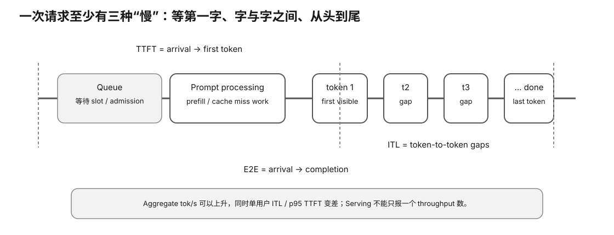

# Experiment 63 — Real llama-server Serving Workload Trace

硬件等级：L1/L2/L3，取决于 server/model。

<figure>
  
  <figcaption>真实服务 trace 要逐请求保存到达、排队、TTFT、decode 与完成时间，才能定位尾延迟来自哪里。</figcaption>
</figure>

## Goal

Capture client-observed serving latency together with pinned/current server metrics.

Evidence:

```
workload identity
→ client request trace
→ /metrics before/after
→ analyzer
→ SLO report
```

No real performance data ships with the course.

## 1. Start server

Example only:

```bash
llama-server \
  -m MODEL.gguf \
  --metrics \
  --parallel 4
```

Confirm current:
```bash
llama-server --help
```

before running.

Continuous batching is enabled by default in the pinned snapshot, but record the actual setting.

## 2. Build exact prompts

Prefer Experiment 57.

For this lab, each JSONL workload item points at an exact already-rendered prompt file.

Example:
```json
{"id":"r0","delay_ms":0,"prompt_file":"prompts/p0.txt","n_predict":64}
```

Using exact rendered files avoids silently changing chat-template serialization inside the load generator.

## 3. Run collector

```bash
python3 client_trace.py \
  workload.jsonl \
  --server http://127.0.0.1:8080 \
  --out-dir evidence
```

The collector:
- schedules requests by `delay_ms`;
- sends streaming `/completion` requests;
- requests returned token IDs;
- records first token-bearing SSE chunk;
- records completion;
- records prompt SHA256;
- saves raw SSE per request;
- snapshots `/metrics` before/after when available.

## 4. Important ITL caveat

The client can timestamp SSE chunks.

But:

```
SSE chunk gap
!= guaranteed true token ITL
```

A chunk can contain:
- multiple token IDs;
- buffering effects;
- non-token events.

Therefore the collector reports:
```
client chunk-gap proxy
```

not "true ITL".

If a runtime exposes validated per-token timings, record them separately.

## 5. Analyze

Convert/inspect:
`requests.csv`

The real collector does not know exact server service-start time, so it cannot isolate queue wait from client timing.

Use:
- client TTFT;
- E2E;
- chunk-gap proxy;
- server `requests_deferred`/processing evidence;
- prompt/predicted counters.

Do not fabricate a queue_ms column.

## 6. Workload identity

Record:
- workload.jsonl SHA;
- every prompt SHA/token count;
- model/runtime manifest;
- slots;
- continuous batching;
- cache state;
- context;
- request arrival schedule;
- requested output lengths;
- client/server location;
- percentile method.

Pair with Experiment 61.

## 7. Current pinned /metrics

The pinned server exposes aggregate:
- prompt tokens/time/rate;
- predicted tokens/time/rate;
- processing/deferred requests;
- context high watermark;
- busy slots per decode;
- speculative metrics.

Pinned tests also verify:
`prompt_tokens_cached_total`.

Save raw metrics text rather than copying one dashboard screenshot.

## 8. Finish

Use:
`RESULT-TEMPLATE.md`.


## Hypothesis

在 workload identity 固定后，client trace 与 raw server metrics 可以给出真实 TTFT/E2E、请求处理/延后和 token counters；没有可信 service-start/per-token timestamp 的量必须保持 proxy/UNKNOWN。

## Fixed variables

exact server build、model SHA、rendered prompts、arrival schedule、n_predict、slots、cache state、context 与 client/server location 固定。比较设置时一次只改变声明变量。

## What to observe

- 每个 request 的 send/first-token-bearing chunk/completion；
- raw SSE 与 returned token IDs；
- TTFT/E2E/chunk-gap proxy；
- metrics before/after 的 processing/deferred/token counters；
- workload/prompt SHA；
- tail percentile 与 SLO。

## Troubleshooting

- SSE chunk gap 不是 guaranteed token ITL。
- first token 不是 service-start，因此不要伪造 queue_ms。
- template/tokenizer 改变会破坏 workload identity。
- metrics unavailable 是有效 Evidence，保留状态即可。

## Evidence to save

保存 workload.jsonl、prompt evidence、requests.csv、raw SSE、raw metrics、manifest 和 RESULT-TEMPLATE。

## What this proves

你能捕获一段真实 Local LLM serving trace，并在客户端可见边界内正确解释 latency/throughput。

## What this does NOT prove

它不能在缺 instrumentation 时拆出精确 queue/service time，也不代表其他 workload 的 serving capacity。

## No-hardware fallback

没有本地 server 时完成 Experiment 62/64。

## Transfer question

客户端 TTFT 从 300ms 增加到 1.2s，但没有 service-start timestamp。你能说 queue 增加了 900ms 吗？
