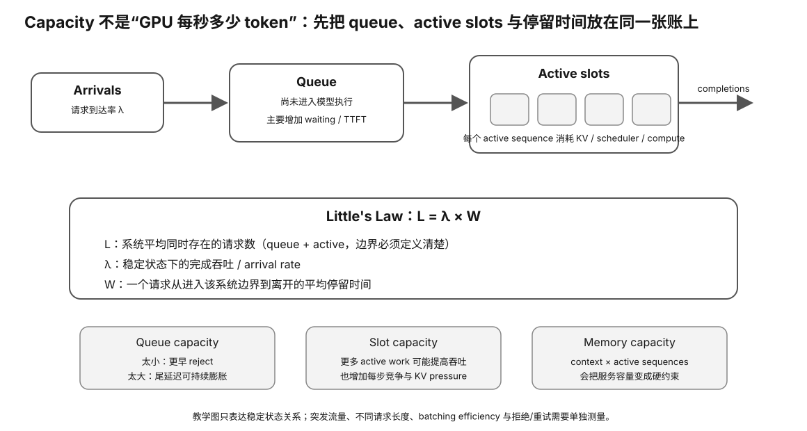

# Experiment 65 — Real Serving Capacity from Request Trace

硬件等级：L1/L2/L3，复用 Experiment 63。

<figure>
  
  <figcaption>真实 serving capacity 要同时看 arrival rate、concurrency、service time 与稳定队列，确认系统没有靠无限排队伪造吞吐。</figcaption>
</figure>

## Goal

Turn a real request trace into:
- completed throughput λ;
- average client time in system W;
- average client in-flight count L;
- peak client in-flight count.

If server-side/service-start timestamps are available, additionally derive:
- queue occupancy;
- active occupancy;
- active-KV planning proxy.

## Run on Experiment 63 output

```bash
python3 capacity_from_trace.py \
  ../63-real-llama-server-serving-trace/evidence/requests.csv
```

Experiment 63 currently records client send/completion but not exact server service-start.

Therefore the expected real output is:

```
L_system available
L_active UNKNOWN
queue UNKNOWN
```

Do not infer service start from first token time.

## If you enrich the CSV

If trusted instrumentation adds:

```
service_start_ms
```

the script will derive active/queue occupancy.

Optional:

```bash
--kv-gib-per-active 1.5
```

is only accepted meaningfully when active intervals exist.

This remains a constant-KV planning proxy.

## Interpretation

### L_system

Includes everything between:
- client send;
- completion.

It may contain:
- network;
- HTTP;
- deferred queue;
- active model service.

### L_active

Requires a trustworthy service-start boundary.

This is closer to slot/active-sequence occupancy.

### Peak

Always report alongside mean.

## Stability warning

A finite completed batch gives an exact area identity.

That does not prove the captured request pattern is representative or sustainable.

Compare multiple workload windows and check whether deferred/backlog state grows.


## Why this experiment

Little's Law 只有在边界定义正确时才有价值。真实 client trace 通常只知道 send/completion，因此可以可靠得到 L_system，却不能凭 first token 猜 service_start 后硬算 active slots。

## Hypothesis

Experiment 63 的现有数据足够算 completed throughput、W_system、L_system 和 peak in-flight；没有可信 service_start 时，L_active/queue 应保持 UNKNOWN。

## Fixed variables

使用同一 request trace 与 observation window。不要为了得到 active occupancy 人工把 first-token timestamp 当 service start。

## What to observe

1. λ、W_system、L_system identity。
2. average in-flight 与 peak in-flight。
3. 为什么 first token 已经包含 queue + prefill。
4. 加入可信 service_start 后，active/queue 才如何被拆开。
5. backlog/deferred 是否随窗口增长。

## Troubleshooting

- completed finite batch 不等于 steady-state sustainable。
- observation window 要一致。
- optional KV proxy 只有在 active interval 存在时才有意义。
- 多个 workload window 应分开报告。

## Evidence to save

保存 requests.csv、capacity output、window definition；如果 enrich service_start，还要保存 instrumentation source。

## What this proves

你能从真实 trace 得到边界正确的 serving capacity 指标，并保留不能计算的 UNKNOWN。

## What this does NOT prove

它不自动给出最佳 slots，也不证明 workload 稳态代表性。

## No-hardware fallback

没有真实 trace 时完成 Experiment 64。

## Transfer question

为什么 TTFT timestamp 不能安全地当作“服务开始时间”来计算 active occupancy？
