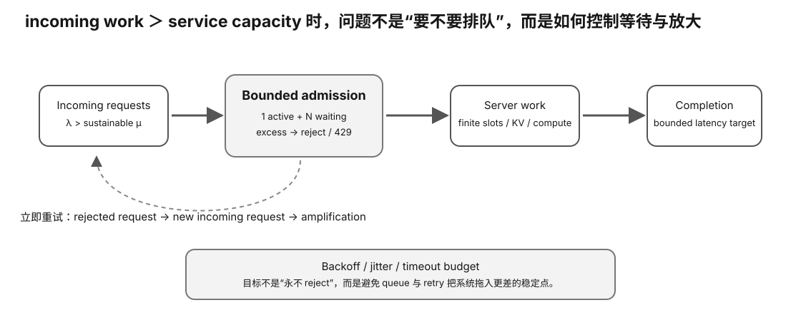

# Experiment 67 — Controlled Local Overload Observation

硬件等级：L1/L2/L3。

<figure>
  
  <figcaption>真实 overload observation 要区分原始负载与 retry amplification，并记录何时开始拒绝、排队和恢复。</figcaption>
</figure>

## Safety / scope

Run only against:
- your own local server;
- a private test server you are authorized to load-test.

The workload generator hard-caps this course lab at 64 requests.

This is not a public-service load-testing recipe.

## Goal

Observe what your actual serving stack does when a short finite burst exceeds immediate slot capacity.

Measure:
- client TTFT/E2E;
- HTTP errors;
- server `requests_deferred`;
- processing requests;
- prompt/predicted token deltas.

## 1. Start with a healthy low-load baseline

Use Experiment 63.

Record:
- server slots;
- continuous batching;
- model;
- context;
- cache state.

## 2. Build a bounded burst

Reuse an exact prompt artifact.

Example:

```bash
python3 make_burst.py \
  --prompt-file ../63-real-llama-server-serving-trace/prompts/p0.txt \
  --requests 8 \
  --spacing-ms 50 \
  --n-predict 64
```

## 3. Capture

Reuse Experiment 63 collector:

```bash
python3 ../63-real-llama-server-serving-trace/client_trace.py \
  workload-burst.jsonl \
  --server http://127.0.0.1:8080 \
  --out-dir evidence-burst
```

## 4. Observe default behavior

Do not assume the server rejects.

The pinned llama-server exposes:
- processing requests;
- deferred requests.

Your exact runtime may queue/defer requests rather than return overload status.

Record what actually happens.

## 5. Admission layer experiment

If your application/reverse proxy supports a bounded queue or concurrency limit, compare:

```
default queueing
vs
bounded admission
```

as a **system comparison** unless only one semantic layer/config is changed and the manifest validator can prove it.

Do not prescribe one proxy product.

## 6. Retry experiment

Do not enable uncontrolled infinite retries.

If testing client retry:
- finite attempt count;
- finite total deadline;
- record every attempt;
- use backoff;
- preferably jitter in a real multi-client system.

## 7. Cancellation

If client deadlines/timeouts are used, verify whether abandoned generation actually stops on the server.

Do not infer cancellation merely because the client disconnected.

## 8. Result

Fill:
`RESULT-TEMPLATE.md`.


## Hypothesis

短而有限的 burst 超过 immediate slot capacity 后，真实 stack 可能 queue/defer、reject 或组合处理；行为必须观测，不能从 server 名字或文档习惯先入为主。

## Fixed variables

先冻结 baseline 的 model/context/slots/cache 与 exact prompt。Burst 对比时只改变 arrival pattern；若再加 admission/retry，另做单独 comparison。

## What to observe

- client TTFT/E2E；
- HTTP status/errors；
- processing/deferred requests；
- prompt/predicted token deltas；
- backlog 是否在 burst 结束后消退；
- timeout/disconnect 后 server generation 是否继续。

## Troubleshooting

- 只对自己/授权的私有测试服务运行。
- 请求上限是安全边界，不要扩大成公共服务压测。
- client timeout 不代表 server cancel。
- retry 要有限次数/期限并记录每次 attempt。

## Evidence to save

保存 baseline 与 burst workload、Experiment 63 evidence、server metrics/logs、RESULT-TEMPLATE。

## What this proves

你能描述当前本地 serving stack 在一个受控 finite overload 下的实际行为。

## What this does NOT prove

它不代表公网 DDoS/容量测试，也不证明长期 sustainable throughput。

## No-hardware fallback

先完成 Experiment 66。

## Transfer question

burst 中客户端大量 timeout，但 server deferred queue 仍持续处理。为什么不能把 timeout 数直接当“服务器已经取消这些请求”？
