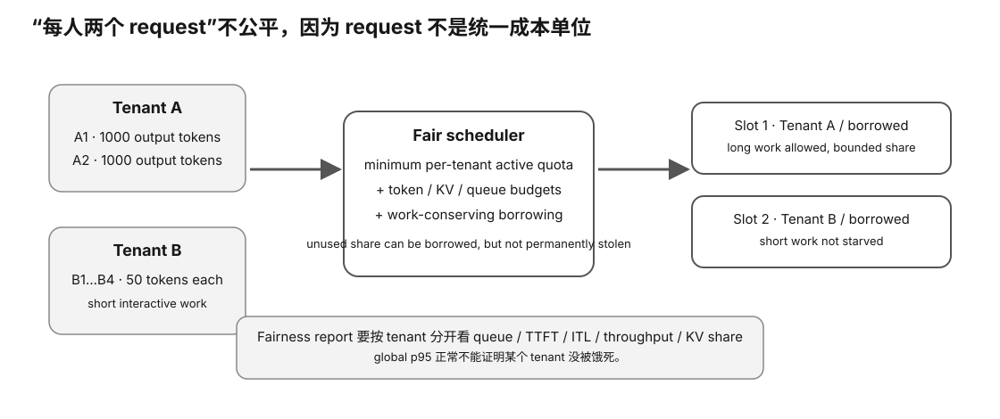

# Experiment 68 — Multi-Tenant Slot Fairness Model

硬件等级：L0

<figure>
  
  <figcaption>多租户公平性不是让所有请求绝对相同，而是用 quota/weight/admission 防止一个 tenant 吃掉全部服务能力。</figcaption>
</figure>

## Goal

Compare:
- global FIFO;
- strict one-active-request-per-tenant cap;
- work-conserving fair borrowing.

Synthetic:
```
2 slots
10 output tok/s/slot
all requests arrive at t=0
```

Tenant A:
```
2 × 100-token jobs
```

Tenant B:
```
4 × 10-token jobs
```

## Run

```bash
python3 simulate.py
```

## Key lesson

Global FIFO:
- utilization 100%;
- B mean wait 10.5 s.

Strict tenant cap:
- B mean wait 1.5 s;
- utilization only 60%.

Fair borrowing:
- B mean wait stays 1.5 s;
- utilization rises to ~85.7%.

## Scope

This is a non-preemptive slot scheduler teaching model.

Real continuous batching is more complex.


## Why this experiment

“每个租户请求数一样”很容易造成假公平。这个实验让你亲眼看到：长请求能长期占 slot，而短请求即使数量更多，也可能被饿在队列里。

## Hypothesis

Global FIFO 会得到高利用率但糟糕的小租户等待时间；严格 tenant cap 改善公平但浪费空闲 slot；work-conserving borrowing 能在二者之间取得更好的平衡。

## Fixed variables

slot 数、每 slot 速度、所有请求 arrival time、A/B job lengths 全部固定，只改变 scheduling policy。

## What to observe

1. B 的 mean/p95 wait。
2. makespan。
3. slot utilization。
4. A/B 分别完成多少工作。
5. 为什么 request count 与 output-token work 给出不同“公平”印象。

## Troubleshooting

- 确认三种 policy 使用同一 workload。
- 不要只比较 utilization；高利用率可能掩盖 starvation。
- strict cap 下空闲 slot 是教学设定，不代表真实 scheduler 一定这样实现。

## Evidence to save

保存三种 policy 的输出，做一张表：policy / B wait / utilization / makespan / fairness tradeoff。

## What this proves

你理解 quota、borrowing、utilization 与 starvation 的基本 tradeoff。

## What this does NOT prove

它不等价于真实 continuous batching，也没有建模 prefill、KV、priority weights 和 preemption。

## No-hardware path

完整 L0 实验。

## Transfer question

如果 Tenant A 没有请求，为什么一个 work-conserving scheduler 应该允许 B 暂时借用更多 slot？
