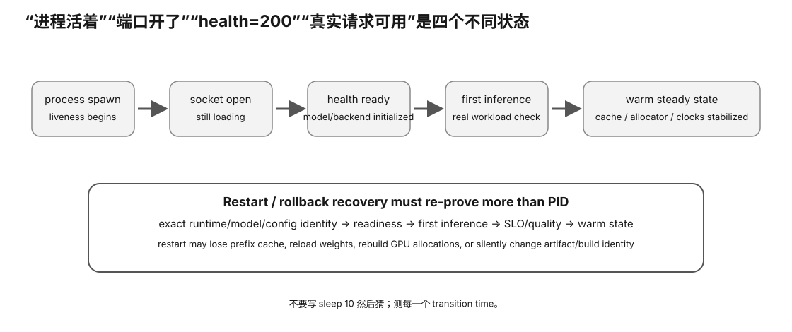

# Experiment 73 — Real Local llama-server Restart / Readiness Probe

硬件等级：L1/L2。

<figure>
  
  <figcaption>真实 restart/readiness 实验要记录停止、启动、依赖恢复、模型加载与首次成功请求的完整时间线。</figcaption>
</figure>

## Safety

This lab:
- launches its own `llama-server` child;
- forces `127.0.0.1`;
- manages only that child PID;
- installs no system service;
- changes no boot configuration;
- rejects auth/TLS/tools/agent/network overrides.

Use a free local port.

## Goal

Measure twice:

```
spawn
→ first HTTP
→ /health 200
→ one-token smoke inference
→ idle terminate
```

Then verify:
- server binary SHA;
- model SHA before/after;
- readiness recovery;
- first smoke inference recovery.

## Run

Example:

```bash
python3 restart_probe.py \
  --server-bin /path/to/llama-server \
  --model /path/to/model.gguf \
  --port 18080 \
  --extra-arg=-ngl \
  --extra-arg=99
```

Confirm current server options with:
```
llama-server --help
```

## Output

```
restart-evidence/
  server-1.log
  server-2.log
  restart-result.json
```

## Health interpretation

Pinned current server:

```
503
→ Loading model

200
→ model successfully loaded / ready
```

The script records status transitions.

## Stop interpretation

The child is terminated only after its smoke request has completed.

This is **not** an in-flight drain test.

A process signal must not be described as an application-level graceful drain unless that behavior is independently verified.

## Cache interpretation

Treat restart as cold for process-local prompt/KV cache unless explicit restore evidence exists.

Do not compare first-after-restart latency with a warm cached request and call the difference "GPU regression".

## Complete

Fill:
`RESULT-TEMPLATE.md`.


## Why this experiment

“自动重启成功”不能只看进程重新出现。一个 Local LLM 服务真正恢复，至少要重新完成模型加载、readiness 和代表性 smoke inference。

## Hypothesis

两次独立启动应都形成完整状态链；binary/model SHA 应保持一致。first HTTP 可能早于 /health ready，而 first smoke completion 又晚于 ready。

## Fixed variables

server binary、model、port policy、extra args 固定；脚本只管理自己的 child PID，不接管系统服务。

## What to observe

1. spawn→first HTTP。
2. first HTTP→health 200。
3. ready→smoke completion。
4. run1/run2 时间差。
5. binary/model SHA 是否一致。
6. restart 后是否存在 cache warm/cold 差异。

## Troubleshooting

- 503 loading 不是服务故障本身。
- 不要把 process signal 描述成 graceful drain。
- first-after-restart 与 warm cached request 不可直接当 GPU regression。
- 失败时保留 server log，而不是只重跑到成功。

## Evidence to save

保存两份 server log、restart-result.json、binary/model hash 和 RESULT-TEMPLATE。

## What this proves

你能验证一个本地 server 的“失败/停止后重新启动并恢复可用”的最小闭环。

## What this does NOT prove

它不测试 in-flight drain、systemd/container orchestration 或 crash-loop policy。

## No-hardware fallback

没有可运行模型时先完成 Experiment 72。

## Transfer question

进程 PID 已经出现，但 /health 仍 503。此时 load balancer 应该把请求送进来吗？
