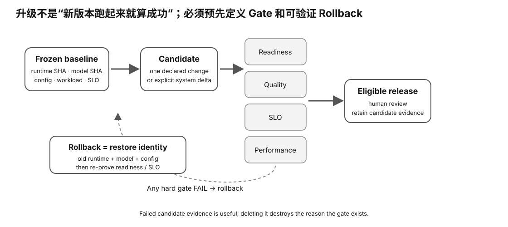

# Experiment 75 — Real Release Gate / Rollback Packet

硬件等级：L1/L2/L3，复用前面实验。

<figure>
  
  <figcaption>真实 release/rollback 要提前固定触发条件、旧版本身份与恢复步骤，避免出问题后临时决定怎么退。</figcaption>
</figure>

## Goal

Turn existing Evidence into one release decision.

This lab does not install/replace a system service.

It consumes results from:
- Experiment 61 — manifest / controlled A/B;
- Experiment 59 — quality;
- Experiment 63 — serving SLO;
- Experiment 73 — readiness/restart.

## 1. Preserve baseline artifacts

Before testing candidate, keep exact:
- server binary;
- model;
- config.

Hash them.

Do not overwrite known-good files in place.

## 2. Define policy first

Copy:

```bash
cp policy.template.json policy.json
```

Choose thresholds for your own workload.

Do not edit them after seeing candidate output merely to force a pass.

## 3. Fill releases

Copy:
`release.template.json`

for:
- baseline;
- candidate;
- rollback verification.

Every `REPLACE` must be resolved.

Numeric evidence is also validated. In particular:
- baseline TG must be > 0;
- baseline/candidate PPL must be > 0;
- SLO/error fractions must be in [0,1];
- policy ranges must be sane.

An unfinished numeric template must be blocked rather than divided by zero or treated as evidence.

## 4. Candidate gate

```bash
python3 release_gate.py \
  policy.json \
  baseline-release.json \
  candidate-release.json \
  --rollback rollback-release.json
```

Possible:

```
GATE: ACCEPT
GATE: ROLLBACK
GATE: BLOCKED_MISSING_EVIDENCE
```

## 5. Rollback semantics

Rollback JSON must restore the exact baseline identity block:

```
runtime SHA
model SHA
config SHA
manifest SHA
```

and prove:
- readiness;
- smoke.

If identity is different:

```
ROLLBACK: FAILED
```

even if something answers on the port.

## 6. Causal discipline

Before release gating, use Experiment 60/61 to classify the change.

If multiple semantic blocks changed:
- call it a system release comparison;
- do not claim one-variable causality.

The release gate can still decide operational acceptance.

## 7. Preserve failed-candidate Evidence

Do not delete:
- logs;
- manifests;
- quality traces;
- serving traces;

after rollback.

Redact secrets/private prompts as required.

## 8. Complete

Use:
`RESULT-TEMPLATE.md`.


## Why this experiment

真正发布/升级时，不能只看“新版本跑得更快”。这个实验把已有真实性能、质量、SLO、readiness Evidence 汇成一次明确的 release decision，并要求 rollback 恢复 exact baseline identity。

## Hypothesis

候选只有在 policy 要求的 gate 全部满足时才能 ACCEPT；缺证据应 BLOCKED；关键 gate 失败则 ROLLBACK。Rollback 只有恢复 baseline identity 并重新 ready/smoke 才算成功。

## Fixed variables

policy 必须在看 candidate 结果前冻结。baseline artifact 不覆盖，candidate 与 rollback 分别保存。

## What to observe

- baseline/candidate/rollback SHA identity；
- performance/quality/SLO/readiness 各 gate；
- missing evidence 与 true FAIL 的区别；
- rollback 后 readiness/smoke；
- 多 semantic block change 时为什么只能叫 system release comparison。

## Troubleshooting

- 不要为 candidate 临时放宽 policy。
- rollback 只恢复 binary 而 model/config 不同，不算 exact restore。
- 某项 numeric template 未填必须 BLOCKED。
- failed candidate logs/evidence 不要删除。

## Evidence to save

保存 policy、三份 release JSON、gate 输出、失败候选 evidence 和 RESULT-TEMPLATE。

## What this proves

你能基于真实证据做可回滚的 operational release decision。

## What this does NOT prove

它不自动安装服务，也不证明单个变量造成全部性能变化。

## No-hardware fallback

先完成 Experiment 74；真实 release packet 留到 Learner Verified。

## Transfer question

候选版本所有性能 gate 都过了，但 rollback artifact 已丢失。这个发布还能被视为“可安全回滚”吗？
