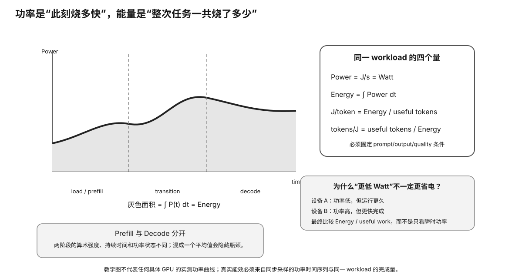

# Experiment 78 — Power / Energy Efficiency Model

硬件等级：L0

<figure>
  
  <figcaption>功耗与能效要分开看：W 是瞬时功率，J/token 把功率与完成单位工作所需时间结合起来。</figcaption>
</figure>

## Goal

Compute:
- job duration;
- joules;
- J/output-token;
- tokens/J;
- incremental J/token above idle;
- kWh per 1M output tokens.

## Run

```bash
python3 energy.py scenarios.csv
```

Default hypothetical electricity price:

```
0.20 currency / kWh
```

## Key result

```
fast-high-power:
5.0 J/token

balanced:
4.4 J/token

low-power:
~4.286 J/token
```

The fastest synthetic GPU is not the most energy-efficient.

## Boundary

These are constant board-power toy values.

They are not real GPU measurements or whole-system electricity costs.


## Why this experiment

功耗（W）只是“每秒消耗多少焦耳”。真正比较推理效率时，要把运行时间和完成的 token 数一起算进去。这个 L0 模型让你先把 W → J → J/token → tokens/J 的单位链条练熟，再去碰真实电表和 GPU telemetry。

## Hypothesis

在同一个固定 workload 下，**功率更低的方案不一定有更低 J/token；速度更快的方案也不一定更耗能**。结果取决于功率和完成时间的乘积。

## Fixed variables

本实验只允许 scenario 中的功率/速度参数变化。输出 token 数、电价定义和计算公式保持一致。不要一边改 token 数一边比较 J/token。

## What to observe

1. 检查 energy = power × time 是否单位一致。
2. 比较 J/token 与 tokens/J，确认二者排序方向相反。
3. 再看 incremental J/token above idle，理解 idle baseline 会影响长期服务判断。
4. 最后把 kWh/1M tokens 当作成本换算，不要把默认电价当现实世界统一电价。

## Troubleshooting

- 如果 J/token 越算越离谱，先检查 W、s、J、kWh 是否混了单位。
- 如果两个 scenario workload 不同，停止比较。
- 如果用真实数据替换 toy 值，必须注明测量边界是 GPU board power 还是整机 wall power。

## Evidence to save

保存命令、scenarios.csv、原始输出，以及一段你自己的解释：为什么“最低 Watts”不自动等于“最低能耗”。

## What this proves

它证明你会在固定 workload 下做能耗算术，并能区分功率、能量与单位 token 能耗。

## What this does NOT prove

它不证明任何具体 GPU 的真实 J/token，也不证明全年电费，因为真实功率会随时间变化，整机还包含 CPU/RAM/PSU loss/idle。

## No-hardware path

这是完整 L0 主路径，不需要 GPU 或电表。

## Transfer question

如果 GPU A 平均 320W、80 tok/s，GPU B 平均 220W、45 tok/s，你会先算什么，才能回答谁更省电？
