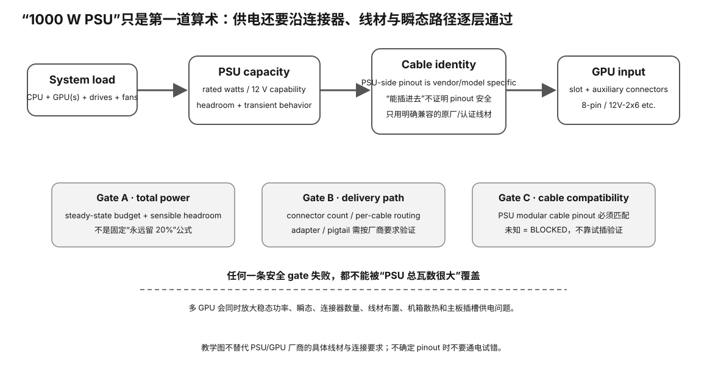

# Experiment 88 — PSU Capacity + Connector Gate Model

硬件等级：L0

<figure>
  
  <figcaption>PSU 预算不只看总瓦数，还要沿墙插→PSU→线材/接头→GPU/主板的供电路径检查接口、余量与瞬态。</figcaption>
</figure>

## Goal

Show that total PSU wattage and cable/connector compatibility are independent gates.

Run:

```bash
python3 evaluate.py case-single-good.json
python3 evaluate.py case-multigpu-tight.json
python3 evaluate.py case-cable-mismatch.json
```

## Policy

Each case explicitly defines:

```json
"policy": {
  "min_headroom_fraction": 0.15
}
```

This is a synthetic scenario policy, **not** a universal 15% recommendation.

## Expected

### Single-GPU good

```text
850W PSU
550W estimate
35.294% arithmetic headroom
connector/cable confirmed
→ ACCEPT
```

### Multi-GPU tight

```text
850W PSU
820W estimate
3.529% headroom
policy requires 15%
→ REVIEW
```

### Cable mismatch

```text
1000W PSU
600W estimate
40% headroom
modular cable compatibility = false
→ REJECT
```

## Scope

The model does not predict electrical transients or certify a PSU.


## Why this experiment

“850W/1000W 足够吗”不能只做加法。总瓦数和 cable/connector compatibility 是两道独立 gate；任何安全关键线材冲突都不能被大 headroom 抵消。

## Hypothesis

single-good 应 ACCEPT，multigpu-tight 因 policy headroom 不足进入 REVIEW，cable-mismatch 即使有 40% 余量也必须 REJECT。

## Fixed variables

每个 case 的 PSU rating、estimated load、connector evidence 和 policy 保持不变。

## What to observe

1. arithmetic headroom 的计算。
2. policy threshold 与 universal recommendation 的区别。
3. cable mismatch 为什么是 hard fail。
4. REVIEW 和 REJECT 的证据条件不同在哪里。

## Troubleshooting

- 不要把 PSU 铭牌瓦数当每根 cable 的能力。
- 不要假设模组线“能插就兼容”。
- 真实系统还要查 exact PSU/GPU 厂商 guidance、线材来源和普通 workload 稳定性。
- 本实验不做故意过载或危险电气测试。

## Evidence to save

保存三个 case 和输出，并画一张 gate 表：capacity / cable / decision。

## What this proves

你理解 PSU capacity 与 connector/cable provenance 是独立门槛。

## What this does NOT prove

它不预测 transient、不认证 PSU，也不替代真实硬件手册。

## No-hardware path

完整 L0。

## Transfer question

1200W 电源带 700W 估算负载，但 GPU 模组线来源未知，你应该 ACCEPT 还是 BLOCKED/REVIEW？为什么？
