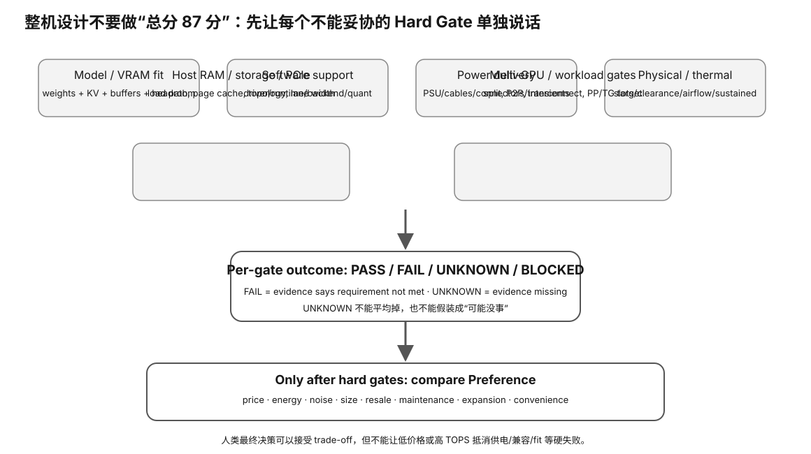

# Experiment 90 — Whole-Machine Feasibility Validator

硬件等级：L0

<figure>
  
  <figcaption>整机可行性要同时过尺寸、插槽/通道、供电、散热、内存、存储与软件兼容等 hard gates；单卡合适不等于整机可装。</figcaption>
</figure>

## Goal

Validate the distinction between:
- known hard failure;
- purchase-critical unknown;
- feasible design.

Run:

```bash
python3 validate.py case-balanced.json
python3 validate.py case-vram-fail.json
python3 validate.py case-unknown-cable.json
```

## Expected

### Balanced

All declared hard gates pass:

```text
DECISION: ACCEPT
```

### VRAM failure

Known capacity requirement exceeds runtime-confirmed available capacity:

```text
DECISION: REVISE
```

### Unknown PSU cable

Capacity is otherwise adequate, but modular-cable compatibility is unknown:

```text
DECISION: BLOCKED
```

## Important

There is no weighted score.

The validator does not choose or purchase replacement hardware.


## Why this experiment

整机设计最危险的错误是把所有条件做成一个加权总分。真正的系统里，有些条件是硬门槛：模型装不下、backend 不支持、供电线材来源不明，都不能被“价格便宜、速度不错”抵消。

## Hypothesis

三种 case 应分别落在 ACCEPT、REVISE、BLOCKED；区别不是分数高低，而是是否存在已知 hard fail 或 purchase-critical unknown。

## Fixed variables

使用每个 case 文件中声明的 requirement/evidence，不修改 validator 的决策规则。

## What to observe

1. balanced 为什么能 ACCEPT。
2. VRAM fail 为什么必须 REVISE，而不是“综合还不错”。
3. unknown cable 为什么是 BLOCKED 而不是 FAIL。
4. 三种结论分别对应什么下一步动作。

## Troubleshooting

- UNKNOWN 不能自动转 PASS。
- FAIL 不能被其他 gate 的 PASS 平均。
- BLOCKED 不是“永远不能用”，而是“先补关键证据”。
- validator 不应该替你自动购买硬件。

## Evidence to save

保存三条命令输出，并自己做一张 gate matrix：requirement / evidence / PASS-FAIL-UNKNOWN / decision impact。

## What this proves

你能把整机设计当作约束满足问题，而不是排行榜。

## What this does NOT prove

synthetic case 不证明任何真实机器可行，也不含当前价格/市场供货。

## No-hardware path

完整 L0 实验。

## Transfer question

一台机器所有性能指标都很优秀，但 modular PSU cable 兼容性是 UNKNOWN，你应该继续排序价格还是先做什么？
