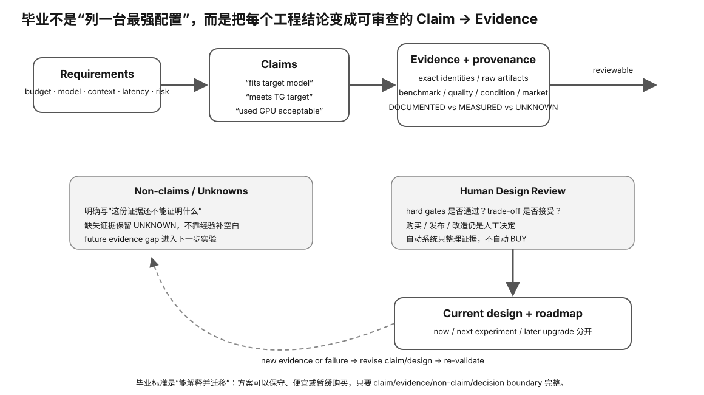

# Experiment 92 — Graduation Design Review Validator

硬件等级：L0

<figure>
  
  <figcaption>Graduation Design Review 把需求、hard gates、Evidence、TCO、风险、rollback 与未知项集中到同一套人工审查流程。</figcaption>
</figure>

## Goal

Verify that a final machine-design conclusion is consistent with:
- the required hard gates;
- material-claim evidence completeness;
- revision coverage;
- explicit non-claims.

This experiment does not recommend or purchase hardware.

## Run

~~~bash
python3 validate.py case-accept.json
python3 validate.py case-revise.json
python3 validate.py case-blocked.json
~~~

## Case A — ACCEPT

Expected:
- all required gates PASS;
- every material claim has a non-placeholder evidence reference;
- final decision ACCEPT;
- explicit non-claims exist.

## Case B — REVISE

Expected:
- one required gate FAILS;
- no blocking required UNKNOWN remains;
- at least one revision names that failed gate;
- final decision REVISE.

## Case C — BLOCKED

Expected:
- at least one required gate is UNKNOWN or missing evidence;
- final decision BLOCKED.

## What the validator does not do

It does not:
- score GPU brands;
- estimate real performance from model names;
- choose a revision;
- verify that a path/URL contains truthful evidence;
- buy or modify hardware.

It checks the internal consistency and completeness of the design-review packet.

## Why this experiment

毕业项目最重要的不是“配置看起来合理”，而是最终结论与 hard gates、证据、revision、non-claims 之间逻辑一致。这个 validator 专门检查这种内部一致性。

## Hypothesis

ACCEPT case 必须 all required PASS；REVISE case 必须存在已知 FAIL 且 revision 覆盖它；BLOCKED case 必须存在关键 UNKNOWN/缺证据。

## Fixed variables

三个 case 文件和 validator 规则保持不变，不允许通过删除 required gate 来“修复”结论。

## What to observe

1. material claim 是否都有 evidence reference。
2. FAIL 与 UNKNOWN 如何导致不同 decision。
3. revision 是否点名具体 failed gate。
4. non-claims 为什么是合格报告的必需部分。

## Troubleshooting

- evidence path 非空不等于内容一定真实；validator 只查 packet consistency。
- FAIL 不能写成 BLOCKED 来逃避已知问题。
- UNKNOWN 也不能乐观写 ACCEPT。
- revision 必须修复已知失败，而不是泛泛“升级硬件”。

## Evidence to save

保存三个 case 和输出，并自己解释为什么三种 decision 都可能是合格毕业结果。

## What this proves

你能检查 design-review packet 的逻辑完整性。

## What this does NOT prove

它不验证外部 evidence 真伪，也不自动选择或购买硬件。

## No-hardware path

完整 L0。

## Transfer question

如果所有 gate 都 PASS，但一个关键性能 claim 没有 evidence reference，最终还能 ACCEPT 吗？
