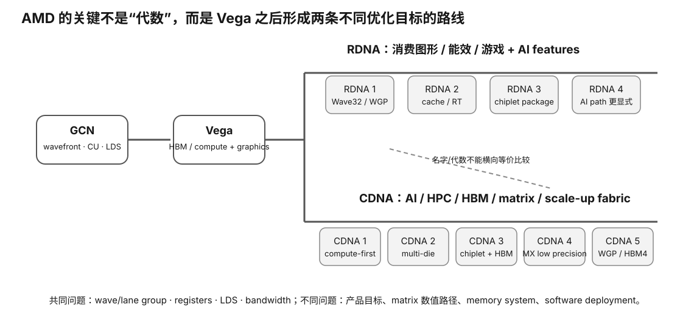

# AMD Architecture Spine — GCN / RDNA / CDNA 速查

<figure>
  
  <figcaption>视觉索引：先用图建立 AMD Architecture Spine — GCN / RDNA / CDNA 速查 的核心关系，再把下面的表格、公式与检查项作为快速查阅层。</figcaption>
</figure>


## The fork

```
GCN / Vega ancestry
        │
        ├─ RDNA → Radeon / graphics / latency
        │
        └─ CDNA → Instinct / HPC / AI throughput
```

Do not draw RDNA and CDNA as one simple sequential line.

## GCN

Classic CU:

```
CU
├─ scalar ALU + SGPR
├─ 4× SIMD
├─ VGPR
└─ LDS
```

Classic:
- wave64;
- 16-wide SIMD;
- one vector instruction over 4 cycles;
- 64 KiB LDS in common documented GCN CU;
- many resident waves hide latency.

## SGPR vs VGPR

```
SGPR = one value shared by the whole wave
VGPR = one value per lane
```

This is a core AMD distinction.

## LDS

AMD's workgroup-shared low-latency scratchpad.

Transfer concept:
```
shared memory reasoning
→ LDS reasoning
```

but exact banks/capacity differ.

## Vega

Key lineage:
- Rapid Packed Math;
- HBM2 / High Bandwidth Cache;
- GCN-family compute modernization.

## RDNA

Major change:
- Wave32 primary;
- Wave64 supported;
- WGP groups two CUs;
- 32-wide SIMD issue;
- L0 per CU → L1 per WGP → L2 global.

## RDNA2

- first-generation Infinity Cache;
- ray accelerator;
- graphics-first;
- ROCm support still SKU-specific.

## CDNA / MI100

- dedicated compute architecture;
- Matrix Core / MFMA;
- HBM2;
- Infinity Fabric;
- gfx908.

## CDNA2 / MI200

- matrix FP64;
- stronger BF16/FP16;
- HBM2e;
- multi-die packaging;
- xGMI/Infinity Fabric scale-up.

## RDNA3

- GCD + MCD chiplets;
- second-gen Infinity Cache;
- first RDNA AI accelerators;
- VOPD dual-issue;
- Wave32 constraint for VOPD.

Dual issue requires:
```
independent instructions
+ legal operands/register banks
+ compiler pairing
```

Not automatic 2×.

## CDNA3 / MI300

- XCD chiplets;
- I/O dies;
- HBM3;
- large Infinity Cache;
- FP8/TF32/sparsity;
- MI300A CPU+GPU shared-HBM coherent package;
- MI300X GPU-focused package.

## RDNA4

- second-gen AI accelerators;
- FP8/INT4;
- third-gen Infinity Cache;
- Wave32 + Wave64;
- gfx1200/gfx1201 current Radeon targets.

## CDNA4

- MI350;
- HBM3E;
- MXFP4/MXFP6/MXFP8;
- gfx950 current ROCm support line.

## CDNA5 frontier

Current 2026 AMD architecture page:
- MI400;
- new WGP;
- Wave32;
- HBM4;
- MXFP8/MXFP6/MXFP4.

Treat software support as dynamic.

## NVIDIA translation table — only for intuition

| AMD | rough transferable idea | warning |
|---|---|---|
| wavefront | warp-like scheduled lane group | wave size can be 32 or 64 |
| CU/WGP | SM-like compute grouping | topology/resources are different |
| LDS | shared-memory-like scratchpad | banks/capacity differ |
| MFMA Matrix Core | Tensor-Core-like matrix acceleration | instruction/data types differ |
| Infinity Fabric/xGMI | high-speed GPU fabric | topology/protocol differ |
| Infinity Cache | large LLC-like cache | not VRAM |

Use this table only to transfer questions, not to equate hardware.

## Buyer checklist

1. exact model?
2. architecture?
3. gfx target?
4. Wave32/Wave64 behavior?
5. VRAM/HBM/GDDR?
6. memory bandwidth?
7. Infinity Cache size?
8. matrix/AI datatype support?
9. current ROCm official support?
10. llama.cpp/PyTorch kernel support?
11. PP vs TG?
12. power/cooling/TCO?
