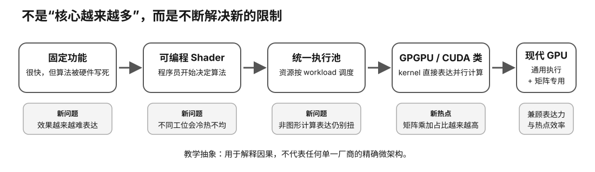

# GPU 演进速查：固定功能 → 可编程 → Unified → Compute → Matrix

<figure>
  
  <figcaption>视觉索引：先用图建立 GPU 演进速查：固定功能 → 可编程 → Unified → Compute → Matrix 的核心关系，再把下面的表格、公式与检查项作为快速查阅层。</figcaption>
</figure>

| 阶段 | 主要问题 | 架构变化 | 对本地 LLM 的意义 |
|---|---|---|---|
| 固定功能 | 功能固定、表达力受限 | 图形阶段由专用硬件完成 | 高吞吐来自大量规则并行工作 |
| 可编程 Shader | 固定效果不够灵活 | 部分图形阶段可运行自定义程序 | GPU 开始成为可编程并行机器 |
| Unified Shader | shader workload 比例变化，静态分区易闲置 | 多类 shader 共享可编程执行资源 | 更灵活的吞吐资源池 |
| GPGPU / CUDA 等 | 通用计算需要绕图形 API | 正式线程、内存、同步模型 | AI 框架可直接使用 GPU 并行计算 |
| Tensor/Matrix acceleration | 矩阵乘加成为高价值热点 | 专用矩阵乘加数据通路 | 数据类型、kernel/backend 显著影响 LLM 性能 |

## 重要纠偏

Unified 不等于没有专用硬件。现代 GPU 仍有纹理、ROP、视频、光追、矩阵等专用模块。

专用化也不是倒退。当某种 workload 足够重要且结构稳定，专用硬件可换取更好的吞吐和能效。

厂商术语可以做作用映射，但不能硬等价：
- NVIDIA: SM / warp / shared memory / Tensor Core
- AMD: CU / wavefront / LDS / MFMA or matrix acceleration

## 后续连接

warp/wavefront 与 scheduler、occupancy、register/shared/LDS/cache/VRAM、GEMM 与低精度、memory-bound vs compute-bound。
