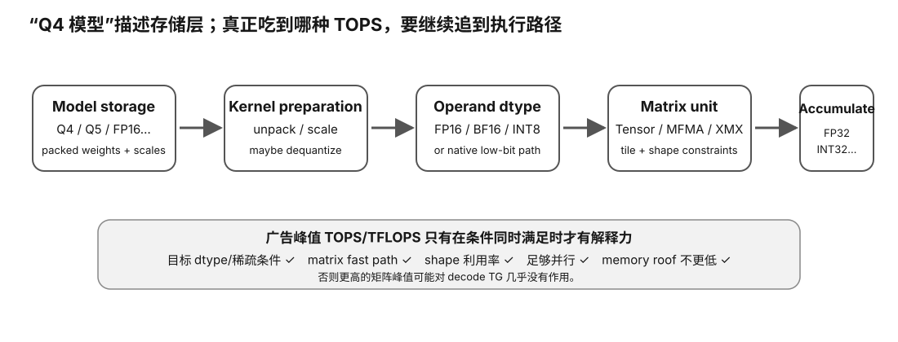

# Matrix Units / Precision / TOPS 速查

<figure>
  
  <figcaption>视觉索引：先用图建立 Matrix Units / Precision / TOPS 速查 的核心关系，再把下面的表格、公式与检查项作为快速查阅层。</figcaption>
</figure>


## 四层必须分开

```
1. storage format
2. kernel input datatype
3. matrix instruction datatype
4. accumulator/output datatype
```

Example：

```
GGUF Q4 weights
→ load packed 4-bit blocks
→ dequantize tile
→ FP16/BF16 matrix math
→ wider accumulation
```

This is still a 4-bit stored model, but not necessarily native INT4 matrix arithmetic.

## Why wider accumulation?

```
many small products
→ summed into one output
```

Common pattern：

```
FP16/BF16 input → FP32 accumulator
INT8 input       → INT32 accumulator
```

Input precision lost cannot be recovered by wide accumulation, but summation is more stable.

## NVIDIA high-level generation map

| generation | key matrix-unit step |
|---|---|
| Volta | first Tensor Cores / FP16 |
| Turing | INT8 / sub-byte inference matrix modes expand |
| Ampere | BF16 + TF32 + FP64 Tensor Core |
| Hopper | FP8 + 4th-gen Tensor Core / Transformer Engine |
| Blackwell | 5th-gen Tensor Core + FP4-class current modes |

Exact SKUs and rates are dynamic.

## AMD

CDNA matrix hardware：

```
MFMA
```

Current ROCm docs show datatype support varies by CDNA/RDNA generation.

Do not map：
```
Tensor Core count ↔ MFMA count
```
mechanically.

## TOPS checklist

Before using a spec number ask：

1. datatype?
2. dense or sparse?
3. matrix or vector path?
4. accumulator?
5. theoretical boost-clock rate?
6. shape requirements?
7. software kernel support?
8. workload arithmetic intensity?
9. actual achieved utilization?

## Why decode can ignore huge TOPS

Decode simplified：

```
read huge weights
→ compute one/few token rows
→ read huge weights again next token
```

Often：

```
memory roof < compute roof
```

Then doubling matrix peak may do little.

## Why quantization can still help

```
weight bits ↓
→ bytes/token ↓
→ memory-bound decode ↑
```

This benefit does not prove native low-bit arithmetic.

## Native low-bit bonus

Best case：

```
smaller storage
+
native low-bit matrix units
+
efficient dequant/scaling/layout
+
good tile utilization
```

Only then can both bandwidth and compute roofs rise.
