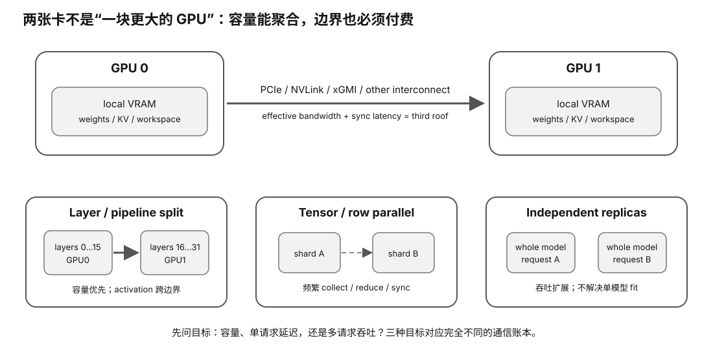

# 单机多 GPU / Interconnect 速查

<figure>
  
  <figcaption>视觉索引：先用图建立 单机多 GPU / Interconnect 速查 的核心关系，再把下面的表格、公式与检查项作为快速查阅层。</figcaption>
</figure>

## 先问目标

多一张 GPU 可能是为了三件完全不同的事：

### A. Fit bigger model

~~~text
capacity aggregation
~~~

### B. Lower one-request latency

~~~text
parallel model compute
~~~

### C. More user throughput

~~~text
multiple model replicas / requests
~~~

不要用一个“多卡 speedup”回答三件事。

## 2×12 GiB 不是一块 24 GiB VRAM

真实是：

~~~text
GPU0 local memory: 12 GiB
GPU1 local memory: 12 GiB
~~~

只有 runtime 把 tensors/state 分区后，单模型才能跨两卡。

还要扣：

- KV
- workspaces
- duplicated tensors
- comm buffers
- allocator headroom

## 三种基本分法

### Data Parallel / Replicas

~~~text
GPU0: whole model
GPU1: whole model
~~~

适合：
- more independent requests

不适合：
- single oversized model

### Layer / Pipeline Split

~~~text
early layers → GPU0
late layers  → GPU1
~~~

Single-token path：

~~~text
GPU0 compute
→ activation transfer
→ GPU1 compute
~~~

主要价值：
- aggregate capacity

single-request compute 不会因为 layers 分半就自动 2× 快。

### Tensor Parallel

Each layer：

~~~text
GPU0 partial math
GPU1 partial math
→ collective / merge
~~~

价值：
- parallel compute within layer
- capacity shard

成本：
- frequent communication
- synchronization
- topology sensitivity

## Multi-GPU latency model

~~~text
T_N
≈ T_compute / N
+ T_comm
+ T_sync
+ T_imbalance
~~~

~~~text
T_comm
≈ critical bytes / effective interconnect bandwidth
~~~

Speedup：

~~~text
S_N = T_1 / T_N
~~~

Scaling efficiency：

~~~text
E_N = S_N / N
~~~

2 GPUs only 1.4×：

~~~text
efficiency = 1.4 / 2 = 70%
~~~

## Synthetic 2-GPU Tensor Split

Assume：

- single GPU = 10 ms/token
- ideal 2-GPU compute = 5 ms
- critical comm = 64 MiB/token
- sync = 0.2 ms

| effective P2P | comm | total | speedup |
|---:|---:|---:|---:|
| 8 GiB/s | 7.81 ms | 13.01 ms | 0.77× |
| 16 GiB/s | 3.91 | 9.11 | 1.10× |
| 32 GiB/s | 1.95 | 7.15 | 1.40× |
| 64 GiB/s | 0.98 | 6.18 | 1.62× |
| 128 GiB/s | 0.49 | 5.69 | 1.76× |

Same GPUs, link changes result.

## P2P

Direct peer path：

~~~text
GPU0 memory
↔
GPU1 memory
~~~

Bad/fallback path can involve：

~~~text
GPU0
→ host RAM / host path
→ GPU1
~~~

AMD HIP docs explicitly warn host staging can happen without P2P and costs performance.

## NVIDIA topology

Read-only investigation：

~~~bash
nvidia-smi topo -m
nvidia-smi topo -p2p r
nvidia-smi topo -p2p w
~~~

Topology labels include：

- PIX
- PXB
- PHB
- NODE
- SYS
- NV#

Current exact commands/legend belong to dynamic tool interface, but principle is stable：

~~~text
where GPUs sit in PCIe/NUMA topology matters
~~~

## AMD topology / P2P

Current official tools/APIs can expose：

- link type/hops
- P2P accessibility
- peer bandwidth

Current recommended benchmarking paths include：

- TransferBench
- ROCm Validation Suite PBQT

Older ROCm Bandwidth Test is being retired; check current docs.

## Link name ≠ measured bandwidth

You need both：

~~~text
negotiated capability
and
measured effective P2P bandwidth
~~~

Reasons they differ：

- slot electrical width
- switch/root complex
- NUMA crossing
- peer support
- software path
- protocol overhead
- simultaneous traffic

## NVLink / xGMI-style links

Higher-bandwidth direct links can lift interconnect roof.

Still check：

- exact pair connectivity
- link count/topology
- P2P enablement
- software collectives
- measured bandwidth

## Collectives

Tensor parallel often needs：

~~~text
all-reduce
all-gather
reduce-scatter
~~~

NVIDIA → NCCL ecosystem  
AMD → RCCL ecosystem

P2P memcpy benchmark is not the same as collective benchmark.

## PP vs TG

### Prompt processing / prefill

More compute-heavy：
communication can be amortized better.

### Text generation / decode

Per-token latency sensitive：
communication/sync fraction can be larger.

Always benchmark both.

## Current llama.cpp split snapshot

Current pinned upstream supports split-mode concepts：

~~~text
none
layer
row
tensor
~~~

and tensor-split proportions.

Stable Lesson maps them only approximately to：

- one-device
- layer sharding
- within-layer parallel split

Exact current semantics/experimental status belong to intelligence.

## Heterogeneous cards

Layer split：

~~~text
strong card gets more layers
weak card fewer
~~~

can sometimes balance capacity/work.

Synchronized tensor split：

~~~text
slow device/link
→ everyone waits
~~~

So “mix a fast card + old cheap card” needs Evidence.

## Garbage-hardware checklist

Before buying second GPU：

1. motherboard physical slots?
2. electrical lane width?
3. CPU PCIe lane budget?
4. same/different root complex or NUMA?
5. power supply/cables?
6. cooling/slot spacing?
7. backend supports both GPUs?
8. P2P available?
9. measured peer bandwidth?
10. model split strategy?
11. PP/TG one-card baseline?
12. expected capacity gain vs speed gain?

## Decision examples

### Model does not fit one GPU; latency less important

Layer/model split may be enough.

### Model fits one GPU; want twice users

Two replicas may beat tensor parallel.

### Want lower single-request latency

Need genuine compute parallelism + strong interconnect; measure tensor-parallel path.

### Very slow P2P

A second GPU may still solve capacity but make single-request latency worse.
