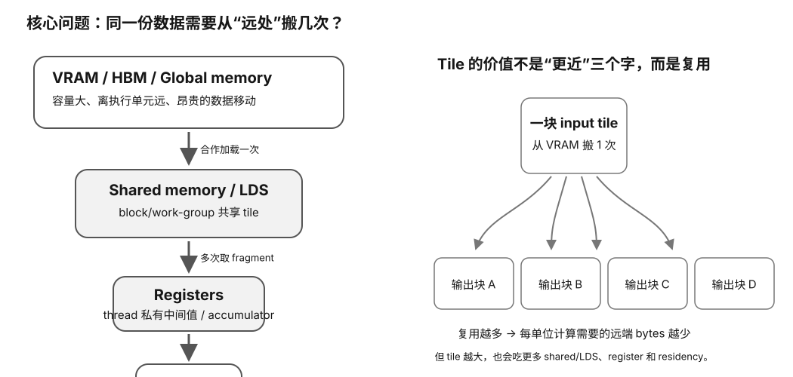

# GPU 片上存储与 Tiling 速查

<figure>
  
  <figcaption>视觉索引：先用图建立 GPU 片上存储与 Tiling 速查 的核心关系，再把下面的表格、公式与检查项作为快速查阅层。</figcaption>
</figure>

## 一句话模型

**高性能 GPU kernel 的核心不是“少访问内存”，而是尽量少访问最远的内存：把 global/VRAM/HBM 数据成块搬近，然后在 shared memory/LDS 与 registers 中重复使用。**

## Memory scope

| 层 | NVIDIA | AMD | Scope | 典型用途 | 主要代价 |
|---|---|---|---|---|---|
| thread-private on-chip | registers | VGPR/SGPR 等 | thread / wave-specific | accumulator、中间值、fragment | register pressure、spill、occupancy |
| block shared on-chip | shared memory | LDS / shared memory | block/work-group | tile、线程协作、reorder | 容量、同步、bank conflicts、occupancy |
| hardware cache | L1/L2 等 | L0/L1/L2 等，随架构 | hardware-managed | locality / reuse | 不完全可控、架构相关 |
| device global | global memory / VRAM/HBM | global memory / VRAM/HBM | device-wide | 大数据集、weights、activations | 较高 latency、带宽有限 |
| spill/private off-chip path | local memory | scratch/private spill | thread-private logical scope | register overflow、stack/private arrays | 高 latency；可能伤性能 |

### 最容易背错

CUDA **local memory** 的 “local” 指 thread-local 作用域，不代表物理上是片上 SRAM。

## Tiling 的因果链

naive:
每个 output thread
→ 自己从 global 反复读 A/B
→ 做乘加
→ 写 C

tiled:
一个 block/work-group
→ cooperative load A/B tile
→ shared memory/LDS
→ 所有 threads 重用 tile
→ registers 中累加
→ 写 C

结果：

global load requests ↓
→ bytes per FLOP ↓
→ arithmetic intensity ↑
→ 更容易喂饱 compute / matrix units

## Coalescing 与 reuse 不是同一件事

| 问题 | Coalescing | Tiling / reuse |
|---|---|---|
| 核心问题 | 一批 threads 的地址能否合成少量 transactions | 同一数据要从 global 搬几次 |
| 优化目标 | 每次 transaction 用得更满 | transaction 总数更少 |
| 典型坏例 | stride access | 每个 output 都重复读同一 tile |
| 常用手段 | 连续线程 → 连续地址、对齐、layout | shared/LDS tile、register tile、fusion |

两者通常要同时做好。

## Tile size trade-off

tile 变大，可能：

**收益**
- reuse ↑
- arithmetic intensity ↑
- global traffic ↓
- 每 tile 效率 ↑

**成本**
- shared memory/LDS ↑
- registers/accumulators ↑
- threads/work per block ↑
- resident blocks ↓
- occupancy ↓
- parallel tiles ↓
- bank-conflict/layout 风险 ↑
- 边界浪费可能 ↑

所以正确问题不是：

> 最大 tile 是多少？

而是：

> 在这个 problem shape、GPU 和 kernel 上，哪个 tile 给出最好的 total throughput？

## Register pressure

更多 registers 可以：
- 留住 accumulators；
- 提高 ILP；
- 减少 shared/global accesses。

也可能：
- 降低 resident warps/wavefronts；
- 降低 occupancy。

强行限制 registers 还可能：
→ spill 到 CUDA local / AMD scratch
→ 结果更慢。

## Shared memory / LDS

适合：
- block/work-group 内 data reuse；
- cross-thread communication；
- global access reorder；
- tile staging。

不适合机械使用：
- 数据只用一次；
- 没有跨 thread reuse；
- synchronization 成本太高；
- footprint 让 residency 掉得太狠；
- layout 导致严重 bank conflicts。

## Bank conflicts

shared memory/LDS 被分成多个 banks。

同一 warp/wavefront 同时访问：
- 不同 banks：可并行程度高；
- 同一 bank 的不同地址：可能序列化；
- 特殊 broadcast/multicast 情况：依架构规则处理。

具体 bank 数与映射必须查目标架构。

## L0 GEMM reuse model

对 N=1024 FP32 方阵 GEMM，忽略 cache/broadcast，只数算法级 input-load requests：

| tile | threads/block | A+B shared footprint | input-load requests | vs naive | approx arithmetic intensity |
|---:|---:|---:|---:|---:|---:|
| naive | — | 0 | 2,147,483,648 | 1× | 0.250 FLOP/B |
| 4 | 16 | 0.125 KiB | 536,870,912 | 4× fewer | 0.998 FLOP/B |
| 8 | 64 | 0.5 KiB | 268,435,456 | 8× fewer | 1.992 FLOP/B |
| 16 | 256 | 2 KiB | 134,217,728 | 16× fewer | 3.969 FLOP/B |
| 32 | 1024 | 8 KiB | 67,108,864 | 32× fewer | 7.877 FLOP/B |

这是 reuse 上限概念，不是 DRAM profiler 结果。

## 读 LLM kernel 的检查顺序

1. global memory 里是什么：weights、activations、KV、scales？
2. 一个 tile 被多少 outputs/threads 重用？
3. global accesses 是否 coalesced？
4. shared/LDS 放了什么？每 block footprint 多大？
5. registers 里留了什么 accumulators/fragments？
6. register/shared pressure 让 occupancy 掉到多少？
7. 有没有 spill/scratch/local-memory traffic？
8. shared/LDS 有无 bank conflict？
9. 增大 tile 后，global traffic 下降多少？
10. 最终 throughput 是否真的上升？

## 工具提示

### NVIDIA

- 编译资源：`nvcc -res-usage ...`
- spill 警告：`-Xptxas=-warn-spills`
- profiler：Nsight Compute 的 memory / occupancy / scheduler sections

### AMD

- 编译资源：`hipcc --resource-usage ...`
- profiler：rocprofv3 / ROCm Compute Profiler
- 可观察：VGPR/SGPR、LDS、scratch、occupancy、memory counters

工具参数会随版本变化；以目标工具链官方文档为准。
