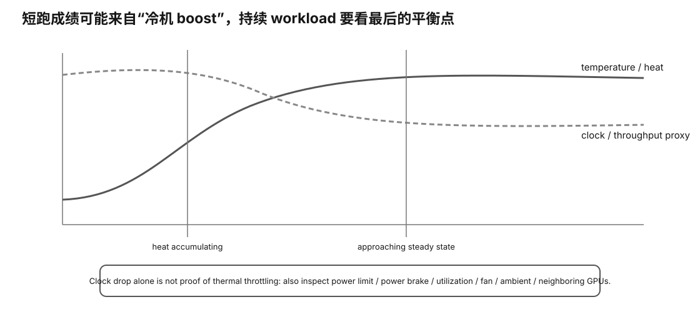

# Thermal / Sustained Performance Card

<figure>
  
  <figcaption>视觉索引：先用图建立 Thermal / Sustained Performance Card 的核心关系，再把下面的表格、公式与检查项作为快速查阅层。</figcaption>
</figure>


## Timeline

```
time
→ power
→ temperature
→ clock
→ TG/ITL
```

## Drift

```
TG drift %
=
(last-window / first-window - 1) × 100
```

Record:
- first-window TG;
- last-window TG;
- min/max;
- temperature delta;
- clock delta.

## Stronger thermal hypothesis

```
temperature ↑
+
clock ↓
+
performance ↓
+
thermal limiter/event evidence
```

is stronger than temperature alone.

## Do not equate

```
high temperature
=
throttling
```

or:

```
clock drop
=
thermal cause
```

## Test identity

- ambient:
- case/open bench:
- fan policy:
- model/runtime:
- TG token count:
- repetitions:
- warmup:
- GPU device:
- power/clocks untouched?:

## Default safety

Measure only:
- no OC/UV;
- no power-limit change;
- no fan-curve change.
