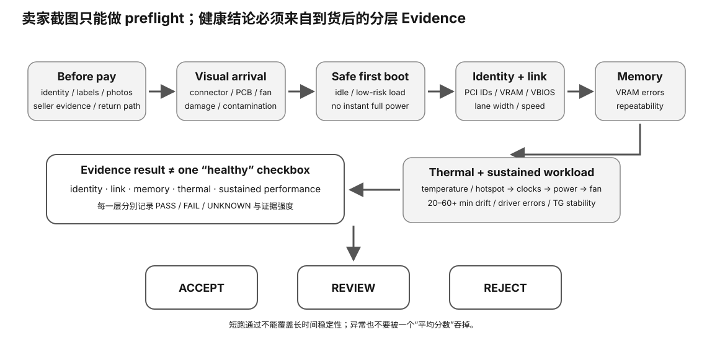

# Used-GPU Purchase Acceptance Card

<figure>
  
  <figcaption>视觉索引：先用图建立 Used-GPU Purchase Acceptance Card 的核心关系，再把下面的表格、公式与检查项作为快速查阅层。</figcaption>
</figure>

## Claim → observation

### Identity
- seller model claim:
- PCI vendor/device:
- subsystem vendor/device:
- BDF:
- vendor UUID:
- runtime product name:
- VBIOS:
- board/subvendor:

### VRAM
- claimed:
- observed:
- tool/runtime:
- units:

### Runtime
- driver recognized:
- CUDA/HIP/Metal path recognized:
- llama.cpp backend recognized:
- ordinary inference completes:

### PCIe
- max capability:
- current idle state:
- current under-load state if measured:
- motherboard/slot max:
- riser/bifurcation:

Do not reject from idle current state alone.

### Errors
- ECC supported?:
- corrected:
- uncorrected:
- PCIe replay/recovery:
- OS/driver errors:
- bad-page/RAS evidence:

Use `N/A` when unsupported, not fake zero.

### Sustained workload
- model SHA:
- runtime SHA/version:
- repetitions/duration:
- TG first/last:
- TG drift:
- temperature:
- clocks:
- errors:

### Physical/display
- display outputs tested:
- physical damage:
- fans/noise:
- power connector:

## Decision

### ACCEPT
Purchase-critical claims match and defined tests complete without material issue.

### REVIEW
Incomplete/non-critical discrepancy or platform-limited evidence.

### REJECT
Material claim mismatch, target runtime unusable, repeated stock-workload failure, uncorrectable error evidence, or severe instability.

## Default safety

No:
- VBIOS flash;
- overclock/undervolt;
- power-limit changes;
- destructive VRAM stress.
