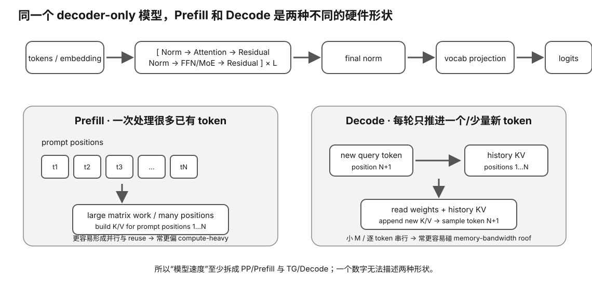

# Decoder-only Transformer Shape Card

<figure>
  
  <figcaption>视觉索引：先用图建立 Decoder-only Transformer Shape Card 的核心关系，再把下面的表格、公式与检查项作为快速查阅层。</figcaption>
</figure>


## Symbols

- B: batch / active sequences
- T: new/query token count in this forward
- S: cached sequence length
- d: hidden size
- Hq: query heads
- Hkv: KV heads
- Dh: head dimension
- d_ff: intermediate/FFN size
- L: layers

## Input

```
token ids [B,T]
→ embedding
→ X [B,T,d]
```

## Attention projections

```
Q [B,Hq,T,Dh]
K [B,Hkv,T,Dh]
V [B,Hkv,T,Dh]
```

Usually:
```
Hq × Dh ≈ d
```

Read actual model config.

## Prefill

Prompt length T:

```
Q [B,Hq,T,Dh]
K/V [B,Hkv,T,Dh]
conceptual score [B,Hq,T,T]
```

Builds KV cache.

## Decode

Cached length S, one new token:

```
Q_new [B,Hq,1,Dh]
K/V_new [B,Hkv,1,Dh]
cache [B,Hkv,S,Dh]
score [B,Hq,1,S]
```

Append K/V.

## KV cache

```
bytes/token
=
2 × L × Hkv × Dh × bytes/element
```

Then multiply by:
- context tokens;
- active sequences.

## MLP

Common gated MLP:

```
gate d→d_ff
up   d→d_ff
down d_ff→d
```

Dense projection parameter baseline:

```
≈ 3 × d × d_ff
```

Not universal for all architectures.

## Final

```
hidden
→ final norm
→ LM head
→ logits [B,T,vocab]
→ sampler
→ token id
```

## Hardware interpretation

### Prefill
- larger GEMM
- higher arithmetic intensity
- matrix units / FA important

### Decode
- one/few token rows
- weight/KV traffic important
- serial dependence
- bandwidth often important

## Do not infer from total parameter count alone

Need:
- hidden_size
- layers
- attention heads
- KV heads
- head_dim
- intermediate_size
- architecture extras
