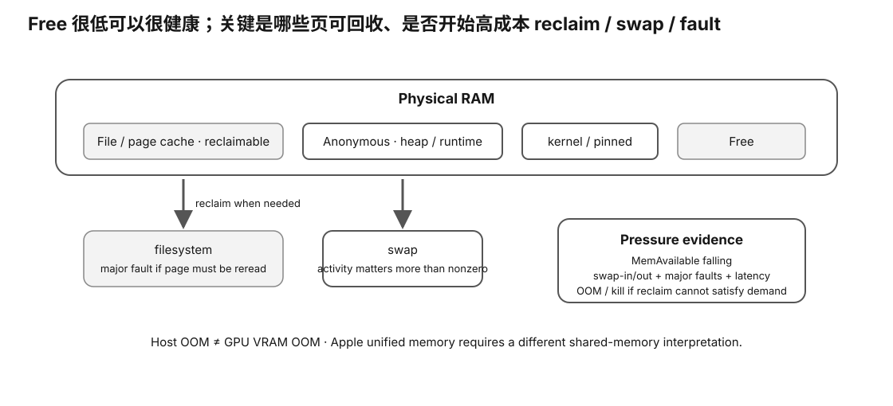

# Host Memory Pressure / Swap / OOM Card

<figure>
  
  <figcaption>视觉索引：先用图建立 Host Memory Pressure / Swap / OOM Card 的核心关系，再把下面的表格、公式与检查项作为快速查阅层。</figcaption>
</figure>


## Linux memory

Prefer:

```
MemAvailable
```

over interpreting `MemFree` alone.

Record:
- MemTotal
- MemFree
- MemAvailable
- Cached
- SReclaimable
- Shmem
- SwapTotal/SwapFree

## Activity

Use deltas over the window:

```
Δpswpin
Δpswpout
Δpgmajfault
Δoom_kill
```

Raw counters are cumulative.

## Process

If available:
- VmRSS
- RssAnon
- RssFile
- VmSwap
- PSS/smaps_rollup

## Distinguish

```
file-backed cache
!=
anonymous memory
```

and:

```
host RAM OOM
!=
discrete GPU VRAM OOM
```

## Healthy cache-heavy pattern

```
MemFree low
MemAvailable healthy
Cached high
swap deltas low
latency healthy
```

can be normal.

## Pressure pattern

```
MemAvailable ↓
swap-out / major faults ↑
latency ↑
```

supports a paging-pressure hypothesis.

## Apple

Unified memory is a different architecture; do not force discrete-VRAM accounting onto it.
