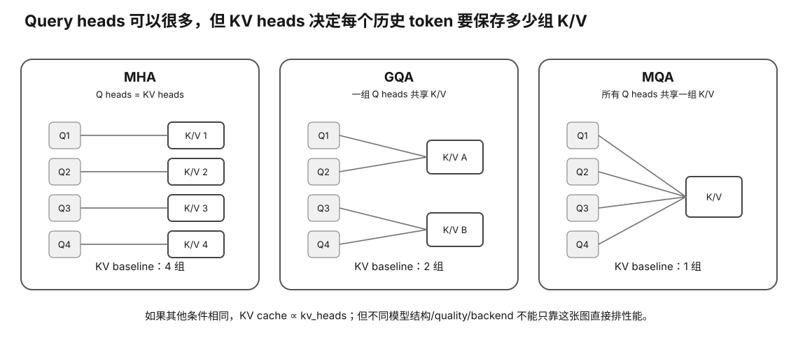

# MHA / MQA / GQA Quick Reference

<figure>
  
  <figcaption>视觉索引：先用图建立 MHA / MQA / GQA Quick Reference 的核心关系，再把下面的表格、公式与检查项作为快速查阅层。</figcaption>
</figure>


## Symbols

- Hq: query heads
- Hkv: KV heads
- Dh: head dimension
- d: hidden size
- L: layers

## Shapes

```
Q [B,Hq,T,Dh]
K [B,Hkv,T,Dh]
V [B,Hkv,T,Dh]
```

## MHA

```
Hkv = Hq
```

## MQA

```
Hkv = 1
```

Many query heads share one K/V head.

## GQA

```
1 < Hkv < Hq
```

Common group size:

```
Hq / Hkv
```

when evenly divisible.

## Projection widths

```
q_width = Hq × Dh
kv_width = Hkv × Dh
```

Weights:

```
Wq d→q_width
Wk d→kv_width
Wv d→kv_width
Wo q_width→d
```

## KV

```
bytes/token
=
2 × L × Hkv × Dh × bytes
```

KV depends on Hkv.

## Example

```
L=32
Hq=32
Dh=128
FP16
```

| type | Hkv | KV/token | KV @ 32k |
|---|---:|---:|---:|
| MHA | 32 | 512 KiB | 16 GiB |
| GQA | 8 | 128 KiB | 4 GiB |
| MQA | 1 | 16 KiB | 0.5 GiB |

## Architecture vs runtime

GQA/MQA:
```
trained model architecture
```

KV quant:
```
runtime representation
```

Different mechanisms.
