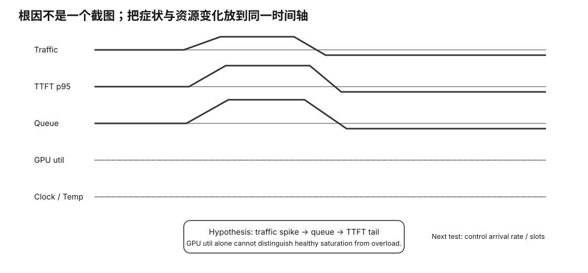

# Observability / Incident Diagnosis Card

<figure>
  
  <figcaption>视觉索引：先用图建立 Observability / Incident Diagnosis Card 的核心关系，再把下面的表格、公式与检查项作为快速查阅层。</figcaption>
</figure>


## Four service views

```
latency
traffic
errors
saturation
```

## Client

- TTFT p50/p95/p99:
- ITL/chunk proxy:
- E2E:
- errors/timeouts:

## Traffic

- req/s:
- prompt tok/s:
- output tok/s:
- concurrency:

## Server saturation

- requests_processing:
- requests_deferred:
- busy slots:
- context/KV pressure:
- cache hit/reuse state:

## GPU/resource

- utilization:
- VRAM used/total:
- clocks:
- temperature:
- power:
- sample interval:

## Logs

- startup/runtime errors:
- OOM:
- backend errors:
- timestamps aligned?:

## Hypothesis language

Prefer:

```
evidence compatible with X
```

until controlled confirmation.

## Do not diagnose from one signal

```
100% GPU
95% VRAM
low GPU util
high temperature
```

alone.

## Incident packet

- release/manifest identity
- workload trace
- client results
- server metrics
- vendor telemetry
- logs
- hypothesis
- action
- follow-up A/B
