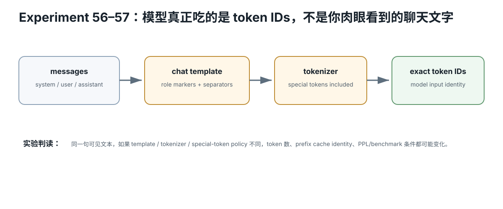

# Prompt / Tokenizer / Sampling Identity Card

<figure>
  
  <figcaption>视觉索引：先用图建立 Prompt / Tokenizer / Sampling Identity Card 的核心关系，再把下面的表格、公式与检查项作为快速查阅层。</figcaption>
</figure>


## Messages

- messages JSON:
- SHA256:
- tools:
- documents:
- dynamic variables:

## Chat template

- source:
- revision:
- variant:
- SHA256:
- add_generation_prompt:
- BOS/EOS policy:

## Rendered prompt

- bytes:
- SHA256:
- saved file:

## Tokenizer

- tokenizer source/revision:
- vocabulary identity:
- special token map:
- token IDs:
- token-ID SHA256:
- token count:

## Context accounting

- system/template tokens:
- user/history tokens:
- tools/RAG tokens:
- generation reserve:
- context limit:

## Model boundary

```
token IDs
→ logits
```

## Sampling

- greedy?:
- temperature:
- top-k:
- top-p:
- min-p:
- penalties:
- grammar:
- seed:
- sampler order:

## Reproducibility rule

Same user text is insufficient.

Freeze:
```
template
+ tokenizer
+ token IDs
+ sampler
```
