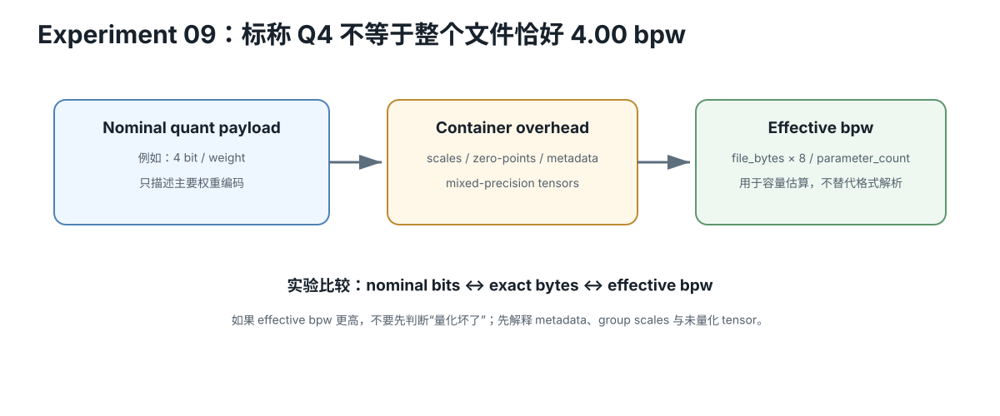

# LLM Quantization / Format / Backend 速查

<figure>
  
  <figcaption>视觉索引：先用图建立 LLM Quantization / Format / Backend 速查 的核心关系，再把下面的表格、公式与检查项作为快速查阅层。</figcaption>
</figure>


## 先拆四层

```text
1. Numerical datatype / precision
2. Quantization algorithm / scheme
3. Checkpoint / container / serialized representation
4. Backend loader + kernel + hardware compatibility
```

## 1. Datatype / precision

回答：数怎么表示？weight、activation、accumulator 分别是什么精度？

例：FP32、FP16、BF16、FP8、INT8、packed low-bit weights。

### W4A16

通常读成：
```text
W4 = 4-bit weight representation
A16 = 16-bit activations
```

不代表 accumulator 也是 4 bit、每个 tensor 都一定 4 bit，或 runtime 每条 instruction 都是 INT4。

## 2. Quantization method

回答：怎样把原始高精度权重映射到低 bit？

例：RTN、GPTQ、AWQ、bitsandbytes-style on-load quantization、mixed-bit optimization。

方法可能决定 calibration、scale selection、group size、error minimization、salient channels，但不自动决定 file container、backend kernel 或 hardware support。

## 3. Container / representation

### Safetensors

保存 tensor names、dtype、shape、offsets、tensor data。

```text
Safetensors != FP16
Safetensors != GPTQ
Safetensors != AWQ
```

### GGUF

保存 metadata KV、tensor names/shapes、per-tensor ggml type、aligned tensor data。

```text
GGUF != Q4
```

GGUF 可承载 F16/F32 与多种 quantized ggml tensor types。llama.cpp 原生使用 GGUF。

### EXL2

更像 ExLlamaV2 ecosystem 的 quantized model representation，可 mixed-bit，并以 target average bitrate 工作。不要机械类比为 Safetensors/GGUF 式通用 container。

## 4. Backend compatibility

真正能不能跑，要同时满足：

```text
parser/loader
+ model architecture support
+ quant representation support
+ target hardware kernel
+ datatype/instruction support
```

所以：
```text
can download != can load != correct != fast
```

## Effective bpw

最简 group-quant 教学模型：

每 group 有 G weights、q-bit code/weight、s-bit scale、z-bit zero-point。

```text
quant-region bpw ≈ q + (s + z) / G
```

### 4-bit + FP16 scale，无 zero

| group | quant-region effective bpw |
|---:|---:|
| 32 | 4.500 |
| 64 | 4.250 |
| 128 | 4.125 |

### scale + zero 都 16 bit

| group | effective bpw |
|---:|---:|
| 32 | 5.000 |
| 64 | 4.500 |
| 128 | 4.250 |

## Mixed tensors

如果 95% params = 4.25 bpw，5% params = FP16：

```text
whole-model bpw
= 0.95 × 4.25 + 0.05 × 16
= 4.8375
```

nominal “4-bit” ≠ overall 4 bpw。

## Compatibility 必须实时查

稳定 Lesson 不保存长期兼容表。

每次部署：
- 查 backend 官方 current docs
- 查 hardware support
- 查 model architecture
- 查 exact quant type
- 查 version
- 查 issue/release if needed
- 做 tiny load test

当前 snapshot：
`intelligence/llm/quantization-backend-compatibility-2026-08-26.md`

## Apple / AMD / NVIDIA

不要说“这个 quant 支持某品牌 GPU”。

改成：“这个 backend 的这个版本，在这个 hardware backend 上，对这个 quant representation 有 loader/kernel support。”

例：
```text
GGUF + llama.cpp + Metal → Apple Silicon path
GGUF + llama.cpp + HIP   → AMD path
GGUF + llama.cpp + CUDA  → NVIDIA path
```

这是软件支持链，不是 GGUF 自己的硬件属性。

## 决策顺序

```text
backend/hardware
→ supported quant representations
→ capacity target
→ quality target
→ speed target
→ effective bpw
→ real benchmark
```
