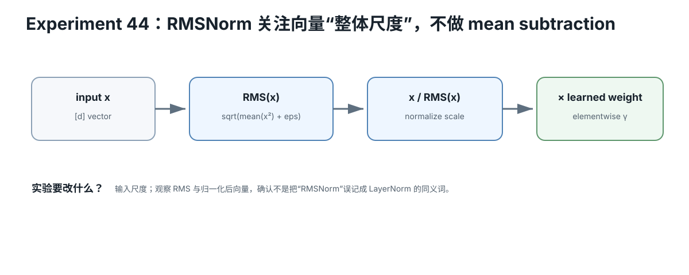

# RMSNorm / Residual / RoPE Quick Reference

<figure>
  
  <figcaption>视觉索引：先用图建立 RMSNorm / Residual / RoPE Quick Reference 的核心关系，再把下面的表格、公式与检查项作为快速查阅层。</figcaption>
</figure>


## RMSNorm

```
rms(x)
=
sqrt(mean(x²) + eps)

y
=
g ⊙ x / rms(x)
```

Key:
- rescales;
- no explicit mean subtraction;
- learned gain g in common implementations.

## LayerNorm contrast

```
LayerNorm:
center + rescale

RMSNorm:
rescale
```

## Pre-Norm residual block

```
h = x + Attention(RMSNorm(x))
y = h + MLP(RMSNorm(h))
```

Residual:
```
existing state + learned update
```

## RoPE 2D pair

```
R(phi)
=
[ cos -sin
  sin  cos ]
```

For pair i at position p:

```
phi_i
=
p × omega_i
```

## Q/K

```
q_p' = R(p)q
k_s' = R(s)k
```

Then:

```
(q_p')ᵀ k_s'
≈ qᵀ R(s-p) k
```

Relative position enters attention geometry.

## Shape

RoPE does not change:

```
Q [B,Hq,T,Dh]
K [B,Hkv,T,Dh]
```

into larger tensors.

## KV identity

Cached key logically depends on:
- model;
- layer;
- token content;
- position;
- RoPE configuration.

## Context extension

Separate:

```
can allocate KV for N tokens?
```

from:

```
model retains quality at N tokens?
```

Check exact:
- rope_theta;
- rope_scaling;
- runtime implementation;
- model documentation.
