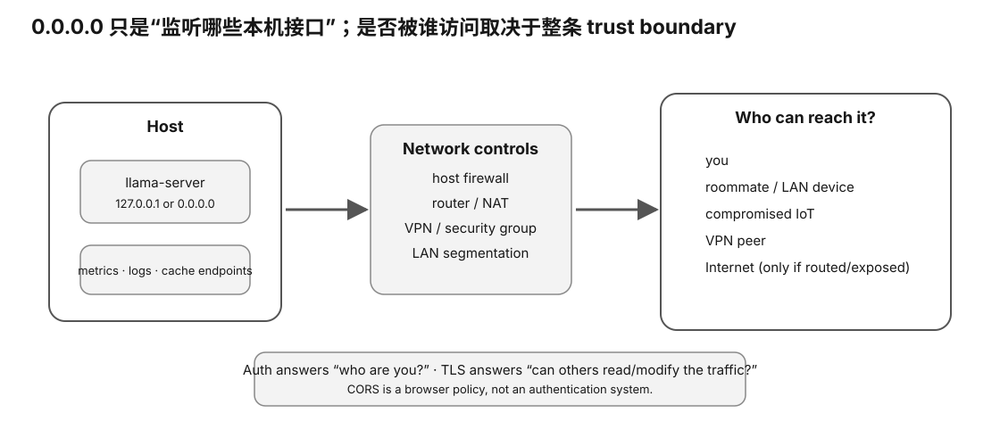

# Service Exposure / Privacy Audit Card

<figure>
  
  <figcaption>视觉索引：先用图建立 Service Exposure / Privacy Audit Card 的核心关系，再把下面的表格、公式与检查项作为快速查阅层。</figcaption>
</figure>

## Network

- listen address:
- listen port:
- actual OS socket evidence:
- loopback / LAN / wildcard / other:
- firewall/NAT unknown?:

## Authentication

- none / API key / upstream / other:
- where enforced:
- secret source:
- **never record raw key**:

## TLS

- none / llama-server / upstream proxy:
- client→TLS endpoint:
- proxy→backend path:

## Endpoints

- chat/completion:
- Web UI:
- metrics:
- slots:
- props:
- model router:
- tools/MCP/agent:

## Data

- prompt logging:
- response logging:
- request metadata:
- retention:
- telemetry export:

## Least exposure

- which clients need access?
- which admin endpoints need access?
- can metrics/slots be narrower than chat API?

## License

- runtime code license:
- exact model artifact license:
- redistribution allowed?:
- notices/attribution:
- gated terms:

## Evidence hygiene

Do not store:
- API keys
- Authorization headers
- cookies
- private prompts unless explicitly required/redacted
