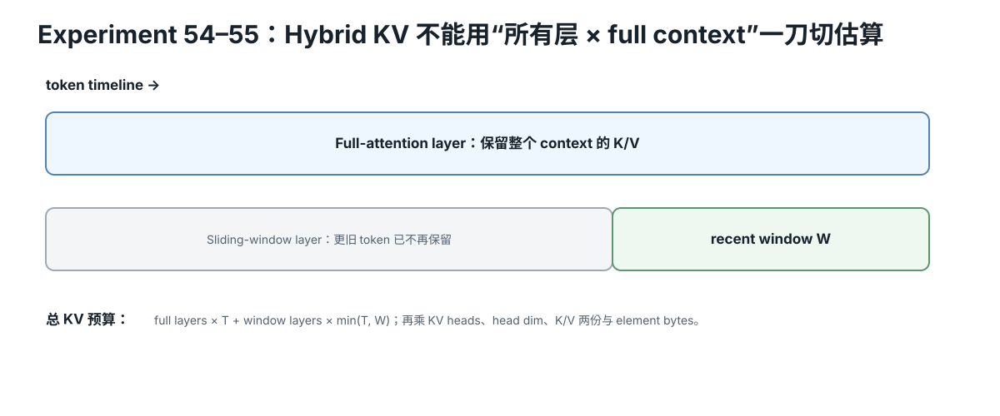

# Modern KV Architecture Quick Reference

<figure>
  
  <figcaption>视觉索引：先用图建立 Modern KV Architecture Quick Reference 的核心关系，再把下面的表格、公式与检查项作为快速查阅层。</figcaption>
</figure>


## General cache accounting

Think per layer:

```
KV/state bytes
=
Σ_l
(
cached positions_l
× cached state width_l
× bytes/element
)
```

## Full MHA/GQA/MQA

```
cached positions_l = S
cached state width_l = 2 × Hkv × Dh
```

## Sliding/local layer

```
cached positions_l
≈
min(S,W)
```

where W is the direct local cache window.

## Hybrid

If F full + R local:

```
KV
≈
2 × Hkv × Dh × bytes
×
[
F×S
+
R×min(S,W)
]
```

assuming homogeneous head dimensions.

## Example

```
L=32
F=8
R=24
W=4096
Hkv=8
Dh=128
FP16
S=32768
```

- all full: 4 GiB
- all local: 0.5 GiB
- hybrid: 1.375 GiB

At S=131072:
- all full: 16 GiB
- all local: 0.5 GiB
- hybrid: 4.375 GiB

## DeepSeek-style MLA concept

Cache:
```
compressed latent state
+
position/RoPE component
```

Some configs expose:
- kv_lora_rank
- qk_rope_head_dim

A model-specific teaching proxy may use their sum as cached width **only after confirming the exact architecture**.

## Questions before calculating

1. Are all attention layers full?
2. Is there a sliding window?
3. Which layers are local/global?
4. Are Hkv/Dh identical across layers?
5. Does the architecture cache standard K/V?
6. Is KV compressed/latent?
7. Does the runtime implement the intended rolling/compressed cache?
