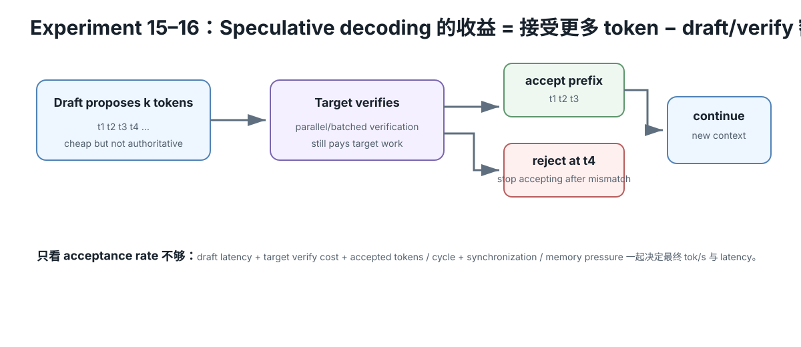

# Speculative Decoding 速查

<figure>
  
  <figcaption>视觉索引：先用图建立 Speculative Decoding 速查 的核心关系，再把下面的表格、公式与检查项作为快速查阅层。</figcaption>
</figure>

## 一句话

~~~text
cheap proposer guesses ahead
→ expensive target verifies several guesses together
→ accepted prefix advances multiple tokens
~~~

Draft 是提案者，Target 才是 authority。

## Baseline

~~~text
target step 1 → token 1
target step 2 → token 2
target step 3 → token 3
target step 4 → token 4
~~~

4 new tokens：
4 serial target steps。

## Speculative

~~~text
draft → d1 d2 d3 d4

target verification batch
→ check d1..d4 together
~~~

如果前 3 个通过：

~~~text
accept d1 d2 d3
+ target/corrected token
→ one verification round advances multiple positions
~~~

## 为什么质量不由 draft 决定

正确 speculative sampling 不是：

~~~text
small model says token
→ blindly append
~~~

而是：

~~~text
draft proposal
→ target probabilities
→ acceptance/rejection/correction
~~~

理论算法设计为保持 target distribution。

Greedy 情况可用“匹配前缀 + target mismatch token”理解；随机采样需要正确 rejection/correction sampler。

## 第一个 mismatch 后为什么丢后续 draft

~~~text
draft:  A B C D
target: A B X ...
~~~

D 是 conditioned on C。

一旦正确 history 变成 X：

~~~text
old D no longer belongs to corrected chain
~~~

所以 simple chain spec 从新 history 重新 proposal。

## Acceptance

~~~text
acceptance rate
= accepted draft tokens / generated draft tokens
~~~

Current llama.cpp can report this statistic。

但：

~~~text
acceptance alone != speedup
~~~

还要看 proposer/verification cost。

## Expected progress teaching model

每 draft token independent survival probability = p，draft length D。

~~~text
E[accepted]
= p + p² + ... + p^D
~~~

~~~text
E[progress/verify]
≈ 1 + p + p² + ... + p^D
~~~

这是 L0 模型，不是 runtime exact formula。

## Cost condition

Baseline：

~~~text
time/token = target serial step
~~~

Spec round：

~~~text
draft cost
+ target batch-verify cost
+ acceptance/correction overhead
~~~

Speedup opportunity：

~~~text
tokens advanced per spec round
--------------------------------
spec-round time

>

1 target token
--------------
baseline target-step time
~~~

## Draft length

High acceptance：

~~~text
longer draft
→ more useful accepted tokens
~~~

Low acceptance：

~~~text
longer draft
→ wasted draft suffix ↑
→ overhead ↑
→ possible slowdown
~~~

不要把 max draft length 当“越大越强”。

## Proposer families

### Small draft model

优点：
- general

成本：
- draft weights
- draft KV
- draft compute

### N-gram / history lookup

优点：
- tiny/no second model
- cheap

适合：
- repetitive code/text
- copy-heavy output

弱点：
- novel text acceptance low

### Learned target-aware / MTP

例如 EAGLE / MTP family。

思路：
- use target-related hidden state/head
- predict multiple future tokens cheaper than full target serial decode

具体算法快速演进，放 intelligence。

## 为什么 low batch 更有机会

单 request decode：

~~~text
target hardware underutilized / memory-bound
~~~

Target batched verify：

~~~text
more positions per forward
→ compute parallelism ↑
~~~

所以 current vLLM/TensorRT-LLM 都强调低/中 QPS 或 low batch-size 场景。

## 和其他 serving 优化分工

| 优化 | 主要省什么 |
|---|---|
| Prefix Cache | repeated prompt prefill |
| Continuous Batching | active multi-request scheduling / throughput |
| Speculative Decoding | serial new-token target rounds |

三者可组合，但 A/B 时先单独测。

## Evidence minimum

固定 baseline/spec：

- same target model artifact
- same target quant
- same prompt/workload
- same sampling settings
- same output limit
- same concurrency
- same context/KV
- same target offload

额外记录：

- proposer type/model
- proposer artifact/hash
- draft length
- proposer placement
- draft tokens generated
- draft tokens accepted
- acceptance rate
- predicted t/s
- E2E latency
- TTFT/stream cadence if relevant
- memory delta

## 结果怎么读

### Acceptance 高 + speedup 高

proposer quality/cost balance 合适。

### Acceptance 高但没 speedup

查：
- draft too expensive
- target verify overhead
- memory placement
- baseline already well batched
- extra model causes offload change

### Acceptance 低 + slower

正常可能性：
wasted speculation > saved target serial steps。

### N-gram 在代码快、开放问答慢

proposer is workload-dependent。

## Correctness wording

推荐：

~~~text
speculative algorithm is designed to preserve target distribution
under its verifier/rejection-sampling rules
~~~

不要承诺每次 runtime output byte-identical。
